# ai-dev-setup

Set up the **Spryker AI Dev SDK** (`spryker-sdk/ai-dev`) in a Spryker project — install the Composer
package, wire its console commands, register the MCP server with Claude Code, and install `CLAUDE.md`
+ `.claude/rules/`.

Two related flows live in one skill: **first-time onboarding** and **updating** the bundled artifacts.
The skill infers which one you want rather than asking, and every step is idempotent — it checks
whether its work is already done, reports the existing state in one line, and fills only the gap.

## When it triggers

User-invocable only (`disable-model-invocation: true`) — it runs when you ask for it, not on the
model's initiative.

| You say | Flow |
|---|---|
| "install", "set up", "onboard", "add", "configure", "first time", "new project" | onboarding |
| "update", "refresh", "sync", "pull latest", "get newer", "upgrade rules", "refresh CLAUDE.md" | update |
| bare invocation, no context | resolved from project state |

Onboarding requires **both Composer and a running `docker/sdk` environment**. Updating only needs the
bundled content on disk.

## Flow schema

```mermaid
flowchart TD
    A([Invoked]) --> SA["Signal A — read the user's invocation<br/>install-words vs refresh-words"]
    SA --> SB["Signal B — read project state<br/>composer show · CLAUDE.md ·<br/>.claude/rules · claude mcp list"]
    SB --> D{"Combine A + B"}

    D -- "A=update, B=fully set up" --> U0
    D -- "A ambiguous, B fully set up" --> STATE1["State the assumption in one line"] --> U0
    D -- "A=update, B=nothing installed" --> ASK1{"Ask: not onboarded —<br/>run full onboarding instead?"}
    D -- "A=onboarding, B=fully set up" --> ASK2{"Ask: already configured —<br/>refresh artifacts instead?"}
    D -- "A and B disagree otherwise" --> ASK3{"State both signals,<br/>ask which flow"}
    D -- "A=onboarding / ambiguous,<br/>B=nothing or mixed" --> R0

    ASK1 -- "yes" --> R0
    ASK2 -- "yes" --> U0
    ASK3 --> R0
    ASK1 -- "no" --> STOP([Stop — never silently fall through])
    ASK2 -- "no" --> STOP

    U0{"Update flow —<br/>CLAUDE.md and .claude/rules<br/>actually present?"}
    U0 -- "missing" --> ASK4{"Looks like a first install —<br/>switch to onboarding?"} --> R0
    U0 -- "present" --> U1["Skip Requirements/Preflight/Steps 1-4<br/>jump to Step 5, default = OVERWRITE<br/>still confirm, never silent"]
    U1 --> UEND([Stop after Step 5 —<br/>report which artifacts refreshed<br/>+ the bundled version])

    R0["Requirements — HARD preconditions"] --> RC{"composer on PATH<br/>AND docker/sdk help works?"}
    RC -- "either missing" --> HALT(["Tell the user what's missing, stop.<br/>Never run docker/sdk up or<br/>install Composer for them"])
    RC -- "both OK" --> P{"Preflight —<br/>composer.json has spryker/* AND<br/>a ConsoleDependencyProvider exists?"}
    P -- "no" --> HALT
    P -- "yes" --> S1

    S1{"Step 1 — composer show +<br/>composer outdated"}
    S1 -- "not found" --> S1I["composer require spryker-sdk/ai-dev --dev<br/>or docker/sdk cli composer require"]
    S1 -- "installed, up to date" --> S1T
    S1 -- "newer available" --> S1A{"Ask before<br/>composer update"} --> S1T
    S1I --> S1T{"src/Generated/Shared/Transfer/AiDev*<br/>present?"}
    S1T -- "no" --> S1G["docker/sdk cli console transfer:generate<br/>success = banner ONLY, nothing else"] --> S2
    S1T -- "yes" --> S2

    S2["Step 2 — find every<br/>*/Zed/Console/ConsoleDependencyProvider.php"]
    S2 --> S2L{"More than one?<br/>which is the LEAF?"}
    S2L -- "one file" --> S2W
    S2L -- "chain calls parent::getConsoleCommands" --> S2W
    S2L -- "a non-leaf skips parent::" --> S2Q{"Ask: wire the leaf directly,<br/>or add the parent:: call?"} --> S2W
    S2W["Per-console pre-check, then add only<br/>the missing import / class_exists-guarded<br/>registration for McpServerConsole +<br/>AiToolSetupConsole. NOT GeneratePromptsConsole"]

    S2W --> S3{"Step 3 — claude mcp list:<br/>entry named after the project basename?"}
    S3 -- "connected" --> S4
    S3 -- "exists but FAILING" --> DEFER["Do NOT re-register.<br/>Defer the decision to Step 4"] --> S4
    S3 -- "absent" --> S3A["claude mcp add $(basename $(pwd)) --<br/>$(pwd)/docker/sdk console ai-dev:mcp-server -q<br/>the -q is mandatory: the banner<br/>would pollute stdio"] --> S4

    S4{"Step 4 — Verify<br/>docker/sdk cli console | grep ai-dev:<br/>exactly two commands?<br/>claude mcp list entry connected?"}
    S4 -- "consoles missing" --> S2
    S4 -- "deferred entry recovered" --> S5
    S4 -- "entry STILL failing" --> ASK5{"Surface the exact error, ask about<br/>claude mcp remove + re-register"} --> S5
    S4 -- "all green" --> S5

    S5["Step 5 — artifacts, one consent each<br/>Auto mode does NOT bypass these prompts"]
    S5 --> A1{"Artifact 1 — CLAUDE.md<br/>absent / bundled / custom?"}
    A1 -- "absent" --> A1A["Ask, then cp AGENTS.example.md"]
    A1 -- "matches bundled" --> A1B["Ask: overwrite or keep"]
    A1 -- "custom" --> A1C["THREE choices:<br/>keep · overwrite · MERGE (recommended)<br/>append only whole missing sections"]
    A1A --> A2
    A1B --> A2
    A1C --> A2
    A2{"Artifact 2 — .claude/rules/<br/>overwrite · merge · cancel"}
    A2 --> FIN(["Final report, 3-5 lines<br/>+ ALWAYS: restart Claude Code /exit<br/>for the MCP tools to load"])

    classDef step fill:#1f6feb,stroke:#0b3d91,color:#fff;
    classDef decision fill:#f0ad4e,stroke:#8a6d3b,color:#000;
    classDef terminal fill:#2ea043,stroke:#176f2c,color:#fff;
    class SA,SB,R0,S1I,S1G,S2,S2W,S3A,DEFER,S5,A1A,A1B,A1C,U1,STATE1 step;
    class D,U0,RC,P,S1,S1T,S1A,S2L,S2Q,S3,S4,A1,A2,ASK1,ASK2,ASK3,ASK4,ASK5 decision;
    class A,STOP,HALT,UEND,FIN terminal;
```



## What a fully onboarded project has

1. `spryker-sdk/ai-dev` installed as a dev dependency.
2. Two console commands wired in the leaf `ConsoleDependencyProvider` — `McpServerConsole` and
   `AiToolSetupConsole`.
3. The AI Dev MCP server registered with Claude Code, so other sessions in this project get
   Spryker-aware tools (transfers, OMS, module map, CSV/ODS).
4. Optionally `CLAUDE.md` at the project root and `.claude/rules/` populated from the bundled content.

`ai-dev:generate-prompts` exists in the package but is **outdated** — the skill never wires it, and
flags an existing wiring for removal rather than deleting it silently.

## Design decisions baked in

- **Infer the flow, don't interrogate.** Two signals (what you said, what the project looks like)
  decide onboarding vs update. Ambiguity gets a stated assumption you can redirect, not a question —
  but a genuine disagreement between the signals always stops and asks.
- **Idempotency is a per-step contract.** Every step first checks whether its work is already done
  correctly, and if partially done, narrates the gap and fills only the gap. Running the skill twice
  produces the same result and never duplicates a registration or overwrites your changes.
- **Requirements are hard, and remediation is yours.** Composer and a *running* `docker/sdk` are both
  needed; the skill stops and tells you what's missing rather than running `docker/sdk up` or
  installing Composer for you — both are state-changing on your machine.
- **Wire the leaf, not `Pyz` by reflex.** Projects often put a project-namespace provider above `Pyz`.
  The class that actually runs is the leaf, and wiring into `Pyz` only surfaces if every override in
  the chain calls `parent::getConsoleCommands($container)`. The skill finds all candidates, identifies
  the leaf, and states in one line which file it edited and why.
- **A failing MCP entry is usually a downstream symptom, not a broken registration.** Step 3 defers
  rather than starting a `mcp remove` / `mcp add` cycle — the same entry typically reports `✓ Connected`
  once Steps 1 and 2 have landed. Only if Step 4 still shows it failing does the skill surface the
  error and ask.
- **The MCP name is the project's folder basename, never a generic one.** Developers with several
  Spryker checkouts on one machine would otherwise collide on a single shared entry in `~/.claude.json`.
  The state check greps `^<name>:` — anchored, colon-delimited — because a substring match
  false-positives on an entry whose name merely contains the project basename.
- **`-q` on the MCP command is mandatory.** MCP speaks over stdio, and the `docker/sdk console` banner
  would otherwise break the handshake.
- **Overwriting is always a separate, explicit consent.** Auto mode does not bypass Step 5's prompts —
  replacing a custom `CLAUDE.md` or files in `.claude/rules/` is destructive. A custom `CLAUDE.md` gets
  three choices, with **merge** (append only whole sections you lack, under a
  `# Spryker AI Dev — bundled additions` divider) recommended.
- **Bundled content is pinned to `composer.lock`.** The skill copies what is on disk under
  `vendor/spryker-sdk/ai-dev/data/` — it never fetches from GitHub. For newer artifacts, run
  `composer update spryker-sdk/ai-dev` first, then re-run in update flow. And `${CLAUDE_PLUGIN_ROOT}`
  is not a substitute source: it points at whichever project loaded the plugin, possibly a different
  one on the same machine.

## Run artifacts

Every run writes a plain-text trail so a completed onboarding can be audited afterwards — created
right after the mode decision (the first thing worth recording), in both the onboarding and update
flows:

```
.ai-dev/ai-dev-setup/<run-id>/run.log      # <run-id> = UTC start timestamp
```

It records the mode decision and the two signals behind it, each Requirements / Preflight check, every
step's START/END, the actual `ConsoleDependencyProvider` path edited, the MCP server name registered,
each Step 5 artifact decision, and every hard stop with its verbatim error. Because this onboarder is
idempotent, **a skip is logged as explicitly as an action** (`already installed: … (skipped)`) — a
skipped step is a result, not an absence. Bulk command output goes to `<step>.log` beside it, keeping
`run.log` to one line per outcome.

The final report's last line is the absolute path to that folder.

## Output

A 3–5 line final report: package + version installed, which provider file was edited and how many
consoles were added, the MCP server name used, and one status per artifact (`added` / `overwritten` /
`merged: …` / `skipped` / `failed: …`).

It always ends with the same reminder: **restart Claude Code (`/exit`) or open a new session** — the
running session loaded its MCP servers at startup and will not pick up the new one. It also suggests
two optional additions: the `php-lsp@claude-plugins-official` language-server plugin, and a Context7
MCP server for Spryker documentation.

## What it escalates instead of forcing

- A `composer require` version conflict — surfaced, never force-installed with `--ignore-platform-reqs`
  or `-W` unasked.
- A missing or unparseable `ConsoleDependencyProvider.php` — stop and ask where to wire; never invent
  a file.
- An older Claude Code CLI without `claude mcp add` — offer the manual JSON snippet rather than
  failing silently.

## Packaging note

This skill ships in the `spryker-ai-dev-sdk` plugin under `vendor/spryker-sdk/ai-dev/…`, which is
Composer-managed — `composer update spryker-sdk/ai-dev` may overwrite it. The durable home for edits
is the plugin's own repository (`github.com/spryker-sdk/ai-dev`).
