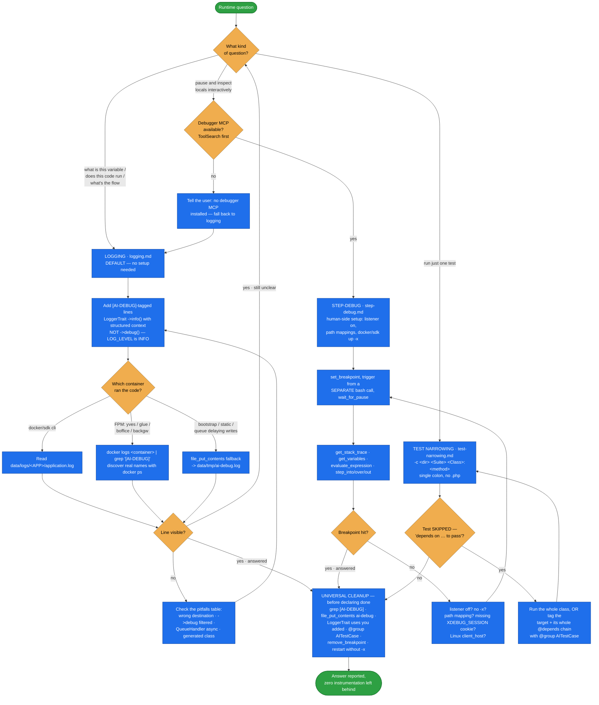

# ai-runtime-debugging

**Inspect Spryker runtime state as an AI agent** — `error_log()` and `var_dump()` are useless here,
because their output disappears into Docker containers you can't see. This skill gives three
techniques that an agent can actually read back: tagged logging, XDebug step-debugging through an
MCP bridge, and narrowing a Codeception run to one method.

The hard part in Spryker isn't emitting a log line — it's knowing **where it went**. The same
`getLogger()->info()` lands on disk when run under `docker/sdk cli` and on `php://stderr` (i.e.
`docker logs`) when the same code runs in an FPM container. Half of this skill is that routing map;
the other half is cleaning the instrumentation back out before it reaches a commit.

## When it triggers

"I can't tell why this code is doing X", "add some debug output", "step through this", "set a
breakpoint", "what does this variable contain at runtime", `error_log` not working, can't see
`var_dump` output — and "how do I run just this one test".

## Flow schema

## Files

| File | Role |
|------|------|
| [`SKILL.md`](SKILL.md) | The technique-selection table and decision tree, the **universal cleanup checklist**, and a "verify this skill in a fresh session" sanity check (does `LoggerTrait` still live where documented, is `LOG_FILE_PATH` still wired, does the FPM container still export `SPRYKER_LOG_STDERR`, does `docker/sdk --help` still document `-x`). |
| [`logging.md`](logging.md) | The default technique. The two log destinations (cli → file on disk vs. FPM → `php://stderr`), `LoggerTrait` usage and where it does/doesn't work, the `file_put_contents` fallback, copy-paste read-back commands, and a logging pitfalls table. |
| [`step-debug.md`](step-debug.md) | XDebug via a DBGp-MCP bridge — how to detect whether one is loaded, the four known bridge options, the human-side setup only the user can do, a worked breakpoint→inspect→cleanup example, how to trigger Xdebug from each entry point, and step-debug pitfalls. |
| [`test-narrowing.md`](test-narrowing.md) | Running one class or one method with `docker/sdk testing`, the exact positional syntax and why `--filter`/`--grep` don't work, the `@depends` skip gotcha, and the `@group AITestCase` workaround. |

## Techniques at a glance

| Technique | Use when | Effort |
|---|---|---|
| **Logging** | You need a trace of values across code paths, or just to confirm a path is reached | Low — edit one line, run, read a file |
| **XDebug step-debug** | You need to walk the call stack, inspect locals at a pause, evaluate ad-hoc expressions | Medium — needs a DBGp-MCP bridge installed |
| **Narrow test runs** | Debugging through tests; one method instead of the whole suite | Low |

**Default to logging.** Step-debug only when you genuinely need to pause execution. Test-narrowing
is independent — useful whenever you run tests, debugging or not.

## Design decisions baked in

- **Never `error_log()`.** It lands in PHP's SAPI log inside the container, with no easy way to read
  it back.
- **`->info()`, not `->debug()`.** `LOG_LEVEL` is `Logger::INFO` in this dev setup, so `->debug()`
  lines are filtered out and look like the code never ran.
- **Tag everything `[AI-DEBUG]`.** The tag is what makes the cleanup grep exhaustive.
- **Structured context as the second argument**, not concatenated into the message — Monolog renders
  it as scannable JSON.
- **Never instrument generated code.** Transfers and `src/Generated/` are rebuilt by
  `transfer:generate` / `propel:install`, so the log line silently disappears. Log from the caller.
- **Trigger the breakpoint from a separate Bash call**, not through MCP — the breakpoint blocks
  waiting for execution.
- **Leftover instrumentation is a blocker**, not a nit: it must not reach a commit, a review, or
  production — and Xdebug must be turned back off, since it adds 2–5x latency and breaks workers.

## Packaging note

This skill ships in the `spryker-ai-dev-sdk` plugin under `vendor/spryker-sdk/ai-dev/…`, which is
Composer-managed — `composer update spryker-sdk/ai-dev` may overwrite it. The durable home for edits
is the plugin's own repository (`github.com/spryker-sdk/ai-dev`).
