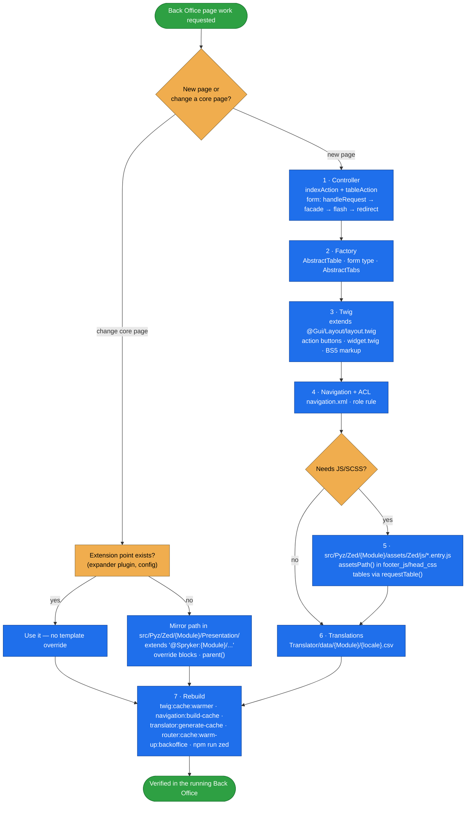

# backoffice-frontend

This skill helps you build, override and style **Spryker Back Office (Zed) pages in a project**. It
covers the controller, the table or form, the Twig template, navigation and ACL, and JS/SCSS assets. It
then shows how to rebuild the right cache and verify the page in the running Back Office.

Back Office pages are server-rendered Twig on Bootstrap 5 with the Inspinia2 theme. They look simple,
but most of what goes wrong is Spryker-specific rather than a Bootstrap or Twig problem:

- An override that extends `@Module/...` instead of `@Spryker:Module/...` extends itself.
- A new template is ignored until the path cache is warmed.
- A menu entry never appears because navigation is cached.
- A project `*.entry.js` silently replaces a core bundle when the file names match.
- A direct `.DataTable()` call races the table orchestrator.
- Several Gui Twig functions exist in vendor but are not registered in the project.

This skill carries those mechanics and uses project paths only. Core is read from `vendor/` and extended
into `src/Pyz/Zed`, never edited.

## When it triggers

It triggers for any Back Office page work: "create a Back Office page", "add an admin screen for X",
"override a Zed template", "add BO navigation", "add a menu entry", "BO JS/SCSS", "Bootstrap classes in
Zed", "my Zed override is not picked up", "the new menu item does not show".

The always-loaded companion rule `zed-backoffice-frontend` (`data/rules/zed-backoffice-frontend.md`)
carries the non-negotiables. This skill carries the procedure.

## Flow schema



## Key rules

- **Overrides**:
  - Mirror the core path under `src/Pyz/Zed/{Module}/Presentation/` and extend
    `@Spryker:`/`@SprykerFeature:`/`@SprykerEco:` explicitly.
  - Override blocks only, and call `parent()` to keep core content.
  - Never copy a whole template, never edit vendor.
- **Pages**:
  - Extend `@Gui/Layout/layout.twig`.
  - Put page buttons in the `action` block, using `createActionButton` and the other action-button helpers.
  - Wrap content in `@Gui/Partials/widget.twig`.
  - Tables need an `index` and a `table` action.
  - Use only the Twig functions registered in `src/Pyz/Zed/Twig/TwigDependencyProvider.php`.
- **Navigation/ACL**: navigation entries and ACL rules both use kebab-case bundle/controller/action.
  Navigation is cached. Restricted roles need an ACL rule, and hiding a menu entry does not protect the page.
- **Assets**:
  - The build scans `src/Pyz/Zed` for `**/Zed/**/*.entry.js`.
  - A project entry replaces a core entry with the same name.
  - Include bundles with `assetsPath()`.
  - Reach Gui tables through `requestTable()`, never `.DataTable()`.
- **Translations**: keys go in `src/Pyz/Zed/Translator/data/{Module}/{locale}.csv`, then run
  `translator:generate-cache`.
- **Verification**:
  - Prettier is the only automated check for Zed JS/SCSS, and a successful build is not verification.
  - Load the page, check the browser console, and try a restricted role.

## Files

| File | Role |
|---|---|
| [`SKILL.md`](SKILL.md) | The main workflow: override vs new page, controller, factory, template, core override, navigation + ACL, assets, translations, the cache/rebuild table, verification, checklist. |
| [`references/twig-layout-and-helpers.md`](references/twig-layout-and-helpers.md) | Layout blocks, the Twig functions actually registered in the project and their signatures, Gui partials, legacy partials to avoid, template namespaces, the path-cache gotcha. |
| [`references/bootstrap-migration.md`](references/bootstrap-migration.md) | Legacy Bootstrap 3/4 → Bootstrap 5 class table, the four styling layers (BS5 → Gui → Inspinia2 → project SCSS), theme colours via configuration and CSS custom properties. |
| [`references/assets-and-build.md`](references/assets-and-build.md) | How `frontend/zed/build.js` finds entries, entry override by file name, the entry file and page inclusion, webpack aliases, the table orchestrator contract and handle API, what is and is not checked. |

## After changing a page

```bash
docker/sdk cli console twig:cache:warmer          # new/moved template
docker/sdk cli console navigation:build-cache     # navigation.xml
docker/sdk cli console translator:generate-cache  # translation CSV
docker/sdk cli console router:cache:warm-up:backoffice  # new controller/action
docker/sdk cli npm run zed                        # JS/SCSS (zed:watch while iterating)
```

## Packaging note

This skill ships in the `spryker-ai-dev-sdk` plugin under `vendor/spryker-sdk/ai-dev/…`. That directory is
Composer-managed, so `composer update spryker-sdk/ai-dev` may overwrite local edits. Make durable edits in
the plugin's own repository (`github.com/spryker-sdk/ai-dev`).
