# boot-and-verify

Take a transformed Spryker project from **"files written" to "verified running"** — pre-boot
validation, the first `docker/sdk up`, and a fixed ladder of per-store verification gates that ends
in an independent verifier's PASS/FAIL.

This is the commit point of a project start: nothing here half-succeeds silently. A green boot log
is not a working shop, and a correct read model is not evidence that a page renders — so the skill
verifies at the granularity that can actually break.

## When it triggers

Three ways in:

- **The first boot** at project start — the [project-starter-wizard](../project-starter-wizard/README.md)'s
  last mandatory step (step 8), which also carries the post-boot halves of
  [brand-project](../brand-project/README.md) (theming),
  [configure-codebase](../configure-codebase/README.md) (the codeception seed) and
  [cypress-migration](../cypress-migration/README.md) (`cy:run`).
- **Re-applying data changes** on an already-booted stack — §3b's iteration ladder.
- **Standalone per-store verification** of storefront, Back Office, search and queues — §4 is
  reusable with no boot, by later live operations (add-store, cleanup reboot, go-live checks).

## Flow schema

```mermaid
flowchart TD
    A([Invoked]) --> V["1 · Validate before boot<br/>preflight vs baseline · manifest-refs<br/>threshold-glossary · refs on *_store<br/>absent on must-be-clean files"]
    V --> VR{"Red<br/>paths / refs / required?"}
    VR -- "yes" --> FIXD["Fix the data<br/>do NOT boot on red"]
    FIXD --> V
    VR -- "no" --> B["2 · Bootstrap<br/>docker/sdk bootstrap deploy.dev.yml<br/>capture the sudo /etc/hosts line"]

    B --> HOSTS["⚠ ACTION NEEDED<br/>surface the /etc/hosts line<br/>verbatim, before the 4c gate"]
    HOSTS --> UP["3 · Boot, detached pty<br/>script -q .ai-dev/boot.log docker/sdk up -t<br/>-t = testing container + SPRYKER_TESTING_ENABLED<br/>run_in_background · 30–90+ min"]

    UP --> LOG{"Read .ai-dev/boot.log<br/>Overall Import status: OK<br/>&amp; no Aborted / SQLSTATE<br/>&amp; demodata section RAN?"}
    LOG -- "environment limit<br/>(ports · composer auth · disk · OOM)" --> DEV([Developer clears it;<br/>plain docker/sdk up as fallback])
    LOG -- "project failure" --> TRAP["Match the signature in<br/>pitfalls.md, then §3b ladder"]
    TRAP --> LADDER
    LOG -- "demodata skipped [LOADED]" --> CLEAN["clean-data (gated)<br/>then re-boot the same way"]
    CLEAN --> UP
    LOG -- "green" --> G0

    LADDER{"3b · Iteration ladder<br/>cheapest rung that works"}
    LADDER -- "1 · validate the edit" --> R1["data:import -c &lt;config&gt;<br/>no teardown"]
    R1 --> LADDER
    LADDER -- "2 · adds/updates only" --> R2["targeted data:import<br/>+ drain queues"]
    LADDER -- "3 · deletions / value change /<br/>insert-only importer" --> R3["reset — DB drop<br/>gated · TTY pty · background"]
    LADDER -- "4 · code/deploy change" --> R4["clean-data + full up"]
    R2 --> G0
    R3 --> UP
    R4 --> UP

    G0{"4a0 · Volumes are NEW?<br/>KV _timestamp / index creation_date<br/>vs boot start; spy_store ids<br/>vs ids in KV payloads"}
    G0 -- "collision — false green" --> RANK([Ranked fix: developer removes<br/>own stale volumes / override the<br/>deploy namespace / new project name])
    G0 -- "new" --> GEN

    GEN{"4a-gen · find src/Generated data/cache<br/>-name '*OLD_TOKEN*' → empty?"}
    GEN -- "hit" --> REGEN["Delete the stale artifact,<br/>re-run its generator, re-probe"]
    REGEN --> GEN
    GEN -- "empty" --> G1

    G1{"4a · Publish queues<br/>drained &amp; error-free?<br/>project vhost, NOT /"}
    G1 -- "non-empty" --> DRAIN["queue:worker:start<br/>--stop-when-empty"]
    DRAIN --> G1
    G1 -- "0" --> G2

    G2{"4a-search · per-store *_page<br/>doc count &gt; 0?<br/>via /_count, never _cat"}
    G2 -- "0" --> FAILB([FAIL the boot —<br/>invisible unsellable catalog])
    G2 -- "&gt; 0" --> G3

    G3["4b · Per-store HTTP probes<br/>ONE PER APP the project KEPT<br/>yves: /&lt;STORE&gt;/&lt;lang&gt; · logo box &gt; 0×0<br/>≥N homepage slot blocks · add-to-cart PERSISTED<br/>guest checkout · anonymous /customer/overview → 302 login<br/>backoffice: login + product list non-empty<br/>merchant-portal · glue &amp; glue-backend:<br/>token + one REGISTERED resource<br/>(406 / 404 on the roots is CORRECT)"]
    G3 --> G4["The full grid<br/>stores × each locale × products<br/>never an aggregate total"]

    G4 --> TI["Post-boot test infra<br/>seed run = pre-check only, then the GATE:<br/>docker/sdk testing codecept run<br/>-c tests/codeception.ci.functional.yml<br/>BOTH PyzTest and NsTest trees<br/>0 errors, upstream skips only, report counts<br/>DataBuilders non-empty → cy:run<br/>on host/CI, not the CLI container"]

    TI --> G5{"4c · spryker-verifier agent<br/>independent PASS/FAIL/BLOCKED<br/>per AC, from scratch"}
    G5 -- "FAIL" --> FIX["Fix the defect,<br/>re-run the verifier fresh"]
    FIX --> G5
    G5 -- "BLOCKED, wizard-clearable" --> G1
    G5 -- "BLOCKED — /etc/hosts declined" --> TERM([done — browser ACs BLOCKED<br/>server checks PASS server only])
    G5 -- "all PASS" --> CLOSE

    CLOSE(["5 · Close<br/>git add project files only<br/>step = done · Go-live debt list<br/>re-state the /etc/hosts line"])
    TERM --> CLOSE
```

## Files

| File | Role |
|------|------|
| [`SKILL.md`](SKILL.md) | The spine — pre-boot validation, bootstrap, the detached-pty boot, the §3b iteration ladder, the gate **order**, the §4c verifier gate, and the close with its go-live debt list. |
| [`references/verify-recipes.md`](references/verify-recipes.md) | The **mechanics** of every gate and probe — exact commands, clients, schema notes and the known false-signal traps. SKILL.md owns the order; this owns how each is run. Read it before probing rather than hand-building commands. |

Failure-signature triage lives one directory over, in
[`project-starter-wizard/references/pitfalls.md`](../project-starter-wizard/references/pitfalls.md) —
match an abort there before diagnosing from scratch.

## The gate order

Never probe ahead of an unpassed gate — each one exists because the signal after it is meaningless
without it.

| Gate | Asserts | The false green it catches |
|------|---------|----------------------------|
| **4a0** | KV/search/broker volumes are new (age + identity) | `up` recreates the DB but **reuses named volumes** — a fresh DB beside a prior project's read models, every signal correct while carrying foreign data. |
| **4a-gen** | No `src/Generated` / `data/cache` artifact keyed by a **renamed** token | Gitignored build output no sweep or `git diff` sees — a `validation<OLD>.cache` surviving a renamed code bucket 500s every API Platform request after a green boot. |
| **4a** | Publish queues drained, error-free, on the **project vhost** | `list_queues` against the default `/` vhost returns an empty list — a dangerous "drained". A storefront hit before the queues settle is a false 500. |
| **4a-search** | Per-store `*_page` product-doc count > 0, via `/_count` | A missing `product-approval-status` makes the publisher write **nothing** while import, queues and DB all read perfect. `_cat/indices` lags the merge and reads near-empty. |
| **4b** | Per-store HTTP for **every kept app**, add-to-cart **persisted**, the logo's rendered box, **≥ N homepage slot blocks**, anonymous `/customer/overview` **302 to login** | A 200 with an error flash or an empty quote is a FAIL; a correctly-configured logo can still render at 0×0; a block-less homepage passes a `<html lang=` probe; an unguarded `/multi-cart` returns 200 and renders, so "not 500" passes the defect; Glue modelled as the Yves *fallback* leaves total API breakage unprobed. |
| **grid** | Per store × each locale × products | An aggregate total hides a zero-locale or a price-less product slice. |
| **4c** | An independent `spryker-verifier` agent's PASS/FAIL per AC | The agent that wrote the data judging its own work. |

## Design decisions baked in

- **Diagnose your own delta first.** When something that worked in the fresh demoshop breaks after
  the transformation, the change is guilty until proven otherwise — diff `data/import config src`
  and re-verify completeness before opening a single `vendor/` file.
- **The boot needs a TTY *and* detachment.** `mutagen` and other steps run `docker … -it`, and the
  boot outlasts the 10-minute tool cap. `script` inside `run_in_background` gives both; a
  hand-rolled `python pty.spawn` is prohibited, and `script` is the one sanctioned pty.
- **Never "fix" a boot by editing project config.** A TTY, mount or timeout failure is a
  run-environment limit. Switching macOS off `mutagen` addresses a detached-execution artifact and
  cripples the Mac dev env.
- **Never mutate the developer's Docker or host state.** No resource-limit changes, no
  `system prune`, no `volume rm`, no daemon restarts — recommend, never do.
- **Climb the cheapest rung.** Adds → targeted `data:import` + drain; deletions, value changes and
  insert-only importers → a DB drop via `reset`; code/deploy → `clean-data` + `up`. Testing CSV
  edits with a full teardown each time is the waste the ladder exists to prevent.
- **Destructive commands are announced, then asked — every time**, even when the allowlist would
  let them through without a prompt.
- **Boot with `up -t`, always.** `-t` provides the testing container and `SPRYKER_TESTING_ENABLED=1`;
  on a plain `up`, `docker/sdk testing` is a silent no-op and codeception falls into a phantom
  `devtest` env — harness errors that read as project failures. A plain stack upgrades
  non-destructively with a re-`up -t`.
- **Operator consent cannot clear a red gate.** A broken customer-facing surface is not a decision to
  offer; "leave as a known issue" is not an available option. The step records `failed`/`in-progress`
  and the defect goes on the go-live debt list — the declined `/etc/hosts` is the only
  terminal-with-caveat state.
- **`script` is scoped to `up` and `reset`.** Wrapping a `console` command or `npx cypress run` in it
  fails `tcgetattr/ioctl` with an *empty* log — a wrapper failure that reads as a dead import.
- **`/etc/hosts` declining is terminal, not a stall.** Server-side checks use `curl --resolve` and
  still stand; the browser ACs record BLOCKED and the step closes
  `done (browser ACs BLOCKED — /etc/hosts declined)` so the run finishes honestly.

## Output

A booted, verified project with the `boot-and-verify` step written `done` only on an all-PASS
verifier report, the changed project files staged (run artifacts in `.ai-dev/` deliberately not
staged), and a `## Go-live debt` section enumerating what a green boot did **not** decide: payments,
mail, OMS, tax, legal content, demo credentials and fallback secrets, the git remote, the
English-copy locales, and the remaining Back Office UI translation work.

## Packaging note

This skill ships in the `spryker-ai-dev-sdk` plugin under `vendor/spryker-sdk/ai-dev/…`, which is
Composer-managed — `composer update spryker-sdk/ai-dev` may overwrite it. The durable home for edits
is the plugin's own repository (`github.com/spryker-sdk/ai-dev`).
