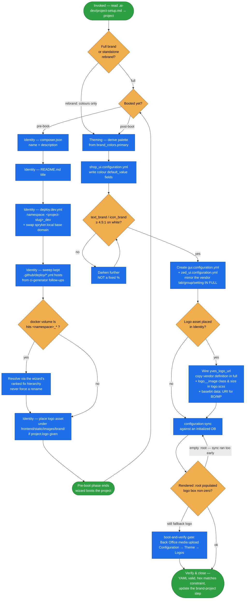

# brand-project

Make the shop present as **the customer's brand, not Spryker's** — project name, dev domain,
docker namespace, colour palette, and logo.

Judgment edits on a few files, driven by `.ai-dev/project-setup.md` → `project`
(`name`, `dev_domain`, `brand_colors`, optional `logo`). It runs as a wizard step at project
start and as a standalone, repeatable rebrand afterwards.

## When it triggers

Applying or changing a Spryker project's brand identity: "change the palette", "apply a new brand
colour", "set the storefront logo", "rebrand the shop" — plus the pre-boot wizard step 3 that sets
project name, dev domain, and docker namespace. Works pre- or post-boot.

## The split that governs everything: pre-boot vs post-boot

The skill has **two phases, split by the first boot**:

| Phase | When | Why it can't move |
|---|---|---|
| **Identity** | pre-boot (wizard step 3) | Needs no `vendor/`, no DB. Pure file edits. |
| **Theming** | post-boot | Needs `vendor/` (to mirror setting definitions in full), an initialized DB (`configuration:sync` compiles the settings map), and a running shop to verify the render. |

Attempting theming at step 3 is explicitly out — the wizard returns to it in the boot-and-verify
phase, the same way `configure-codebase` is split.

## Flow schema

## Palette derivation

Colour setting keys live in `data/configuration/shop_ui.configuration.yml`; the skill writes the
**`default_value`** field of each, in place, at string level — never restructuring the yml or
dropping comments, and only touching hex values matching `^#[0-9A-Fa-f]{6}$`.

| shop_ui key | value |
|---|---|
| `background_brand_primary`, `border_brand` | primary |
| `background_brand_hover` | darken(primary, ~20%) |
| `text_brand`, `icon_brand` | darken until **≥ 4.5:1 on white** (WCAG AA) — not a fixed % |
| `background_brand_pressed` | darken(primary, ~40%) |
| `background_brand_subtle` | lighten(primary, ~92%) |
| `focus_ring`, `shadows_focus_color` | lighten(accent ∥ primary, ~75%) |
| `header_topbar`, `footer_newsletter` | dark neutral from the primary hue |
| others (`header_main`, `footer_main`, `header_nav`, …) | keep shipped defaults unless an accent is given |

## Design decisions baked in

- **Contrast, not a fixed formula, for text/icon roles.** `darken(~20%)` works for a dark primary
  and FAILS for light/warm hues — amber `#F0B323` darkened 20% is `#c08f1c` = 2.9:1 on white, below
  AA. Roles rendered as text or icons must be darkened until they clear 4.5:1.
- **`default_value`, never `configuration_value.csv`.** The shipped `configuration-value` importer
  stores a blank global-scope `scope_identifier` as `''` while the reader matches `IS NULL`, so
  imported global values never resolve. The skill ships *defaults*, so a business admin's Back Office
  override survives a re-run and "Use Default" returns to this palette.
- **Mirror vendor setting definitions in full.** A partial definition (just `key` + `default_value`)
  fails `configuration:sync` schema validation and aborts the install — every required field the
  schema demands is copied, and only the colour changes.
- **The docker namespace also names the VOLUMES.** `docker/sdk up` recreates the database but
  **reuses existing named volumes**, so a colliding namespace gives a fresh DB behind stale KV /
  search / broker read models carrying another project's stores and IDs — a false-green generator.
  Pre-flight checks `docker volume ls` and defers to the wizard's ranked fix hierarchy.
- **BO/MP logos go in as base64 `data:` URIs.** `frontend/static/` is Yves-only, and the BO/MP asset
  dirs are gitignored and regenerated by `frontend:zed:build` — a dropped file is neither committable
  nor durable. The BO login and sidenav are dark, so they take a **reversed** lockup; the MP chrome
  is light and takes the standard one.
- **A correctly-configured logo can still render at 0×0.** `logo.twig`'s configured branch emits a
  bare `` with no class while only the SVG fallback is sized — so the skill adds a
  `logo__image` class and explicit dimensions, and the gate measures the rendered box, not asset
  reachability.

## Known limits, flagged rather than chased

- Only the **horizontal lockup** has a config wiring point on a stock clone. A favicon or app-tile
  variant needs a post-boot Yves head-template override — marked as such, not silently produced.
- `.zed-logo-sm` (collapsed BO sidebar) reads `--zed-spryker-logo-small-url`, which no setting sets.
  That surface cannot be branded through this mechanism.
- No logo provided means the storefront keeps the Spryker fallback icon — flagged as go-live debt.
  The skill never generates a logo.

## Standalone rebrand

Changing an already-set-up project's palette is this same skill with **only the Theming section** —
Identity is skipped, since name/domain/docker/README are settled. Take the new primary (+ optional
accent), re-derive the table, apply it. Then: on a booted project `docker/sdk console
configuration:sync` recompiles the settings map and the values reach the storefront and Back Office
(verify the rendered `:root`, not a DB row) — no publish, no reset. Pre-boot, nothing to run; the
values flow at the next boot. Repeatable any number of times.

## Related references

Theming/logo failure-signature triage lives in the Known-traps catalog,
`../project-starter-wizard/references/pitfalls.md`. The full list of colour setting keys and how to
re-derive it lives in `../spryker-import-tools/references/demo-facts.md#colours`.

## Packaging note

This skill ships in the `spryker-ai-dev-sdk` plugin under `vendor/spryker-sdk/ai-dev/…`, which is
Composer-managed — `composer update spryker-sdk/ai-dev` may overwrite it. The durable home for edits
is the plugin's own repository (`github.com/spryker-sdk/ai-dev`).
