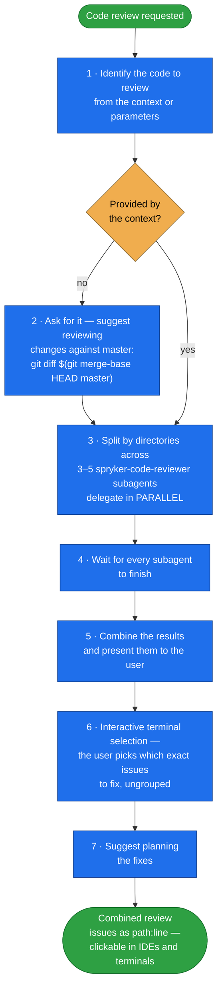

# code-review

**Parallel code review by fan-out.** Splits the code under review across 3–5
`spryker-code-reviewer` subagents by directory, runs them at once, then combines their findings into
one list you pick from.

The skill itself is deliberately thin — it is the dispatcher. The actual Spryker review criteria
live in the `spryker-code-reviewer` subagent it delegates to.

## When it triggers

Whenever a code review is requested.

## Flow schema

## Output

Issues are always reported as `<path_from_git_root>:<line_number>` — e.g.
`src/Spryker/Session/src/Spryker/Yves/Session/SessionConfig.php:10` — the format most IDEs and
terminals turn into a clickable jump to the exact line.

The final selection step lists issues **individually, not grouped**, so the user chooses precisely
what gets fixed before any planning starts.

## Packaging note

This skill ships in the `spryker-ai-dev-sdk` plugin under `vendor/spryker-sdk/ai-dev/…`, which is
Composer-managed — `composer update spryker-sdk/ai-dev` may overwrite it. The durable home for edits
is the plugin's own repository (`github.com/spryker-sdk/ai-dev`).
