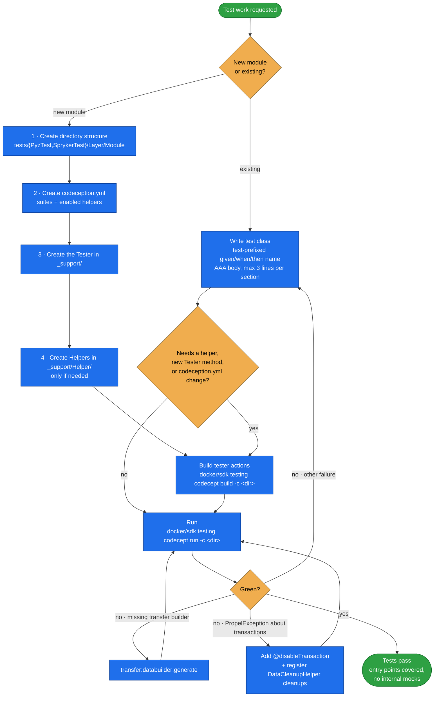

# codecept-functional

Write, fix, and run **Codeception tests that follow Spryker conventions** — expressive naming, AAA
structure, entry-point focus, and helpers for anything reusable.

Codeception in Spryker has a lot of surface: a per-module `codeception.yml`, a generated tester
Actor, Testify helpers, data builders, and a `codecept build` step that must be re-run whenever any
of that changes. This skill is the convention sheet plus the exact commands, so a test lands in the
right directory, uses the right helper, and actually runs.

## When it triggers

Whenever tests under `src/**/tests/**` or `tests/**` are being created, updated, fixed, edited, or
run — functional tests, unit tests, any Codeception suite.

## Flow schema



## The rules that shape every test

| Rule | What it means |
|------|---------------|
| **Entry-point focus** | Test Facades, Controllers, and Console Commands — not method flows. Verify outcomes. |
| **Naming** | `test` prefix, given/when/then or outcome-focused: `testGivenValidQuoteWhenPlacingOrderThenOrderIsCreatedSuccessfully()`. Not `testPlaceOrder()`. |
| **Body** | `// Arrange` `// Act` `// Assert` (`// Expect` optional for exception setup); max 3 lines per section — extract the rest to helper methods. |
| **Setup** | Per-test `setUp()` only. **Never** `setUpBeforeClass()` or global class-wide setup. |
| **Coverage** | As **few** tests as possible to cover core functionality. |
| **Data** | DataBuilders for transfers (`(new QuoteBuilder())->withItem(…)->build()`), tester `have*()` helpers for entities, unique IDs (`uniqid()`) to avoid collisions. |
| **Mocking** | Mock **only** Config and 3rd-party external APIs. **Never** mock Facade, Plugins, Factory, Repository, EntityManager — use the real ones via `$this->tester->getFacade()` / `getFactory()`. |
| **Cleanup** | Where `TransactionHelper` can't apply (`@disableTransaction`), register `DataCleanupHelper::_addCleanup()` callbacks inside `have*()` helpers so the DB isn't polluted. |

## Usage

```bash
# Build tester actions — required after a new module, new helper, or a codeception.yml change
docker/sdk testing codecept build -c path/to/codeception.yml

# Run every test in a module
docker/sdk testing codecept run -c path/to/codeception.yml

# Run one suite
docker/sdk testing codecept run -c path/to/codeception.yml -g Business

# Run one file, or one method
docker/sdk testing codecept run tests/SprykerTest/Zed/ModuleName/Business/SomeFacadeTest.php
docker/sdk testing codecept run tests/SprykerTest/Zed/ModuleName/Business/SomeFacadeTest.php::testSpecificMethod

# Verbose
docker/sdk testing codecept run -c path/to/codeception.yml -vvv

# Generate a data builder for a transfer that has none
docker/sdk testing console transfer:databuilder:generate
```

## What the skill spells out

- **Directory structure** for `tests/{PyzTest,SprykerTest}/` across Zed, Client, Service, Glue,
  Shared, and Yves — including where `_support/Helper/` and `_support/PageObject/` go.
- **Module tester** at `tests/SprykerTest/[Layer]/[Module]/_support/[Module][Layer]Tester.php`, with
  the `have[Entity]()` / `see[Entity]()` method convention and the `@method` docblock that types
  `getFacade()` / `getFactory()`.
- **`codeception.yml`** skeleton: namespace, paths, coverage whitelist, and the `modules.enabled`
  list of Testify helpers.
- **Key helpers** and what each unlocks — `ConfigHelper`, `DependencyHelper`, `LocatorHelper`,
  `DataCleanupHelper`, `BusinessHelper`, `CommunicationHelper`, `ConsoleHelper`, `TransactionHelper`,
  plus the Publish & Synchronize set (`PublishAndSynchronizeHelper`, `EventBehaviorHelper`,
  `QueueHelper`, `StorageHelper`, `SearchHelper`).
- **P&S testing flow** — save/update/delete an entity, then assert it published, synchronized, and
  landed in (or was removed from) storage.
- **Console command tests** via `$this->tester->getConsoleTester($command)`, asserting the status
  code and display output.

## Packaging note

This skill ships in the `spryker-ai-dev-sdk` plugin under `vendor/spryker-sdk/ai-dev/…`, which is
Composer-managed — `composer update spryker-sdk/ai-dev` may overwrite it. The durable home for edits
is the plugin's own repository (`github.com/spryker-sdk/ai-dev`).
