# configure-codebase

Make a Spryker project's **custom namespace actually resolve, build, lint and test** — namespace
registration across every config overlay, composer autoload, frontend build wiring, phpcs/eslint
configs, and a committed **runnable** codeception seed.

The deliverable is not "ready to write tests". It is: a class in `src/<Ns>/…` overrides Pyz/core, a
Yves component under `src/<Ns>/Yves/*/Theme` compiles, and `codecept build` + `codecept run` on a
committed example module come back green — an empty `.gitkeep` tree proves nothing.

## When it triggers

When a Spryker project adopts a **custom namespace instead of `Pyz`** and the code layer must be
wired for it. It is step 2 of the [project-starter-wizard](../project-starter-wizard/README.md),
pre-boot, and **skipped entirely when the project keeps Pyz** — the skill reads
`.ai-dev/project-setup.md` → `namespace`, records `skipped (keep-Pyz)` on `mode: keep-pyz`, and stops.

## Flow schema

```mermaid
flowchart TD
    A([Invoked]) --> R["Read .ai-dev/project-setup.md<br/>→ namespace"]
    R --> M{"mode: keep-pyz?"}
    M -- "yes" --> SK([Record skipped keep-Pyz<br/>and stop])
    M -- "no — Ns = namespace.name" --> E1

    E1["1 · Register the namespace<br/>config_default.php:<br/>PROJECT_NAMESPACE + PROJECT_NAMESPACES<br/>+ GlueBackendApiApplicationConstants"]
    E1 --> E1B{"Grep every<br/>config_default-*.php overlay<br/>for a PROJECT_NAMESPACE<br/>re-assignment"}
    E1B -- "found (docker.dev, ci)" --> E1C["Patch each overlay to<br/>['Ns','Pyz'] — the base-file<br/>edit alone is NOT registration"]
    E1C --> E1D
    E1B -- "none left" --> E1D["Append 'src/Ns' to<br/>sourceDirectories() in all THREE<br/>spryker_api_platform.php files"]

    E1D --> E2["2 · Autoload<br/>composer.json psr-4:<br/>Ns → src/Ns<br/>NsTest → tests/NsTest"]
    E2 --> E3["3 · Skeletons<br/>src/Ns/{Client,Glue,Service,<br/>Shared,Yves,Zed} + Zed/Translator/data<br/>tests/NsTest/{Zed,Yves,Glue,Shared}"]

    E3 --> E4["4 · Test infrastructure<br/>root codeception.yml include + whitelist<br/>EVERY aggregate suite config found by<br/>ls tests/codeception.*.yml<br/>test-autoload.php NsTest branch"]
    E4 --> SH{"Store helper already<br/>shipped by this clone?<br/>grep the suite codeception.yml files"}
    SH -- "present, suites repointed" --> INH["Inherit it — follow the<br/>pattern for new suites"]
    SH -- "absent" --> CRE["Create PyzTest StoreDependencyHelper<br/>resolving the store from the DB,<br/>repoint every suite modules.enabled"]
    INH --> SEED
    CRE --> SEED

    SEED["Seed module tests/NsTest/Shared/Example<br/>namespace: NsTest\\Shared\\Example<br/>LocatorHelper projectNamespaces: ['Ns','Pyz']<br/>ExampleCest + ProjectNamespaceCest<br/>assert via the actor, never static Assert::"]
    SEED --> SWEEP["Sweep EVERY projectNamespaces:<br/>already in tests/ and prepend Ns<br/>— can move test outcomes, apply deliberately"]

    SWEEP --> E5["5 · Frontend build — probe THREE shapes<br/>(a) projectNamespaces array → add<br/>(b) no array → append to<br/>componentEntryPoints/shopUiEntryPoints dirs<br/>(c) no settings.js — test the FACT:<br/>which settings file exists + ShopUi version<br/>≥2.0.0 → yves.settings.mts,<br/>else DEFER as post-boot verification<br/>tsconfig include · package.json globs<br/>LEAVE tsconfig.yves.json paths aliases"]
    E5 --> E6["6 · phpcs.xml<br/>add Ns to MethodAnnotation.* lists<br/>IF the clone ships them<br/>leave SprykerNamespace = Pyz"]
    E6 --> E7["7 · eslint.config.mjs<br/>fix the Yves-TS glob that matches<br/>no project code — a post-boot gate<br/>with a NAMED rollback"]
    E7 --> E8["8 · architecture-sniffer<br/>optional — flag, don't assume"]

    E8 --> VER{"Verify (static)<br/>Grep PROJECT_NAMESPACE across ALL<br/>config_default*.php — Ns in every one?<br/>BOTH NsTest AND PyzTest in the root +<br/>every tests/codeception.*.yml + whitelists?<br/>ZERO projectNamespaces: ['Pyz'] in tests/?<br/>php -l · JSON-validate with php"}
    VER -- "an overlay still ['Pyz']" --> E1C
    VER -- "clean" --> POST(["Step done — but two GREEN PROOFS are<br/>post-boot (vendor/ needed):<br/>codecept build/run on the seed, and the<br/>Yves add-component + override-component probe"])
```

## What "runnable test infrastructure" means here

A test only runs when its module has a `codeception.yml` **and** the aggregate suite configs include
the namespace. All four are required — the first three pre-boot, the fourth verified post-boot:

| Piece | Why it's not optional |
|-------|-----------------------|
| Root `codeception.yml` | `include` + coverage whitelist for `tests/<Ns>Test/*/*` and `src/<Ns>/*.php`. |
| Every aggregate suite config | Discovered with `ls tests/codeception.*.yml` — today `codeception.acceptance.yml`, `codeception.api.yml`, `codeception.ci.functional.yml`, but those are **examples, not the set**. Each ships `PyzTest/*/*` only; patching just the root config leaves them blind. |
| The seed module | `tests/<Ns>Test/Shared/Example/` is both the green proof and the canonical copy-me template, carrying the `namespace:` + `projectNamespaces: ['<Ns>','Pyz']` shape every later module copies. |
| The post-boot run | `codecept build` then `codecept run -c tests/<Ns>Test/Shared/Example Example` → `OK`, executed by [boot-and-verify](../boot-and-verify/README.md) because `vendor/` doesn't exist pre-boot. |

## Design decisions baked in

- **Every filename here is an example of a class, never a closed list — classify by property, then
  discover.** Files that need `<Ns>` are identified by what they *are*, not by being named: an
  aggregate suite config is any `tests/codeception.*.yml`; a namespace-pinned suite is any hit of
  `grep -rln 'projectNamespaces' tests/`; a namespace re-assignment is any hit of `PROJECT_NAMESPACE`
  across `config/Shared/config_default*.php`; a Pyz-hardcoded discovery path is any
  `sourceDirectories(...)` under `config/*/packages/`; a namespace-aware lint config is any
  ruleset carrying a hardcoded namespace list (`phpcs.xml`, `phpstan.neon`, …). Clones differ and
  new files of these shapes appear as the demoshop evolves — run the discovery command and apply
  the same rule to whatever it returns, including files not named anywhere in this skill.
- **Placement principle — it governs the whole project run, not just this step.** Once `<Ns>` wins
  resolution, every project-level PHP customization is created in `src/<Ns>/…` **extending the Pyz
  class** (or core only where no Pyz counterpart exists), and `src/Pyz` is left pristine as the
  inherited demoshop layer. Extending core when a Pyz class exists silently drops its overrides.
- **The overlays clobber the base file.** `config_default-docker.dev.php` and `config_default-ci.php`
  re-assign `GlueBackendApiApplicationConstants::PROJECT_NAMESPACES = ['Pyz']` — in exactly the
  environment the first boot runs, and in CI. Registration is only complete when a grep across
  *every* `config_default*.php` shows `<Ns>` in every assignment.
- **A suite can go green on the wrong values.** `LocatorHelper` **overwrites** the runtime
  `PROJECT_NAMESPACES` from the suite's own YAML, so a suite left on `['Pyz']` exercises `src/Pyz`
  and never touches your overrides — nothing fails. That also makes a
  `Config::get(PROJECT_NAMESPACES)` assertion useless; the seed asserts what the suite *cannot*
  fake (composer autoload wiring, and resolver precedence once a real override exists).
- **The shipped tests assume store `DE`.** The core `StoreDependencyHelper` hardcodes
  `DEFAULT_STORE = 'DE'`, so a non-`DE` project throws `StoreNotFoundException` deep inside a plugin
  and reads as a code bug. The fix is a project-level helper resolving the store from the DB — with
  a detect-first grep, because some clones already ship it and some don't.
- **Inspect the file's real shape before editing it — and accept that it may not exist.**
  `frontend/settings.js` comes in three shapes, the third being **absent**: from ShopUi **2.0.0** the
  Yves builder is vendorized and the project settings file becomes `frontend/yves.settings.mts`
  (`yves:*` scripts re-pointed, Node 24+). The branch is chosen by testable facts — which settings
  file exists, and the installed ShopUi version — not by how recent the clone is, and the skill
  documents the behaviour inline so it does not depend on the `spryker-upgrade` skill being
  installed. `vendor/` doesn't exist pre-boot, so that half becomes a recorded **post-boot
  verification** — an add-a-component *and* override-a-component probe — rather than a silent
  "done". `phpcs.xml` may ship no `MethodAnnotation.*` rules at all. Match what's there rather than
  forcing the expected shape.
- **`tsconfig.yves.json`'s `paths` aliases are deliberately left alone.** The build resolves each
  alias to its first entry, so prepending an empty `src/<Ns>/Yves` skeleton aborts
  `frontend:yves:build`. The namespace is wired through `settings.js` dirs instead.
- **A mandate with no greppable check does not survive the run.** Step 4's two test-scoping
  mandates (every aggregate config; the `projectNamespaces` sweep) are commonly skipped, so
  § Verify checks them instead of trusting them: it greps for `<Ns>Test` **and** `PyzTest` in the
  root config and every `tests/codeception.*.yml`, plus both coverage whitelists, and for **zero** `projectNamespaces: ['Pyz']` under `tests/`. The failure is
  bidirectional — one direction runs only `<Ns>`, the other only `Pyz`, and each reports `OK` while
  testing half the code.
- **An `include` glob that matches nothing is a project-wide fatal.** `include: tests/<Ns>Test/*/*`
  without a real module `codeception.yml` under it makes `codecept` unloadable
  (`Configuration file(s) could not be found in "tests/<Ns>Test/*/*"`) — nothing runs, not even
  `PyzTest`. The include and the seed module are one atomic edit. And `<Ns>Test` gets no
  auto-generated `@group` annotations (the upstream sniff matches `SprykerTest|PyzTest` only), so the
  acceptance/api includes stay inert until each cest carries a hand-written group block.
- **Project-authored test code goes in `tests/<Ns>Test/`, never `tests/PyzTest/`** — anything in the
  Pyz tree sits in the merge path the next time it re-syncs from upstream. Closing check:
  `find tests/PyzTest -newer composer.json`.

## Output

A wired code layer plus a **dev-loop reference** for the team (verified edit→effect): which console
command each kind of change needs — `cache:class-resolver:build` for a class override,
`transfer:generate` for transfers, the Propel schema chain, and the copy-the-seed recipe for a new
test module. Runtime proof is deferred to [boot-and-verify](../boot-and-verify/README.md); the
eslint glob fix is recorded as a post-boot gate with a named rollback.

## Packaging note

This skill ships in the `spryker-ai-dev-sdk` plugin under `vendor/spryker-sdk/ai-dev/…`, which is
Composer-managed — `composer update spryker-sdk/ai-dev` may overwrite it. The durable home for edits
is the plugin's own repository (`github.com/spryker-sdk/ai-dev`).
