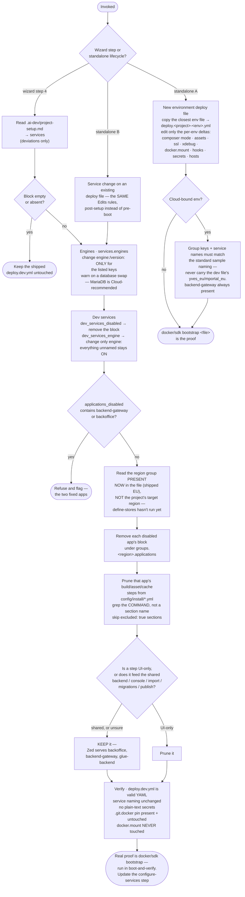

# configure-services

Put the project's chosen **engines, optional dev services and applications into `deploy.dev.yml`** —
and prune a disabled app's build steps out of the install recipes, so a dropped app stops costing
boot time as well as serving traffic.

The clone ships **everything enabled**. So every edit here is a *deviation* from the shipped deploy
file — a swap or a disable, never an "enable". An empty or absent `services` block in the state file
means keep the demoshop default untouched.

## When it triggers

When changing what infrastructure a Spryker project runs on: swap or disable an engine (database,
search, broker, key-value store, session), turn off an optional dev service (mail catcher, swagger,
dashboard, redis-gui, webdriver, scheduler), disable an application, or build a new environment
deploy file (`deploy.<project>-<env>.yml`).

It is step 4 of the [project-starter-wizard](../project-starter-wizard/README.md) — pre-boot, before
[define-stores](../define-stores/README.md) — and remains the standalone deploy-file lifecycle skill
afterwards.

## Flow schema

## The two fixed applications

Every application in the deploy file is a project choice **except two**, and the skill refuses if
either shows up in `applications_disabled`:

| App | Why it is never disablable |
|-----|----------------------------|
| `backend-gateway` | The primal `HOST_ZED_API` Zed RPC gateway that every Yves *and* Glue business call routes through — the one hard boot dependency. |
| `backoffice` | Kept mandatory: the vendored Cypress E2E baseline exercises admin flows, and a demoshop-derived project realistically always wants an admin panel. |

The rest are genuine choices — `yves` (dropping it means headless), `merchant-portal`, `glue`,
`glue-backend`, `static` (Storybook). Disabling an app removes only its deploy **endpoint**:
`backoffice`, `backend-gateway` and `glue-backend` share the one Zed backend, so console, data
import and OMS are unaffected. Spryker ships a `docker.ci.acceptance-no-mp.yml` install recipe,
confirming merchant-portal is officially optional.

## Design decisions baked in

- **A disabled app still burns boot time until its recipe steps go too.** The install recipes run
  each app's frontend/asset/cache commands unconditionally — disabling `static` without pruning
  still runs `frontend:storybook:build` at boot, building assets nobody serves.
- **Grep for the command, not the section name.** Recipe section names drift (`build-static`,
  `build-static-production` with `excluded: true`, `build-static-development`) and storybook sat in
  production *and* development, not in `build-static`. Find every step running the command and
  prune the ones in active sections.
- **When unsure whether a step is UI-only or backend-shared, keep it.** The cost of keeping a step
  is boot time; the cost of pruning a shared one is a broken backend.
- **The region group is read from the file, not from the state file.** This step runs *before*
  [define-stores](../define-stores/README.md) renames the region, so `groups.<project-region>`
  doesn't exist yet — the shipped `EU` group is what's actually there.
- **Anchored edits, never parse→dump.** Rewriting the YAML reformats it and drops comments; locate
  the section and edit in place.
- **`docker.mount` is never touched.** The per-OS file-sync blocks are not service config, and
  macOS must stay on `mutagen` — native bind-mounts are unusably slow for Spryker on Mac.
- **Standard service naming is a go-live requirement.** The Cloud checklist requires names matching
  the sample deploy file exactly, so services are never renamed.

## Output

An edited `deploy.dev.yml` carrying only the chosen deviations, matching install recipes with the
disabled apps' UI/asset/build steps pruned, and the `configure-services` step updated in the state
file. Validity is proven by `docker/sdk bootstrap`, which runs in
[boot-and-verify](../boot-and-verify/README.md) — not here.

## Packaging note

This skill ships in the `spryker-ai-dev-sdk` plugin under `vendor/spryker-sdk/ai-dev/…`, which is
Composer-managed — `composer update spryker-sdk/ai-dev` may overwrite it. The durable home for edits
is the plugin's own repository (`github.com/spryker-sdk/ai-dev`).
