# curate-golive-data

A **go-live checklist for data** — run late on a Spryker project that already boots green, to turn
dev-adapted data (English copies, demo imagery, placeholder tax rates, demo accounts) into data a
real shop can launch on.

It closes the go-live liabilities that `project-data`'s adapt strategy flags and `boot-and-verify`
lists at close. Data only: it is **not** infra/deploy hardening (that's `configure-services`) and not
code.

## When it triggers

Before go-live, on a project that already boots:

- "make the data production-safe", "go-live data pass", "we're launching next week";
- real tax rates instead of placeholders; the customer's own imagery instead of Spryker-CDN URLs;
- demo accounts and passwords removed or rotated; remaining demo leftovers cleared;
- integrity re-verified on the data being kept.

**Boundary vs `project-data`'s cleanup strategy:** this pass makes the data you are **keeping**
production-safe. Dropping a whole demo domain ("remove all the demo customers") is `cleanup`, run any
time. Rule of thumb — *"make X real for launch"* → here; *"drop the demo X"* → `project-data`.

Real translation mechanics live in `translate-content`; this skill only flags which locales are still
English copies.

## Flow schema

```mermaid
flowchart TD
    A([Trigger: pre-launch data pass<br/>project already boots green]) --> SC["Scan for the SHAPE, not the names<br/>scoped to the ACTIVE manifest bucket<br/>decide explicitly on CI/fixture buckets"]
    SC --> C1["1 · Real tax rates<br/>every go-live country's statutory rate<br/>set --where country_name=X (required)<br/>remove countries you don't sell to"]
    C1 --> C2["2 · Customer imagery<br/>replace cloudfront URLs with<br/>developer-supplied asset URLs"]
    C2 --> C3["3 · Demo accounts + weak passwords<br/>delete or rotate; note customer_reference<br/>still carrying the old demo store token"]
    C3 --> C4["4 · Real translations<br/>FLAG the English-copy locales<br/>defer to translate-content"]
    C4 --> C5["5 · Legal &amp; consent content<br/>GTC · Imprint · Privacy · Terms<br/>+ email sender identity"]
    C5 --> LEGAL{"Any page still<br/>holding demo copy?"}
    LEGAL -- "yes" --> BLOCK["List it as a BLOCKING go-live item<br/>compliance incident — never<br/>author legal text yourself"]
    LEGAL -- "no" --> C6
    BLOCK --> C6

    C6["6 · Remaining leftovers<br/>placeholder copy · unreferenced rows<br/>delete now-orphan CSVs"]
    C6 --> DG{"Destructive step?<br/>delete · reset · clean-data"}
    DG -- "yes" --> ASK["Preview → announce in ONE line<br/>→ explicit yes"]
    ASK --> C7
    DG -- "no" --> C7

    C7["7 · Release gate<br/>absent sweep = zero hits<br/>product-refs · refs --composite<br/>price completeness: empty OR literal 0<br/>is_searchable · per store×locale grid"]
    C7 --> GATE{Gate clean?}
    GATE -- "no" --> C6
    GATE -- "yes" --> APPLY{Booted?}
    APPLY -- "pre-boot" --> REP
    APPLY -- "running" --> LADDER["Iteration ladder<br/>data:import -c for adds/edits<br/>reset for deletions/value changes<br/>then drain the queues + re-verify"]
    LADDER --> REP(["Report: what was curated<br/>+ developer-supplied inputs still owed"])

    classDef step fill:#1f6feb,stroke:#0b3d91,color:#fff;
    classDef decision fill:#f0ad4e,stroke:#8a6d3b,color:#000;
    classDef terminal fill:#2ea043,stroke:#176f2c,color:#fff;
    class SC,C1,C2,C3,C4,C5,BLOCK,C6,ASK,C7,LADDER step;
    class LEGAL,DG,GATE,APPLY decision;
    class A,REP terminal;
```

## The checklist

| # | Item | What "done" means |
|---|---|---|
| 1 | **Real tax rates** | Every go-live country carries its correct statutory rate (developer-supplied — never invented). Demo countries you don't sell to are removed. |
| 2 | **Customer imagery** | No Spryker-CDN (`*.cloudfront.net`) URLs remain in product, category, CMS or merchant image columns — replaced with the customer's own asset URLs. |
| 3 | **Demo accounts + passwords** | Demo customer rows removed, or any surviving seed login rotated to a strong developer-supplied password. Demo `customer_reference` values carrying the old store token rewritten or dropped. |
| 4 | **Real translations** | Each still-English locale is *flagged*; the actual work is `translate-content`. |
| 5 | **Legal & consent content** | GTC, Imprint, Privacy, Terms pages and the transactional-email sender identity all carry customer-supplied text. Anything still on demo copy is listed as blocking. |
| 6 | **Remaining leftovers** | Placeholder copy, unreferenced demo rows and now-orphan CSV files cleared. |
| 7 | **Release gate** | `absent` sweep clean over the active bucket; `product-refs` zero orphans; `refs` (composite where a parent is store-scoped); price completeness per store×currency; `is_searchable.<locale>`; the full per store×locale grid. |

## Design decisions baked in

- **Never fabricate a go-live input.** Tax rates, asset URLs and legal text are developer-supplied.
  The skill's job is to detect what's missing and demand it, not to invent a plausible value.
- **Legal copy is the failure no mechanical sweep catches.** Demo GTC/Imprint/Privacy text passes
  every cloudfront and password check and is still a compliance incident at launch — so it gets its
  own checklist item, listed as blocking.
- **`required` does not catch a priced-at-zero store.** A literal `0` passes a non-empty check;
  empty **and** `0` both mean "no price", so zero is scanned for separately.
- **Scope the sweep to the active manifest's bucket.** The tree also holds CI/fixture buckets
  (`b2b_common/`, `robot/`, `b2b_robot/`) the boot never reads — whether they are inside the go-live
  bar is an explicit decision, not a silent one.
- **The `set` `--where` is load-bearing.** Without it, setting a tax rate overwrites every country's
  rate in the file.
- **A green boot proves none of this.** The release gate re-runs integrity and completeness itself.
- **One gap is named, not hidden.** Hardcoded fallback secrets in config (the shipped fallback
  encryption key, `?: 'change…'` patterns) fall between this data-only skill and
  `configure-services`' deploy-file scope — the skill says so explicitly and recommends the team grep
  for them, rather than implying coverage it doesn't have.

## Packaging note

This skill ships in the `spryker-ai-dev-sdk` plugin under `vendor/spryker-sdk/ai-dev/…`, which is
Composer-managed — `composer update spryker-sdk/ai-dev` may overwrite it. The durable home for edits
is the plugin's own repository (`github.com/spryker-sdk/ai-dev`).
