# cypress-migration

Onboard a Spryker project onto a **project-owned Cypress E2E baseline** in place of Spryker's
internal demo-shop test suites — remove `spryker/cypress-tests` / `spryker/robotframework-suite-tests`,
vendor in the battle-tested `tests/cypress-boilerplate/` implementation, wire CI, and generate the
companion day-to-day `cypress-tests` skill for the target project.

A one-time setup/migration. Its defining discipline: **every step discovers facts about the target
project before acting** — file names, job names, hostnames, locator conventions are grepped and
verified in the repo you're actually in, never assumed from the reference project. Several
verification sub-steps exist specifically because assuming instead of verifying caused real mistakes
the first time this migration was run.

## When it triggers

"Migrate off spryker/cypress-tests", "remove the demo-shop cypress/robot suites", "set up
project-owned cypress testing", "bootstrap cypress-boilerplate for this project", "onboard this
project onto cypress", "integrate cypress-boilerplate" — or any request to replace the internal
Spryker test packages with a project's own Cypress setup.

## Proven vs. not proven — read this before trusting a step

The two halves of this migration have very different track records in the reference repo
(`spryker-shop/b2b-demo-marketplace`):

| Half | Status |
|---|---|
| **Steps 6–11** — the vendored suite, its CI jobs, the companion skill | **Proven.** Built and debugged against a live Spryker B2B Marketplace instance. |
| **The removal half** — Step 2, plus the CI/config removal now owned by `project-ci-generator` | **Never executed end-to-end.** The reference repo is Spryker's own *product* repo — it still needs its demo-shop suites, so its boilerplate work was purely additive. Treat the removal as a careful plan, not a proven script; verify each deletion with the greps given. |

Instead of deleting its own suites, the reference repo **labels everything an adopting project
should delete** (the `REMOVE FOR PROJECT` banner) — that inventory is the authoritative removal list.

## Flow schema

```mermaid
flowchart TD
    A([Invoked: migrate onto project-owned Cypress]) --> S1{"Step 1 — Confirm scope<br/>grep composer.json for<br/>cypress-tests / robotframework"}

    S1 -- "neither present" --> S6
    S1 -- "found" --> WIZ{"Under the<br/>project-starter wizard?"}

    WIZ -- "yes — pre-boot, no vendor/" --> S2A["Step 2 — edit composer.json ONLY<br/>lock + vendor/ sync at first boot"]
    WIZ -- "no — standalone, installed" --> S2B["Step 2 — remove require-dev,<br/>repositories, installer-types/paths<br/>then composer update --lock<br/>+ composer install"]

    S2A --> S2C
    S2B --> S2C["Check leftover untracked installer dir<br/>git status --porcelain &lt;path&gt;<br/>?? = stale artifact, safe to delete"]

    S2C --> S3{"Step 3 — CI + deploy/install removal<br/>owned by project-ci-generator<br/>did it run?"}
    S3 -- "wizard: ci-generator ran" --> S3A["VERIFY, don't redo<br/>grep .github/workflows, config/install,<br/>.github/deploy — only the KEPT<br/>cypress-boilerplate job may survive"]
    S3 -- "standalone" --> S3B["Do the removal per ci-generator guidance<br/>mind the two traps: near-identical<br/>kept-vs-dropped filenames, and a<br/>*_ROBOT.yml shared with demodata import"]

    S3A --> S5
    S3B --> S5["Step 5 — clean up .gitignore<br/>grep before removing any entry<br/>Step 4 folded into Step 3"]

    S5 --> S6["Step 6 — detect the project's<br/>locator convention<br/>grep data-qa / data-testid / data-cy"]
    S6 --> S6D{"A convention<br/>already in real use?"}
    S6D -- "yes" --> S7
    S6D -- "none yet — data-qa default" --> ASK["CONFIRM with the user explicitly<br/>project-wide + expensive to reverse"]
    ASK --> S7

    S7["Step 7 — vendor tests/cypress-boilerplate/<br/>from spryker-shop/b2b-demo-marketplace"]
    S7 --> LS{"ls &lt;scratch&gt;/tests/cypress-boilerplate/<br/>package.json present?"}
    LS -- "no" --> BR["git ls-remote --heads<br/>re-clone the branch that carries it<br/>add-cypress-boilerplate"]
    BR --> LS
    LS -- "yes" --> RSYNC["rsync into tests/cypress-boilerplate/<br/>git check-ignore must print nothing"]

    RSYNC --> ADAPT["Adapt by DISCOVERY:<br/>package.json name · endpoint URLs incl.<br/>mandatory GLUE_BACKEND_URL · PROJECT_LOCATION<br/>in EVERY .envs file · DEFAULT_PASSWORD ·<br/>PRODUCT_PRICE_ABOVE_THRESHOLD ·<br/>CurrencyDataHelper + its enable line ·<br/>selectors if Step 6 differs"]
    ADAPT --> NOSTORE["Do NOT set store/locale/currency/country —<br/>resolveStoreContext POSTs getAllowedStore<br/>to glue-backend /dynamic-fixtures once per run"]

    NOSTORE --> S8["Step 8 — add smoke tests:<br/>homepage → search/PDP → add-to-cart,<br/>and a full checkout"]
    S8 --> RUN{"npm ci · lint:check ·<br/>prettier:check · cy:run<br/>all pass?"}
    RUN -- "no" --> S8
    RUN -- "no local instance" --> SAY["Say so explicitly —<br/>never claim this step passed"]
    SAY --> S9
    RUN -- "yes" --> S9["Step 9 — wire CI on the project's<br/>existing acceptance stack:<br/>lint job + E2E job that needs: it"]

    S9 --> YAML{"python3 yaml.safe_load<br/>parses?"}
    YAML -- "no" --> S9
    YAML -- "yes" --> S10["Step 10 — generate the companion<br/>.claude/skills/cypress-tests/SKILL.md<br/>with DISCOVERED values, not placeholders"]
    S10 --> S11["Step 11 — update project README"]
    S11 --> AC{"Final checklist —<br/>10 acceptance criteria"}
    AC -- "a criterion fails" --> S1
    AC -- "all pass" --> DONE([Project-owned Cypress baseline,<br/>CI, and companion skill committed])

    classDef step fill:#1f6feb,stroke:#0b3d91,color:#fff;
    classDef decision fill:#f0ad4e,stroke:#8a6d3b,color:#000;
    classDef terminal fill:#2ea043,stroke:#176f2c,color:#fff;
    class S2A,S2B,S2C,S3A,S3B,S5,S6,S7,BR,RSYNC,ADAPT,NOSTORE,S8,SAY,S9,S10,S11,ASK step;
    class S1,WIZ,S3,S6D,LS,RUN,YAML,AC decision;
    class A,DONE terminal;
```

## Ownership split with `project-ci-generator`

Step 3 exists to say what this skill does **not** do. The old suites' CI jobs and the
deploy/install-pipeline/fixture configs they referenced are removed by `project-ci-generator` — it is
the CI skill, it decides the robot/acceptance-fixture lane from its interview's `keep_suites`, and it
already rebuilds the pipeline. Keeping the removal here too would re-edit `.github/workflows`,
`config/install/*.yml`, and `.github/deploy/*.yml` at a second point in the run.

- **Under the wizard** — verify rather than redo. A surviving old-suite job is a ci-generator gap to
  report, not something to fix here.
- **Standalone** — do the removal per ci-generator's guidance, honouring its two traps: near-identical
  kept-vs-dropped filenames (`…cypress-boilerplate.yml` kept vs `…cypress.yml` dropped — delete by
  which surviving job references it), and a `*_ROBOT.yml` fixture config that may be shared with the
  regular demodata import.

This skill's own removal is limited to the Composer packages (Step 2).

## Non-obvious constraints the steps encode

- **Store facts are resolved, not configured.** `cypress.config.ts`'s `resolveStoreContext()` POSTs
  `getAllowedStore` to glue-backend `/dynamic-fixtures` once per run and writes `STORE_NAME` /
  `LOCALE_NAME` / `LOCALE_PREFIX` / `CURRENCY_CODE` / `COUNTRY_ISO2` into `config.env`. Hand-setting
  any of them in `.envs` reintroduces a second source of truth.
- **`GLUE_BACKEND_URL` is mandatory** — store-context resolution dies without it. And resolve shop
  facts through *glue-backend*, never storefront Glue `/stores`: `glue` is an optional app, so a suite
  reading it becomes unrunnable on a headless project. (Header `Content-Type:
  application/vnd.api+json`; `application/json` returns a bare 404 that looks like a missing route.)
- **`PROJECT_LOCATION` must be set in every `.envs/.env.<environment>`, including local.** A value set
  only for CI silently no-ops any CLI-exec step (OMS transitions) when run locally, instead of failing
  loudly.
- **A `#key` fixture reference only resolves against an `AbstractTransfer`/`ArrayObject`.** Scalar
  helpers (`haveCurrency`, `haveLocaleStore` — they return `int`) are silently discarded and a later
  `#key` dies with `Undefined array key`. References are also one level deep and can't index arrays.
- **`CurrencyDataHelper` is a two-file pair.** The ~10-line project helper overriding
  `getCurrencyByIsoCode()` and its enable line in
  `tests/PyzTest/Zed/TestifyBackendApi/codeception.dynamic.fixtures.yml` — one without the other is a
  dangling reference. (No `codecept build` needed.)
- **`cy.formatDisplayPrice` is not upstream.** It's absent from `cypress-boilerplate` HEAD and
  implemented three incompatible ways in the wild. Post-vendor it must exist, derive currency and
  locale from the resolved `CURRENCY_CODE`/`LOCALE_NAME`, and pass `currencyDisplay:
  'narrowSymbol'` — ICU's default differs per runtime (UAH: `грн` under Electron, `₴` under Chrome
  and the app's PHP formatter), which reads as an app bug.
- **Never gate on `npm run code:check`.** The boilerplate defines it as `eslint . ; prettier . --check`
  — the `;` means the script exits with *prettier's* status, so a real ESLint failure reports success.
  Run `lint:check` and `prettier:check` separately; this is why the CI job runs them as two steps.
- **Storefront checkout specs must use a non-marketplace payment method** (`dummyPaymentInvoice`)
  while their fixtures put a plain product in the cart — marketplace payment is filtered out of the
  form until a merchant offer is present, so the spec hangs on a radio that never renders.
- **BO/MP specs need the `getBackofficeUILocales()` override** on any project whose store locales
  exclude `en_US`/`de_DE`, or a BO admin sees empty product lists. It's owned by `define-stores`, but
  it's a prerequisite if BO/MP specs are kept.

## The CI E2E step order

Two of the six steps exist to fix real flakiness rather than as boilerplate:

1. checkout → `ramsey/composer-install` → `setup-node` (Node 24, npm cache on
   `tests/cypress-boilerplate/package-lock.json`) → `npm ci`
2. `docker/sdk boot <deploy>.yml`, add hostnames to `/etc/hosts`, `docker/sdk up -t`
3. **`docker/sdk console queue:worker:start --stop-when-empty`** — drain the queue, or
   asynchronously-published data isn't visible yet. This drains what was published *before* the run;
   for specs that create and then search their own SKU, run a **continuous** worker alongside Cypress.
4. **`docker/sdk console sync:data merchant` + drain again** — warm the search index, or merchant and
   product listings are empty on the first assertions.
5. `npx cypress run --env environment=ci --headless --browser chrome`
6. Upload `cypress/data/screenshots/**` and `cypress/data/reports/**`, `if: always() && …failure()`

Place the two jobs **above** the `REMOVE FOR PROJECT` banner deliberately, so the old-suite CI removal
doesn't take them with it.

## Output

- `tests/cypress-boilerplate/` committed to the project — not a Composer dependency, not re-fetched
  at CI or runtime.
- Two CI jobs: a fast Docker-independent lint/format job, and an E2E job that `needs:` it.
- `.claude/skills/cypress-tests/SKILL.md` in the target project, documenting the *actual* discovered
  paths, locator convention, npm scripts, and CI job names — plus an executable quality gate (tests
  pass, lint/format clean, no raw `cy.get()` outside page objects, no positional/XPath selectors,
  deterministic setup/cleanup, specific assertions).
- A 10-item acceptance checklist at the end of `SKILL.md`, the removal criteria carrying the greps
  that prove them.

## Related references

Failure-signature triage for the E2E steps lives in the Known-traps catalog,
`../project-starter-wizard/references/pitfalls.md`.

## Packaging note

This skill ships in the `spryker-ai-dev-sdk` plugin under `vendor/spryker-sdk/ai-dev/…`, which is
Composer-managed — `composer update spryker-sdk/ai-dev` may overwrite it. The durable home for edits
is the plugin's own repository (`github.com/spryker-sdk/ai-dev`).
