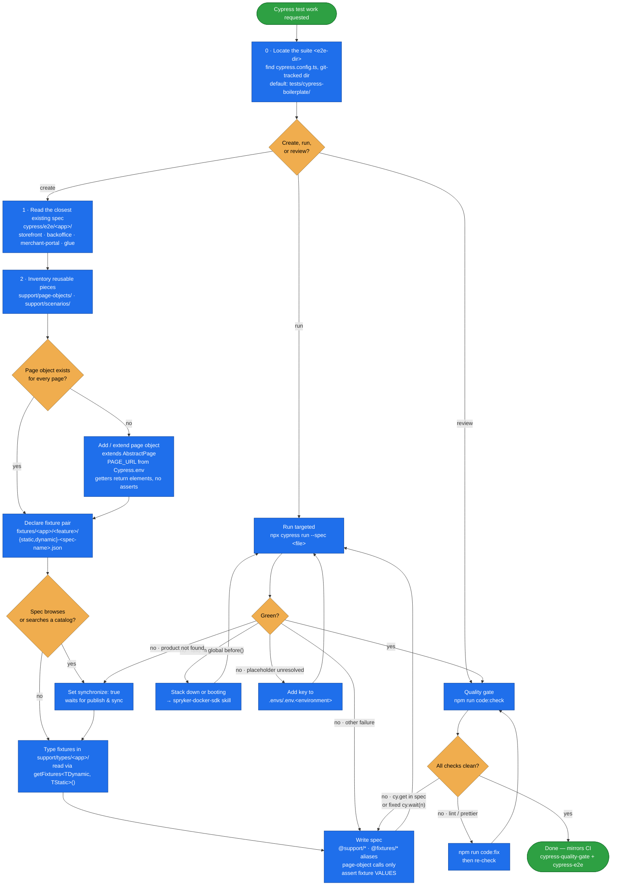

# cypress-tests

Day-to-day **Cypress E2E work against this project's own suite** — write a spec, run it, and get
it past the quality gate CI enforces.

The suite is a self-contained Node project vendored in by the `cypress-migration` skill — at
`tests/cypress-boilerplate/` by default, though the migration may have chosen another directory
name, so the skill locates it first (Step 0) and calls it `<e2e-dir>`. It is not a Composer
dependency. It replaces Spryker's
internal demo-shop Cypress/Robot Framework packages, which target Spryker's own core features and
aren't guaranteed to work on a customized project.

## Why

Two things about this suite are easy to get wrong from habit, and both produce tests that pass
locally and fail on CI:

- **Selectors belong in page objects, never in specs.** A spec that calls `cy.get()` turns every
  markup change into a multi-file sweep.
- **Test data is created per run, not assumed to exist.** Each spec owns a
  `dynamic-*.json` / `static-*.json` fixture pair resolved from its own path; the shop builds
  those records before the spec starts. Hardcoding a SKU or reusing demodata is what breaks on a
  fresh CI database.

This skill is the convention sheet, the exact commands, and the pre-flight checklist that
matches CI — so a new spec lands in the right directory, reads its data the right way, and
doesn't fail the gate on formatting.

## When it triggers

Creating, running, reviewing, or validating Cypress E2E tests — "add a cypress test", "write an
e2e test", "run the e2e tests", "review this cypress spec", "does this pass the quality gate", or
any request to test the storefront, backoffice, merchant portal, or Glue API end-to-end.

## Flow schema



## The rules that shape every test

| Rule | What it means |
|------|---------------|
| **No selectors in specs** | Specs call page-object methods only — no `cy.get()`/`cy.visit()` in a `.cy.ts`. Selectors live in page objects so markup changes stay one-line. |
| **Locators** | `data-qa="..."` (the project's Twig convention), then stable semantics already in use (`[itemprop="price"]`, `cart-items-list`), then a new `data-qa`. Never positional CSS, class hashes, or XPath. Pick the selector from the **rendered** DOM — Twig is pre-hydration and a custom element (`<quantity-counter>`) may have replaced the markup. |
| **Page objects** | Extend `AbstractPage`; `PAGE_URL` from `Cypress.env(...)`, never a hardcoded host. Getters return `Cypress.Chainable` and don't assert — the spec owns the claim. |
| **Data is declared** | A `dynamic-*.json`/`static-*.json` pair named after the spec, resolved from the spec's path. No data whose existence the spec doesn't control — a project-catalog SKU only under the conditions in `test-data.md`. |
| **`synchronize: true`** | Required when the spec browses or searches a catalog, so publish & sync lands the data in Redis/Elasticsearch first. |
| **Assertions** | Assert real values from fixtures (name, price, status), not `.should('exist')` alone — a failure should say what broke. |
| **Waiting** | Raise the timeout on the specific slow getter, or wait on an intercepted alias. No fixed `cy.wait(<number>)` — the main source of CI-only flake. An ajax mutation (cart quantity, wishlist) *must* wait on an intercepted 2xx and be re-read after a `visit()`: the optimistic DOM makes a wrong order pass. |
| **Aliases** | Import via `@support/*` and `@fixtures/*`, not relative `../../..` paths. |

## Usage

All commands run from `<e2e-dir>` — it's a standalone npm project, so the repo root won't work:

```bash
cd <e2e-dir>               # tests/cypress-boilerplate unless the migration renamed it

npm ci                     # first time / after package.json changes
npm run cy:open            # interactive runner, local environment
npm run cy:run             # headless, all specs, local environment
npm run cy:run:docker      # headless, from inside the Docker network

# Iterate on one spec (do this while authoring)
npx cypress run --spec "cypress/e2e/storefront/cart/storefront-cart-smoke.cy.ts"

# Run the way CI does
npx cypress run --env environment=ci --headless --browser chrome

# Quality gate
npm run code:check         # eslint + prettier
npm run code:fix           # autofix both, then re-check
```

Environment comes from `--env environment=<local|ci>` (default `local`), mapping to
`.envs/.env.<environment>`. Those committed files carry the app URLs and the fixture
placeholder values, so no `.env` setup is needed to get started.

Requires a running Spryker stack the URLs point at — start it with the `spryker-docker-sdk`
skill. Because fixtures are created through the shop, a spec cannot pass against a stopped
environment.

## What CI enforces

| Job (`.github/workflows/ci.yml`) | Runs |
|---|---|
| `cypress-quality-gate` | `npm run lint:check`, `npm run prettier:check` |
| `cypress-e2e` | `npx cypress run --env environment=ci --headless --browser chrome` against a `docker/sdk`-booted acceptance stack |

`cypress-e2e` needs `js-validation`, `validation`, and `cypress-quality-gate` first — a
formatting slip blocks the E2E run entirely, which is why `npm run code:check` is the cheapest
pre-push step. On failure the job uploads `cypress-e2e-failed-artifacts` with screenshots and
reports from `cypress/data/`.

## Layout

```
cypress-tests/
├── SKILL.md                        # trigger + agent workflow
├── README.md                       # this file
└── references/
    ├── conventions.md              # layout, naming, locators, page objects, specs
    ├── test-data.md                # dynamic/static fixtures, placeholders, synchronize
    └── running-and-ci.md           # commands, environments, CI jobs, failure triage
```

The suite's own `<e2e-dir>/README.md` covers setup and the available fixture helper operations
in more depth — prefer it over guessing a helper name.

## Related skills

- **`spryker-docker-sdk`** — start/stop the environment the specs run against.
- **`cypress-migration`** — the one-time setup that vendored this suite in and wired up CI.
- **`codecept-functional`** — PHP-level functional/unit tests, for logic that doesn't need a browser.

## Packaging note

This skill ships in the `spryker-ai-dev-sdk` plugin under `vendor/spryker-sdk/ai-dev/…`, which is
Composer-managed — `composer update spryker-sdk/ai-dev` may overwrite it. The durable home for
edits is the plugin's own repository (`github.com/spryker-sdk/ai-dev`).
