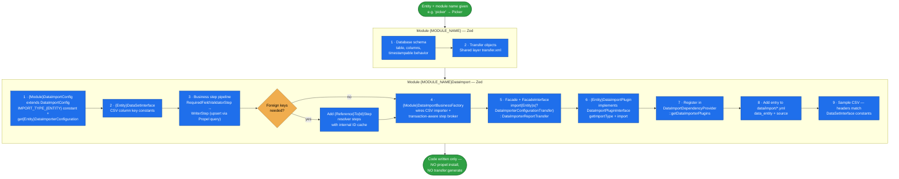

# data-import

Scaffold a **complete Spryker CSV data importer for a new entity** — the entity module (schema +
transfer) plus a `{Module}DataImport` module with its config, DataSet interface, step pipeline, business
factory, facade, plugin, registration, YAML entry, and a sample CSV.

A working Spryker import is not one class — it's a fixed constellation of nine pieces that must agree on
one import-type string and one set of CSV column keys. Miss the plugin registration or the `data/import`
YAML entry and the importer exists but never runs. This skill lays out the full set in order.

## When it triggers

"Create a data import", "implement an importer for entity X", "update/fix the data import", "I need to
import this CSV into a new table" — anything that creates, updates, fixes, or implements a Spryker data
import.

## Flow schema

## The nine pieces

| # | Piece | Role |
|---|---|---|
| 1 | `{Module}DataImportConfig` | Extends `DataImportConfig`; declares `IMPORT_TYPE_{ENTITY_UPPER}` and returns the `DataImporterConfigurationTransfer`. |
| 2 | `{Entity}DataSetInterface` | The CSV column-key constants — the single contract between the CSV file and the steps. |
| 3 | Step pipeline | `{Entity}RequiredFieldValidatorStep` (validates required fields) → `{Entity}WriterStep` (reads the DataSet, upserts via the Propel query, saves). Foreign keys add `{Reference}To{Id}Step` resolvers with an internal ID cache. |
| 4 | `{Module}DataImportBusinessFactory` | Extends `DataImportBusinessFactory`; `get{Entity}DataImport()` wires the CSV importer plus a transaction-aware step broker holding every step. |
| 5 | Facade + interface | `import{Entity}s(?DataImporterConfigurationTransfer $c = null): DataImporterReportTransfer`. |
| 6 | `{Entity}DataImportPlugin` | In `Communication/Plugin`, implements `DataImportPluginInterface`: `getImportType()` returns the constant, `import()` delegates to the facade. |
| 7 | Registration | Added to `DataImportDependencyProvider::getDataImporterPlugins()` — without this the importer never runs. |
| 8 | YAML entry | `- data_entity: {import-type}` + `source: data/import/common/common/{entity}.csv` in the relevant `data/import/*.yml`. |
| 9 | Sample CSV | Headers matching the `DataSetInterface` constants exactly. |

## Conventions baked in

- **Spryker best practices, native PHP types, no extra DocBlocks.**
- **Works on the current branch** — no branching.
- **Writes code only.** It deliberately does **not** run `propel:install` or `transfer:generate`;
  refreshing the system afterwards is the caller's step (see `spryker-refresher`).
- **Upsert, not insert.** The writer step upserts through the Propel query so re-running an import is
  idempotent.
- **Transaction-aware broker.** The step broker wraps the pipeline so a partial import doesn't leave
  half-written rows.

## Files

| File | Role |
|---|---|
| [`SKILL.md`](SKILL.md) | The whole skill — the parameterised nine-step recipe, a fully worked `picker` example (schema, DataSet constants, steps, facade signature, YAML block, CSV), and the expected output directory tree. |

## Packaging note

This skill ships in the `spryker-ai-dev-sdk` plugin under `vendor/spryker-sdk/ai-dev/…`, which is
Composer-managed — `composer update spryker-sdk/ai-dev` may overwrite it. The durable home for edits
is the plugin's own repository (`github.com/spryker-sdk/ai-dev`).
