# define-stores

Make a Spryker DMS project's **stores exist before first boot** — the store-definition CSVs, the
region token across deploy and install recipes, and the hardcoded store/locale literals that
otherwise fatal the boot.

Skeleton only. Catalog, CMS, prices, glossary and the catalog import config belong to `project-data`;
this skill stops at the store definitions plus the store-definition manifest
(`data/import/local/store_<REGION>.yml`). It works in files-mode on an un-booted clone, adapting the
shipped store-definition import **in place** — git on the fresh clone is the diff and the revert.

## When it triggers

When a project's stores or region must be created or redefined pre-boot:

- a new store set, or a region rename (`EU` → `NA`);
- hardcoded store/locale literals blocking boot — `CodeBucketConfig`, `default_store`, host maps;
- invoked by the wizard's store step, or standalone on an un-booted clone.

Not for live-project store changes (those are the later `add-store` / `delete-store`), and not for
any content — `data.mode` sends that to `project-data` (`adapt`, `clean`, `generate`; `leave` skips
both).

## Flow schema

```mermaid
flowchart TD
    A([Trigger: stores/region must exist pre-boot]) --> IN["Inputs<br/>.ai-dev/project-setup.md<br/>project.name · region · stores[]<br/>standalone → ask only for these"]
    IN --> SEED{"Seeding rule<br/>ONE canonical source dir?"}
    SEED -- "1:1 rename of whichever demo dirs exist" --> BAD([WRONG — US is net-only/USD,<br/>DE/AT gross+net EUR<br/>→ structurally inconsistent stores])
    SEED -- "yes: common/DE is canonical" --> S1

    S1["Step 1 — Store-definition CSVs<br/>mv canonical → first store<br/>cp -r per additional store<br/>rm -rf the other demo dirs"]
    S1 --> S1B["Write per store dir<br/>currency_store · country_store<br/>locale_store · default_locale_store<br/>store_context (entity context-store)"]
    S1B --> YB{"Token in the YAML<br/>boolean set?<br/>NO/no/yes/on/off/true/false"}
    YB -- "yes" --> QUOTE["Emit it QUOTED everywhere<br/>workflows · deploy · recipes<br/>manifests · Cypress config"]
    YB -- "no" --> S2
    QUOTE --> S2

    S2["Step 2 — Region token, full surface<br/>deploy.dev.yml · 4 install recipes<br/>kept .github/deploy/*.yml<br/>mv the region dir, rewrite tokens<br/>rename store_EU.yml → store_&lt;REGION&gt;.yml"]
    S2 --> S3["Step 3 — Hardcoded literals<br/>CodeBucketConfig (hard blocker)<br/>default_store · host mappings<br/>translator fallback · StockConfig<br/>CheckoutPageConfig<br/>CUSTOMER_SECURED_PATTERN +<br/>Yves firewall regexes (silent auth hole)<br/>per-locale date/time formats<br/>installer/admin user locales"]
    S3 --> S4["Step 4 — Dangling-manifest sweep<br/>grep ALL data/import/**/*.yml<br/>disposition every hit explicitly"]

    S4 --> V["Validate<br/>refs: store values ⊆ declared<br/>absent on CodeBucketConfig +<br/>default_store → ZERO hits"]
    V --> VD{"Zero hits on the<br/>must-be-clean files?"}
    VD -- "no" --> S3
    VD -- "yes" --> TRI["Broader absent over config/ + src/Pyz<br/>= triage aid, NOT a gate<br/>classify each hit"]
    TRI --> PAT["Second pass — PATTERN-shaped<br/>grep BARE en/de inside regexes<br/>a de_DE-shaped search cannot match them<br/>en_US-is-a-keep does NOT exempt it<br/>removed locale → drop .locale columns,<br/>routes, config branches too"]
    PAT --> DONE([Step done →<br/>hand off to project-data<br/>per data.mode<br/>+ POST-BOOT: stale src/Generated<br/>and data/cache artifacts])

    classDef step fill:#1f6feb,stroke:#0b3d91,color:#fff;
    classDef decision fill:#f0ad4e,stroke:#8a6d3b,color:#000;
    classDef terminal fill:#2ea043,stroke:#176f2c,color:#fff;
    class IN,S1,S1B,QUOTE,S2,S3,S4,V,TRI,PAT step;
    class SEED,YB,VD decision;
    class A,DONE,BAD terminal;
```

## Files

| File | Role |
|------|------|
| [`SKILL.md`](SKILL.md) | The single-source seeding rule, inputs, Steps 1–4, and the validation gate. |
| [`references/literal-sweep.md`](references/literal-sweep.md) | **Authoritative** region-token surface and config-literal spots: `deploy.dev.yml`, install recipes, the Stripe boot-blocker recipe, orphaned per-store `<STORE>.yml` manifests, the hardcoded-literal table, the Back Office `getBackofficeUILocales()` override, leave-alone items, post-boot store-keyed decisions, the final sweep + the **pattern-shaped second pass** (firewall regexes) and the **post-boot generated-artifact obligation**. |
| [`references/minimal-baseline.md`](references/minimal-baseline.md) | Spec of the minimal bootable tree — keep-populated / keep-with-transform / header-only / store relations. Consumed by `project-data`'s **clean** strategy as its build spec, not by this skill's own steps. |

## The seeding rule

The one decision that shapes everything else: **seed every project store from ONE canonical demo
source dir** — `common/DE` (gross+net, EUR, richest) — then `cp -r` it per additional store and
delete the other demo store dirs.

Do **not** 1:1-rename whichever demo dirs happen to exist. They embody different commercial
conventions: `common/US` is net-only, USD, and currency-mixed per file, so a store seeded from it
lands with `gross=0` prices (no visible prices at all), can lose a product's only price when a stray
off-currency row is dropped as dirt, and prices through a double conversion. With one canonical
source, project stores differ only by locale, currency, country and name — the catalog and price
*structure* is identical across them, and there is one source currency with one rate per target.

## Design decisions baked in

- **`CodeBucketConfig` is a hard fatal before any DB work.** It, and `config/Shared/default_store.php`,
  are the two files where the `absent` sweep is a genuine zero-hit gate rather than triage.
- **Rename, don't duplicate.** `mv` the primary region dir to `config/install/<REGION>/` and remove
  the other shipped region dirs — no leftover EU/US/`<REGION>` clutter pointing at stores that no
  longer exist. The one place `cp -r` is correct is seeding additional stores from the canonical dir.
- **Broken inert config is the worst outcome.** Deleting demo store dirs breaks every manifest that
  sources them, so Step 4 greps all of `data/import/**/*.yml` and dispositions each hit explicitly
  rather than leaving dangling YAML behind.
- **Two owners never touch one tree, and the disposition has exactly two states.** The `b2b_robot/`
  fixture tree belongs to `project-ci-generator`; this skill only *verifies* it was removed on a
  dropped lane and reports a survivor as a gap. The choice is **derived** from the CI `keep_suites`
  answer, never asked: kept lane → fixture adaptation is a required follow-up in
  `.ai-dev/project-setup.md`; dropped lane → ci-generator removes the tree. There is no
  "leave alone for now".
- **`vendor/` does not exist pre-boot.** Composer materializes it in-container during boot, so the
  Stripe fix authors a project-local store-assignment CSV plus a `stripe.yml` referencing the vendor
  paths (which resolve at import time) — never copying vendor files or hunting the filesystem.
- **Extend the Pyz class, not the core class.** Under a custom namespace, `<Ns>\…Config extends
  \Pyz\…Config` — extending core instead wins resolution and silently drops every existing Pyz
  override in that class.
- **The broad literal sweep is triage, not a gate.** Some hits are intentional keeps (classic-mode
  `stores.php`); classify them, don't blind-fix. `de_DE` in the Back Office translator fallback is
  the one paired keep — it lives or dies **with** the `getBackofficeUILocales()` override, in one
  logged decision, never as a silent default on a project that speaks neither German nor English.
- **Two translation layers, never confused.** `TRANSLATION_ZED_FALLBACK_LOCALES` and
  `getBackofficeUILocales()` govern the **Back Office/Zed** layer, whose translations ship as
  per-module `translations/` / `data/translation/` files (project overrides under
  `src/<Ns>/Zed/Translator/data/`). `glossary.csv` is the **storefront** layer — keeping or dropping a
  glossary file has no effect on Back Office translations, and vice versa.
- **Two shapes of literal, two passes.** The list-shaped sweep hunts `xx_XX` locale tokens and store
  names; it structurally cannot match a **bare** `(en|de)` alternation inside a firewall regex — which
  is why `CUSTOMER_SECURED_PATTERN` survives that pass and leaves `customer`, `cart`, `checkout` and
  nine more routes unguarded on a non-`en`/`de` project. A *partially* correct pattern is the worst
  case: `/en/` keeps working, so nothing looks broken.
- **Removing a locale removes everything keyed to it.** Not just the `xx_XX` tokens: the
  `.<locale>`-suffixed data-import columns, the URL/route segments in that language, and the config
  branches and regex alternations naming it. The single deliberate exception is a glossary file kept
  as a technical fallback layer — a kept fallback glossary is never permission to keep the locale
  everywhere else.
- **Installer/admin users must sit on a locale the project still has.** Back Office data is
  locale-specific, so an admin seeded with a removed locale opens the BO to blank product names,
  attributes and category names. When the locale set changes, repoint every
  `UserConfig::getInstallerUsers()` entry's `localeName` (or drop that admin).
- **Some obligations can only be discharged after the first boot.** `src/Generated/**` and
  `data/cache/**` are gitignored build output that doesn't exist pre-boot, so no sweep can see a
  stale artifact keyed by the old region/store/bucket token (a surviving `validation<OLD_REGION>.cache`
  500s every API Platform request after a green boot). The reference carries it as an explicit post-boot step:
  discover by token match, regenerate, delete the stale sibling.

## Packaging note

This skill ships in the `spryker-ai-dev-sdk` plugin under `vendor/spryker-sdk/ai-dev/…`, which is
Composer-managed — `composer update spryker-sdk/ai-dev` may overwrite it. The durable home for edits
is the plugin's own repository (`github.com/spryker-sdk/ai-dev`).
