# demo-prep-wizard

Prepare a **customer demo end to end** on the demo clone — intake, requirements, design reference,
harvest, build, rehearsal and run sheet — as one guided run.

It is the demo-side parallel of [project-starter-wizard](../project-starter-wizard/README.md): that one
turns a demoshop clone into a project, this one prepares the demo on it. It **orchestrates and owns no
mechanics** — every phase is handed to a named skill, and this skill never re-implements harvesting,
design or data work. The person running it is usually a solution consultant or a salesperson, not a
developer: they own the story and judge the look; every technical decision is made for them and logged.

## When it triggers

"We have a demo coming up", "help me prepare a demo for …", "prepare the demo", "here is the briefing
for the demo", "what do we need for this demo" — and the resume entry when a prior run left
`.ai-dev/demo-prep.md`. A demo can start at any phase, so the entry phase is chosen from what the
preparer already has:

| the preparer says | starts at |
|---|---|
| "here is the briefing for the demo" | 1 · intake |
| "here is the demo, what do we need" / "a second demo on the project we built" | 2 · requirements |
| "I already have the material — build it" | 5 · build (the needs list is still derived first) |
| "we ran this before, continue" | resume — only if `answers_confirmed_at` is present (and the sitting is re-run without `up_front_confirmed_at`) |

## Flow schema

```mermaid
flowchart TD
    A([Invoked]) --> PF["Pre-flight, read-only<br/>Docker · disk · /etc/hosts<br/>anything to do → one up-front message"]
    PF --> P1["1 · Intake — demo-intake<br/>handoff block: platform, audience,<br/>purpose, content, brand, open questions"]
    P1 -- "not confirmed on its own ·<br/>open questions go to the sitting" --> P2["2 · Routing table<br/>classify every row against work-classes.md<br/>consumer / both demo adds its own rows"]
    P2 --> C2{"Confirm the table once<br/>'Shown — look and content'<br/>'Shown — a small working version'<br/>'Left out'"}
    C2 -- "changes" --> P2
    C2 -- "confirmed" --> STAMP["Stamp answers_confirmed_at<br/>first write of .ai-dev/demo-prep.md"]
    STAMP --> SIT["The one sitting<br/>products · intake open questions ·<br/>demo fast path questions · run-sheet format ·<br/>run mode last"]
    SIT --> UF["One confirmation of every answer<br/>+ derived value (reference sites, harvest folder)<br/>→ up_front: · stamp up_front_confirmed_at"]
    UF --> NEEDS["Needs list, beat by beat<br/>products · categories · facets · personas ·<br/>blocks (exact wording) · imagery<br/>→ ## Needs, one-line summary shown"]
    NEEDS --> P3["3 · Design reference — match-reference-design<br/>against up_front.reference_sites<br/>spec.md, before harvest: it sizes the editorial imagery"]
    P3 --> P4["4 · Harvest — harvest-source-materials<br/>driven by the needs list + spec"]
    P4 --> G4{"Coverage read against<br/>the needs list, line by line"}
    G4 -- "gap" --> GAP["Carried forward, named<br/>never closed by substitution"]
    GAP --> P5
    G4 -- "covered" --> P5["5 · Build — the project track<br/>project-data · define-stores · translate-content ·<br/>match-reference-design · boot-and-verify ·<br/>spryker-customization demo preset per PoC row<br/>3rd rebuild: log the reason, continue"]
    P5 --> P6["6 · Rehearsal<br/>validate.php demo-needs first,<br/>then walk every beat in Claude in Chrome;<br/>logins → spryker-verifier"]
    P6 --> G6{"Every beat pass, or a<br/>named gap?<br/>.ai-dev/rehearsal.md"}
    G6 -- "fixable" --> P5
    G6 -- "yes" --> P7["7 · Run sheet — demo-run-sheet<br/>format from up_front.run_sheet_format<br/>local copy always on disk"]
    P7 --> MODE{"run_mode?"}
    MODE -- "autonomous" --> FR(["One final review<br/>reference next to result · PoC screenshots ·<br/>gaps · the look matched to + the pictures and<br/>texts gathered, taken as recommended ·<br/>run sheet path → gaps_accepted"])
    MODE -- "collaborative" --> CL(["'Continue to next phase?'<br/>was asked at every boundary"])

    classDef step fill:#1f6feb,stroke:#0b3d91,color:#fff;
    classDef decision fill:#f0ad4e,stroke:#8a6d3b,color:#000;
    classDef terminal fill:#2ea043,stroke:#176f2c,color:#fff;
    class PF,P1,P2,STAMP,SIT,UF,NEEDS,P3,P4,GAP,P5,P6,P7 step;
    class C2,G4,G6,MODE decision;
    class A,FR,CL terminal;
```

## The routing table and the needs list

The routing table is the only place the preparer confirms scope — in their terms, never in work
classes. Class and owner skill per row are recorded in `.ai-dev/demo-prep.md`, not in the table they see.

| classified as | shown to the preparer as | built by |
|---|---|---|
| setup · data · design · *already works* | **Shown — look and content** (the default, the bulk of every demo) | the project track, no code |
| customization | **Shown — a small working version**, with what it looks like and roughly how long it takes | `spryker-customization` at the PoC quality bar |
| not worth its cost to the story | **Left out**, offered as a talking point on the run sheet | nobody |

The audience (`business`, `consumer` or `both`) comes from the intake and is served by the single
`b2b-demo-marketplace` clone. A consumer demo always gets two rows of its own. **Guests see prices and can
buy**, one customization row shown as a small working version: `spryker-customization` (demo preset) applies
the [B2B guest-checkout recipe](../spryker-customization/references/b2b-guest-checkout.md) — guest access in the
installer defaults of `CustomerAccessConfig`, then templates, the secured pattern and one Client permission
plugin, verified with a delivery cart and a pickup cart. This skill only orders it: on an unmodified clone,
after `project-starter-wizard`'s pre-boot steps (1–7) and before its step 8, in the demo preset's pre-boot
mode (file edits only, the guest journey asserted by `boot-and-verify` after the first boot); on a clone
already booted, the run reports "needs a reset" and this skill runs it through `boot-and-verify`.
**The business-only screens stay out of sight**, built by `match-reference-design` in templates and
navigation. A `both` demo keeps the first and shows business screens only to logged-in business customers.

The run has **three moments with the preparer**: the routing-table confirmation (stamps
`answers_confirmed_at`), the one sitting with its confirmation (stamps `up_front_confirmed_at`), and the
final review — nothing in between. The intake block is not confirmed on its own — its open questions
are asked in the sitting.

The **needs list** is then derived mechanically from the supplied demo, beat by beat, into
`## Needs` in the state file. It is the harvest's shopping list, the rehearsal's acceptance criterion
and the run sheet's source of beats, and its `key: value` shape is what `validate.php demo-needs` parses.

## Files

| file | holds |
|---|---|
| `SKILL.md` | the phases and their owners, the needs list, run modes, the final review, skip-ahead and resume, delegation discipline, the closing checklist, pitfalls |
| `references/state-file.md` | the `.ai-dev/demo-prep.md` template (frontmatter, Steps table, decision log) and how the hooks police it |

It reads, without restating: [work-classes.md](../demo-intake/references/work-classes.md) for
classification; `../project-starter-wizard/references/` — `preflight.md`, `interview.md` (the demo fast
path and the plain-language table) and `autonomous-runs.md`.

## Design decisions baked in

- **The demo is read as supplied.** The preparer arrives with the story decided. The beats come
  from the brief's script, a pasted script, or the brief's prose — in that order — and nothing is
  proposed or re-confirmed. If nothing supplied says what will be shown, the skill asks for the script.
- **One sitting, then silence.** Everything the run will ever need is asked straight after the routing
  table, recommended option first, and written to `up_front:` — including `reference_sites` (default: the
  intake's source URL, shown at the confirmation, not asked). Delegates read their answers from there
  instead of asking again; a checkpoint on material not seen yet takes the recommended option, logs it,
  and shows it at the final review. Only a hard-stop (starting Docker, the one `/etc/hosts` command)
  interrupts an autonomous run before the final review.
- **Rebuilds never interrupt the preparer.** Trusted rebuilds (demo clone, first setup, or an explicit
  "rebuilds" approval) run without a prompt; on a project with real data the hook asks once; from the
  third rebuild on a project the hook denies until the decision log has `rebuild #N: <why rung 1 cannot
  show it>` — the agent writes it and continues.
- **Content, look and story questions only.** A question that cannot be phrased without a technical
  term is not the preparer's — it is decided, logged in the decision log, and not asked.
- **Quoted UI strings are fixed wording from the moment the brief is read** — copied character for
  character by the content pass and the run sheet.
- **Design before harvest.** The composition spec decides how much editorial imagery is fetched;
  harvesting first means fetching without the ratios and fetching again.
- **A gap is named, never filled.** A need the source cannot supply is a gap line; behaviour the platform
  lacks is its own customization row, built only once confirmed.
- **Rehearsal is its own phase**, so the first end-to-end walk happens before the demo, not during it. The mechanical check runs first; the browser walk proves the story reads well.
- **The local shop is driven in Claude in Chrome**, never the built-in browser, which prompts on every
  action for a local host.
- **What crosses a phase boundary is an artifact** — the intake block, the needs list, `spec.md`, the
  coverage record, `rehearsal.md` — so a resume hours later has the file, not the chat.

## Enforced by hooks

The plugin's hooks police this run ([hooks/README.md](../../hooks/README.md)):

- `guard-files.php` denies the first write of `.ai-dev/demo-prep.md` unless the routing table was really
  shown and confirmed, and denies `rehearsal` → `done` without pass/gap lines written after the last rebuild.
- `guard-skill.php` denies the phase-5 step skills while the state file carries no `answers_confirmed_at`.
- `gate-docker-sdk.php` lets trusted rebuilds through without a prompt, asks once on a project with real
  data, and from the third rebuild on a project denies until the decision log carries
  `rebuild #N: <why rung 1 cannot show it>` — not a hard stop; the agent writes the line and continues.
- `guard-files.php` accepts the demo fast path's `answers_source: demo-prep` only when
  `.ai-dev/demo-prep.md` carries `up_front_confirmed_at`, and denies the run-sheet step `done` until
  `.ai-dev/demo-run-sheet.html`, `.md` or `.txt` exists.
- `guard-browser.php` denies the built-in browser for the local shop.

## Output

A booted demo shop carrying the harvested material; `.ai-dev/demo-prep.md` with the confirmed routing,
`up_front:` answers, the needs list, the decision log and accepted gaps; `.ai-dev/rehearsal.md` with
pass/gap per beat; and the run sheet on disk. The close walks four lines with their evidence — every beat
rehearsed, every gap named and accepted, the run sheet produced, the material recorded with its coverage.
Anything short of all four is reported as what it is.

## Packaging note

This skill ships in the `spryker-ai-dev-sdk` plugin under `vendor/spryker-sdk/ai-dev/…`, which is
Composer-managed — `composer update spryker-sdk/ai-dev` may overwrite it. The durable home for edits
is the plugin's own repository (`github.com/spryker-sdk/ai-dev`).
