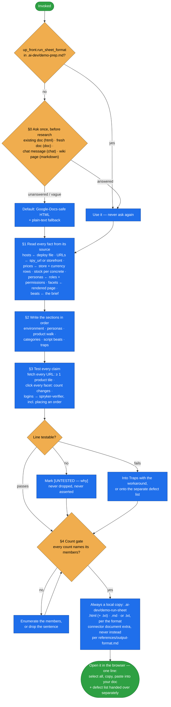

# demo-run-sheet

Produce the document a **salesperson opens on a second screen while presenting** — hosts, logins,
product and category URLs, the filters that actually work, the beats in the brief's order, and the traps
to avoid on stage.

It is the last phase of [demo-prep-wizard](../demo-prep-wizard/README.md). It is not a handover doc, a
status report or a list of what was built. Two rules govern it: the sheet is judged by whether it
**pastes**, and **nothing on it is composed, inferred or remembered** — every line is read from the
running system and tested before it ships.

## When it triggers

"Demo cheat sheet", "run sheet", "what do I show", "give me the links and logins for the demo",
"prepare for the customer call" — and phase 7 of the demo-prep wizard.

## Flow schema

## The sections, in the order a presenter reads them

| section | carries |
|---|---|
| **Environment** | storefront per store, Back Office, any other app the demo touches — each a fetched, clickable link, with the `/<STORE>/<lang>/` prefix stated |
| **Personas** | consumer: a guest and a shopper account. Business: per account — email, password, company / unit, role, what it is **for** and what it must **not** be used for. `both`: all three |
| **Product walk** | per product: URL, the point it makes, in-stock **and** out-of-stock variants named, list vs the persona's price in the demoed currency |
| **Categories** | per category: URL, products actually visible (counted from tiles), the facets that narrow the result with their working values |
| **Script beats** | one-to-one with the brief's wording, in the brief's order; an unsupportable beat stays on the sheet, marked |
| **Traps** | everything found while testing that would derail a live run, each with its workaround |

## Files

| file | holds |
|---|---|
| `SKILL.md` | the format question, the source table for every fact, the required sections, the test rules, the count gate, scope, a worked skeleton, the close checklist, pitfalls |
| `references/output-format.md` | the paste contract, which HTML survives a rich-text paste and which does not, the HTML template, the plain-text fallback rules, and other targets (wiki, fresh document, chat) |

## Design decisions baked in

- **Ask the format once, first.** A format complaint is answered by changing the format of the next
  artefact, never by re-issuing the same content in a new markdown file.
- **Never markdown unless the target is a wiki.** A markdown table pasted into a document arrives as
  rows of pipe characters. The default HTML uses inline styles only and absolute URLs only, because classes and relative
  links do not survive a paste.
- **No URL is composed.** Slugs are generated from localized names and are not derivable from keys or
  titles; every URL is read from the url table or copied from the storefront, then fetched.
- **A 200 alone does not pass.** A category page renders 200 with zero products, and its `N Items` string is
  unreliable — product tiles are counted instead.
- **A role's name does not prove its permissions.** On a business or `both` demo, an account can hold
  a role that lacks the place-order permission; on a consumer or `both` demo, the guest path (prices, an
  order without login) is proved the same way. Every persona the script asks to transact completes the path, order placed,
  through the [spryker-verifier](../../agents/spryker-verifier.md) agent — a verifier FAIL is cross-checked
  against persisted state before it becomes a trap.
- **Stock is per concrete.** Out-of-stock variants of every demoed product are named, because an
  unavailable hero size breaks a beat during the demo.
- **A line may be marked untested; it is never guessed.**
- **The sheet describes what exists.** Gaps go on a separate defect list, never into the beats, and
  design opinions stay off the defect list.

## Output

`up_front.run_sheet_format` is one of `html | doc | chat | markdown`, matching §0's four options. By default
`.ai-dev/demo-run-sheet.html`, opened in the browser for select-all → copy → paste, plus
`.ai-dev/demo-run-sheet.txt` for chat. **Whatever the format, a local copy is always written** —
`.html`, `.md` or `.txt`; a document created through a connector is extra, never instead. A one-line
pointer to the file, and a short defect list handed over separately (in a demo run, to the wizard's final
review). The wizard marks `demo-run-sheet` → `done` in its state file only once one of those local
files exists.

## Packaging note

This skill ships in the `spryker-ai-dev-sdk` plugin under `vendor/spryker-sdk/ai-dev/…`, which is
Composer-managed — `composer update spryker-sdk/ai-dev` may overwrite it. The durable home for edits
is the plugin's own repository (`github.com/spryker-sdk/ai-dev`).
