# harvest-source-materials

Collect the raw material a demo is built from — product data, product imagery, editorial and campaign
imagery, brand assets — out of a customer's public website or a supplied export, into a **harvest
directory beside the project, never inside it**.

It sits between [demo-intake](../demo-intake/README.md) (what the demo is, where the material lives) and
[project-data](../project-data/README.md)'s `dataset:` mode (what the catalogue becomes). Every fetch
traces to a demo beat, every limit of the fetch is written down, and the run ends with a handoff line the
data step consumes. It does not write `data/import/**`, does not import, and does not build.

## When it triggers

"Gather the images", "harvest the product data", "scrape their site for the demo", "we need the materials
for the demo", "get the assets from <url>", "prepare the source data" — and phase 4 of
[demo-prep-wizard](../demo-prep-wizard/README.md). It runs **after** the intake and after the demo's needs
list is derived, because the needs list decides what is fetched.

## Flow schema

```mermaid
flowchart TD
    A([Invoked]) --> R0{"Rule 0 — inputs present?<br/>## Needs in .ai-dev/demo-prep.md<br/>+ the composition spec (spec.md)"}
    R0 -- "either missing" --> NARROW["No needs list → the person's request is the fetch list<br/>no spec → no editorial imagery<br/>each said in one line"]
    NARROW --> ROOT
    R0 -- "both" --> ROOT["§1 Resolve the harvest root<br/>named dir · up_front.harvest_root ·<br/>else &lt;parent&gt;/&lt;customer&gt;-harvest/<br/>never inside the clone"]
    ROOT --> PROD{"Products named in the brief or needs list,<br/>or up_front.products present (even [])?"}
    PROD -- "no" --> ASKP["Ask once: which products must appear?<br/>names or links — or pick from the story"]
    PROD -- "yes" --> SURV
    ASKP --> SURV["§2 Pass A — survey, pages only<br/>ranges · category depth · price basis ·<br/>variant axes · image roles · structured payload ·<br/>editorial surfaces → harvest README"]
    SURV --> FL["§3 Fetch list — every row cites<br/>a demo beat or spec panel; margin declared"]
    FL --> RM{"run_mode: autonomous?"}
    RM -- "yes" --> LOG["Fetch against the recommended list<br/>one decision-log line, shown at final review"]
    RM -- "no" --> OK{"Preparer's 'ok'<br/>in their terms"}
    OK -- "changes" --> FL
    OK -- "ok" --> PB
    LOG --> PB["§4 Pass B — re-runnable fetcher in the root<br/>config block on top · cached by path ·<br/>polite parallel · --export-only ·<br/>largest asset variant · role-named paths"]
    PB --> GAPQ{"A need the source<br/>does not have?"}
    GAPQ -- "yes" --> GAP["§5 Gap line, three options, unranked<br/>other product · change the beat ·<br/>state the limitation — never a fourth<br/>autonomous: recommended option logged,<br/>carried to the final review, no question"]
    GAPQ -- "no" --> ROLE
    GAP --> ROLE["§6 Read the live page's rendered img src<br/>match the asset family before wiring"]
    ROLE --> DER["§7 Derivatives into frontend/static only<br/>really resized, dimensions + bytes asserted,<br/>default size budget set + logged, du -sh reported,<br/>overrun → final review"]
    DER --> ED["§8 Editorial + brand, separate deliverable<br/>sized by the spec · manifest.csv ·<br/>selected/&lt;beat&gt;/index.csv · brand/source.csv"]
    ED --> COV["§9 Coverage as data<br/>out/coverage.json + README:<br/>visited · caps (hit flagged) · skipped · failed"]
    COV --> END(["§12 Handoff line — path + field mapping,<br/>column names read from the written files"])

    classDef step fill:#1f6feb,stroke:#0b3d91,color:#fff;
    classDef decision fill:#f0ad4e,stroke:#8a6d3b,color:#000;
    classDef terminal fill:#2ea043,stroke:#176f2c,color:#fff;
    class NARROW,ROOT,ASKP,SURV,FL,LOG,PB,GAP,ROLE,DER,ED,COV step;
    class R0,PROD,RM,OK,GAPQ decision;
    class A,END terminal;
```



## Who owns what around it

| need | owner |
|---|---|
| platform pin, dataset field mapping, measured brand colour, where the beats live | `demo-intake` |
| panel count, aspect ratios, full-bleed vs contained | [match-reference-design](../match-reference-design/README.md) §1 spec |
| palette, logo placement, the asset-scope rule | [brand-project](../brand-project/README.md) |
| turning the harvest into `data/import/**` rows | `project-data` (`dataset:` mode) |
| the frontend build that publishes `frontend/static` | [yves-atomic-frontend](../yves-atomic-frontend/README.md) |

## Files

| file | holds |
|---|---|
| `SKILL.md` | Rule 0, harvest root placement, the survey, the fetch list, the fetcher's shape, gaps, image roles, derivatives, editorial and brand imagery, coverage, the one-paragraph legal label, re-running and pivots, the output contract, the close checklist, pitfalls |

## Design decisions baked in

- **The needs list decides the scope; nothing is fetched because it is there.** Every fetch traces to a
  needs-list line, a spec panel, or an explicit request. Without it, a large harvest can still miss the
  product the story needs.
- **Beside the project, never inside it.** Originals stay in the harvest root forever. Only resized
  derivatives cross into the repo, and only into the tracked static directory — a published assets
  directory is wiped by the next build while the alt text keeps a markup check green.
- **Survey before fetch.** A cheap, image-free pass answers the questions the fetch list depends on, and
  the survey becomes the README a later session reads instead of re-deriving the source.
- **The preparer approves products and pages, not parameters.** Caps, depth, margin and request delay
  live in `fetch-list.md` and are the skill's to set.
- **Re-runnable by construction.** Cached images and `--export-only` mean a changed demo costs a listing
  sweep, not a full refetch. A cap that was actually hit is always reported.
- **Gaps get three options and no fourth.** Tagging products with an attribute they lack, or
  borrowing a neighbour's value, is falsification and is never proposed. In an autonomous run a gap is
  logged with the recommended option and carried to the wizard's final review — never asked mid-run.
- **Answered once, never again.** `up_front.products` present — even `[]`, "pick from the story" — means
  the products question was answered. The size budget is the skill's to set and log; an overrun is
  reported at the final review. A preparer sees at most one plain line about the survey, never the survey.
- **Coverage is recorded, not remembered.** Any later claim about the customer's range cites
  `coverage.json` or is phrased "in what we captured" — a scraper's cap says nothing about the catalogue's real size.
- **Editorial is its own deliverable**, sized by the composition spec, so a homepage band never ends up
  with product packshots and editorial is never fetched "to be safe".
- **One labelling paragraph.** The material is labelled illustrative demo data with its price
  basis; go-live imagery debt is not raised for `purpose: demo`.
- **A file referenced from a CSV cell is still in use.** A pivot lists everything the abandoned approach brought in as one
  removable set, and an orphan sweep greps CSV cells as well as markup.

## Output

```
<harvest-root>/            README.md · fetch-list.md · harvest.py · harvest.log
  out/                     products.json/.csv · sizes.csv · categories.json · relations.json
                           coverage.json · report.md
    images/<master>/<variant>/<role>-<n>.<ext>
    editorial/             + manifest.csv, selected/<NN>-<beat-slug>/ + index.csv
    brand/                 + source.csv
```

Entity files bend to the source; `README.md`, `coverage.json`, `report.md`, the role-named image tree and
the two editorial manifests do not. The run closes with the one-line handoff block — path, sku, name,
category, price with its tax basis, image, variant axes, editorial and coverage — that `project-data`
takes as its two `dataset:` inputs.

## Packaging note

This skill ships in the `spryker-ai-dev-sdk` plugin under `vendor/spryker-sdk/ai-dev/…`, which is
Composer-managed — `composer update spryker-sdk/ai-dev` may overwrite it. The durable home for edits
is the plugin's own repository (`github.com/spryker-sdk/ai-dev`).
