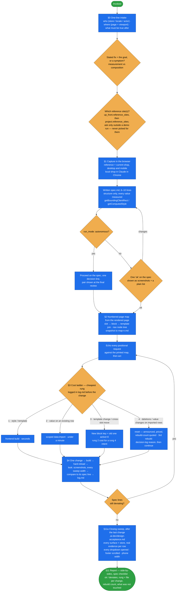

# match-reference-design

Make a Spryker storefront **read as a reference site** — the customer's own, or one the person
names — with every step cheap, visible and reversible.

This is the *workflow* layer for homepage composition, navigation and CMS blocks: it decides **what** to
change, in **what order**, at **what cost**, and how the result is **proved** — reference capture, a
numbered page map, a cost ladder, one change per cycle, a screenshotted before/after and a closing sweep.
The mechanics belong elsewhere: component code, overrides, the build and the Twig cache to
[yves-atomic-frontend](../yves-atomic-frontend/README.md); palette, logo and theme tokens to
[brand-project](../brand-project/README.md); catalogue and CMS rows to
[project-data](../project-data/README.md); behaviour changes to
[spryker-customization](../spryker-customization/README.md).

## When it triggers

"Make it look like <url>", "match the reference", "fix the navigation to be like theirs", "this block
looks ugly", "make it bigger", "swap this block with the second one". In a
[demo-prep-wizard](../demo-prep-wizard/README.md) run it is called twice: at phase 3 for the composition
spec (before harvesting, because the spec sizes the editorial imagery) and in phase 5 for the look itself.

## Flow schema

## Files

| file | holds |
|---|---|
| `SKILL.md` | intake, reference capture and the spec, the page map and echo rule, the cost ladder, the one-change cycle, the data and shared-component boundaries, measuring, build output, the vocabulary questions, CMS content hygiene in short, verification and the closing sweep, hiding the business-only screens on consumer and `both` demos, pitfalls |
| `references/visual-defects.md` | the sweep widths and the measurable check for each visual defect |
| `references/cms-content-hygiene.md` | the CMS block and placeholder rules, and the rung each one otherwise forces |

Work products live in `.ai-dev/match-reference/<slug>/`: `spec.md` (this task's checklist), `map-<n>.md`
(one snapshot per positional change) and `log.md` (one line per cycle — map, rung, file, spec line,
screenshot pair). `.ai-dev/composition.md` is the project's durable visual grammar — extended, never
re-derived.

## Design decisions baked in

- **Verify in the browser.** The browser that opened the reference checks the result. A `curl |
  grep` or an identical DOM diff proves a string is present, never that it looks right; a person
  sending a screenshot back indicates that the look step was skipped.
- **Measure, never eyeball.** Container width, gaps and utility-class values are read from the rendered
  page and the served stylesheet (this clone serves `critical.css` + `util.css`, not `app.css`).
- **The rung is the skill's call; the person judges the look.** Sizing and spacing complaints are rung 1
  until proven otherwise. The cheapest rung that achieves the result wins; when it cannot deliver, the
  skill takes the next rung itself (logged in an autonomous run) instead of asking. A template change on an existing
  block becomes a new block key plus the old one deactivated, because the CMS importers are insert-only
  or add-only, not upserts — an insert at rung-2 cost instead of a reset.
- **One change per cycle.** Two changes in one build means neither is attributable and a rejection undoes both.
- **Numbers come from the rendered page.** Every positional request is echoed against the printed map —
  to a preparer in plain words ("the second band, the three category tiles"), never slot or block keys —
  and snapshots survive a revert so "where it was originally" still resolves.
- **The reference is read, not asked, in a demo run.** `up_front.reference_sites` (default: the intake's
  source URL, shown at the wizard's one-sitting confirmation) names the site(s); in an autonomous run the
  spec is taken as recommended, logged, and shown next to the result at the final review.
- **Never compensate in data for a layout problem.** The test before every edit: does this change what
  the shop sells, or what the page looks like? Removing categories to make a menu fit is out of scope.
- **Never restyle a shared component for one page.** Consumers are enumerated first; identical markup in
  two places means a change to one repaints both. A page-scoped intent gets a new view or variant.
- **Layout lives in templates, never inline in a CMS cell**, and more content areas mean a second block.
- **One question for ambiguous feedback.** "Bigger" gets "the block, or the text inside it?" — two
  guesses cost more, and the second one moves what the first moved.
- **The step is done when every surface was looked at since the last change**, not when the last reported
  defect is gone. Anything behind a login goes to the
  [spryker-verifier](../../agents/spryker-verifier.md) agent; this skill never logs in.

## Enforced by hooks

From [hooks/README.md](../../hooks/README.md): `guard-browser.php` denies the built-in browser for the local
shop; `guard-files.php` stops edits to gitignored build output and denies a design-closing step → `done`
without an evidenced `.ai-dev/design-acceptance.md` — no row without evidence, not the same token on every
row, and not older than the newest template edit or the last rebuild; `gate-docker-sdk.php` lets trusted
rebuilds (demo clone, first setup, explicit "rebuilds" approval) through without a prompt, asks once on a
project with real data, and from the third rebuild on a project denies until the decision log has
`rebuild #N: <why rung 1 cannot show it>` — not a hard stop, the agent writes it and continues;
`count-rebuild.php` keeps `.ai-dev/rebuild-count` (per project), quoted in every report.

## Output

The shop reading as the reference, proved by side-by-side screenshots at every sweep width for every changed
band, the spec checklist line by line (`ok` or `deviates — measured vs spec`), the rung and file per
change with the build's own success line, the quoted rebuild count, what was deliberately not touched,
and a filled `.ai-dev/design-acceptance.md`.

## Packaging note

This skill ships in the `spryker-ai-dev-sdk` plugin under `vendor/spryker-sdk/ai-dev/…`, which is
Composer-managed — `composer update spryker-sdk/ai-dev` may overwrite it. The durable home for edits
is the plugin's own repository (`github.com/spryker-sdk/ai-dev`).
