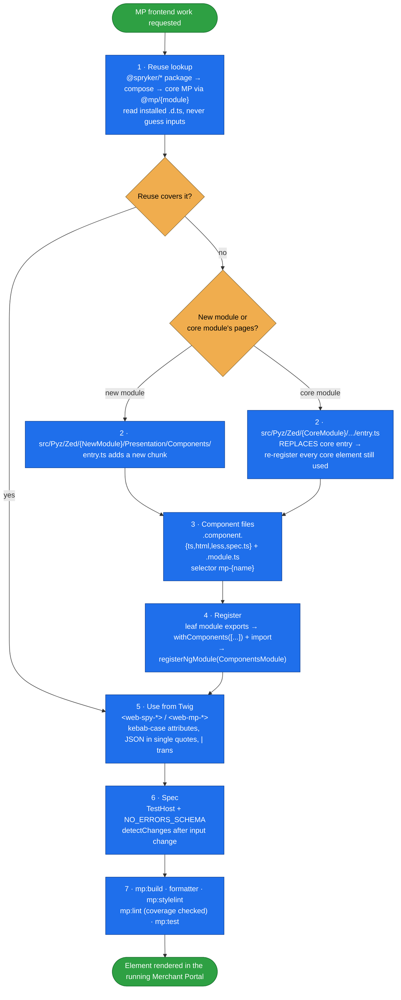

# merchant-portal-frontend

Build, extend, and replace **Spryker Merchant Portal Angular components in a project**. That covers the
components, their registration, the Zed Twig pages that render them, and their Jest specs. The skill then
validates the work honestly.

The Merchant Portal is Angular Elements inside Twig, not an SPA. A component reaches a page only through
`entry.ts` → `components.module.ts` (`WebComponentsModule.withComponents`) → leaf module, and it renders
as `<web-mp-*>`. Break any link and the tag stays empty without an error. The builder also has project
traps:
- It scans only `src/Pyz/Zed`.
- A project `entry.ts` with a core module's name replaces the core entry, so core elements must be
  re-registered.
- `@mp/*` aliases exist only for core modules.
- The packaged ESLint config silently skips every project file.

This skill carries all of that with project paths only. Core is read from `vendor/` and extended into
`src/Pyz/Zed`, never edited.

## When it triggers

Any Merchant Portal Angular work:
- "create a Merchant Portal component"
- "extend an MP page"
- "add a web-mp component"
- "replace a core MP component"
- "use a @spryker table/drawer/select in the Merchant Portal"
- "pass data from Twig to Angular"
- "write an MP Jest spec"
- "mp:test is failing"
- "mp:build fails"
- "my MP component does not render"

The always-loaded companion rule `merchant-portal-angular` (`data/rules/merchant-portal-angular.md`)
carries the conventions. This skill carries the procedures.

## Flow schema



## Files

| File | Role |
|---|---|
| [`SKILL.md`](SKILL.md) | The spine: project vs core paths, the 7-step workflow (reuse → decide module → create → register → Twig → spec → build/validate/verify), troubleshooting table. |
| [`references/component-wiring.md`](references/component-wiring.md) | Entry discovery and chunk naming, the single-entry marker, first-definition-wins, a recipe for a new module, a recipe for a same-name core override with re-registration, `@mp/*` aliases, assets and global styles. |
| [`references/ui-components-lookup.md`](references/ui-components-lookup.md) | Searching installed `@spryker/*` packages, core MP components and Twig usage; reading typings (`types/` vs `index.d.ts`); package naming; `<web-spy-*>` vs in-template usage; server-configured tables. |
| [`references/testing.md`](references/testing.md) | TestHost spec template, running one spec, the stale-`node_modules` error, the ESLint coverage check, and a verified `eslint.config.mp.mjs` override. |

## After changing components

```bash
docker/sdk cli npm run mp:build
# watch mode during development (restart after adding a new entry.ts):
docker/sdk cli npm run mp:build:watch
```

## Packaging note

This skill ships in the `spryker-ai-dev-sdk` plugin under `vendor/spryker-sdk/ai-dev/…`, which Composer
manages, so `composer update spryker-sdk/ai-dev` may overwrite local edits. Make durable edits in the
plugin's own repository (`github.com/spryker-sdk/ai-dev`).
