# payment-template

Build a complete, working **PSP payment integration** in Spryker from scratch — scaffolded from
`spryker-community/payment-template`, driven by an interactive requirements interview, and executed
against the template's own `IMPLEMENTATION.md` checklist.

Four phases up front: **Collect → Plan → Confirm → Execute.** No code is written and no file is
modified until the developer has confirmed the implementation plan. A set of security patterns is
hard-coded into the skill and **overrides anything IMPLEMENTATION.md says**.

Refund support is out of scope — it lands when the template introduces it.

## When it triggers

"Add X as payment provider", "implement X payment integration", "build a payment module for X",
"set up a new payment gateway", "new PSP integration", "create a payment provider module" — for
named providers (Adyen, Mollie, Stripe, Braintree, Klarna, Worldpay, Buckaroo, Payone, Nuvei) or any
custom PSP partner.

**Not for:** debugging existing integrations, adding refunds to existing modules, back office payment
configuration, writing payment tests, or API Platform migrations.

## Flow schema

```mermaid
flowchart TD
    A([Invoked: new PSP integration]) --> PF["Pre-flight — git rev-parse --abbrev-ref HEAD<br/>note if on master/main/develop/staging/<br/>production/release*"]

    PF --> ST1["Stage 1 — PSP identity<br/>kebab-case name · namespace (default Pyz) ·<br/>payment methods in snake_case"]
    ST1 --> CASE["Establish the case-conversion table once<br/>Pascal · camel · snake · SCREAMING · kebab"]
    CASE --> C1{"Confirm Stage 1"}
    C1 -- "no" --> ST1
    C1 -- "yes, and still on a protected branch" --> BR["git checkout -b<br/>feature/payment-integration/{psp-name}"]
    C1 -- "yes, already on a custom branch" --> ST2
    BR --> ST2

    ST2["Stage 2 — shared PSP configuration, one block:<br/>credentials + which need Yves frontend access ·<br/>sandbox/production base URLs · auth mechanism ·<br/>Authorize/Capture/Cancel sync or async ·<br/>webhooks · status constant names"]
    ST2 --> WS{"Webhooks on but no credential<br/>named *SECRET* / *WEBHOOK*?"}
    WS -- "yes" --> ASKS["Ask what to name it,<br/>add to the credentials list"] --> C2
    WS -- "no" --> C2{"Confirm Stage 2"}
    C2 -- "no" --> ST2
    C2 -- "yes" --> ST3

    ST3["Stage 3 — per-method table<br/>Flow (redirect | direct | js-sdk) · form fields ·<br/>line items? · method-specific fields · redirect domains"]
    ST3 --> CARD{"Card-method detection<br/>run BEFORE asking to confirm:<br/>name matches card/cc/credit/debit/visa/… OR<br/>fields include card_number/pan/cvv/expiry/…"}
    CARD -- "card method with Flow = direct" --> STOP(["HARD STOP — Spryker must never<br/>receive raw card data server-side.<br/>Change to redirect or js-sdk.<br/>Do not proceed until resolved"])
    STOP --> ST3
    CARD -- "clear" --> C3{"Confirm the full<br/>collected-requirements summary"}
    C3 -- "no" --> ST3

    C3 -- "yes" --> P2["Phase 2 — WebFetch IMPLEMENTATION.md<br/>from spryker-community/payment-template<br/>Generate a numbered plan with PSP-specific<br/>values substituted per checklist section"]
    P2 --> GATE{"Confirm the plan<br/>NO code, NO file changes<br/>before this passes"}
    GATE -- "no" --> P2

    GATE -- "yes" --> P3["Phase 3 — Bootstrap<br/>resolve {project-root} via git rev-parse --show-toplevel<br/>rm -rf then clone the template to /tmp<br/>php rename.php {psp-name} --project-path --namespace"]
    P3 --> VER{"Renamed dirs in src/{Namespace}/?<br/>Config class name + namespace correct?"}
    VER -- "no" --> REPORT(["Stop and report"])
    VER -- "yes" --> CM1["commit: Add {PspName} payment<br/>integration scaffolding"]

    CM1 --> P4["Phase 4 — execute IMPLEMENTATION.md<br/>sections 1-9 only<br/>skip 10 Testing · 13 Docs · 14 Deployment"]
    P4 --> SEC{"Per file: read before modifying ·<br/>implement TODO stubs from the requirements ·<br/>apply the Hard Rules · never transfer->toArray()"}
    SEC --> COND["Skip the conditional sections whose<br/>condition wasn't met (webhooks, redirect,<br/>js-sdk, line items)"]
    COND --> CI{"CI gate after EVERY section<br/>vendor/bin/spryker-ci spryker-ci --current"}
    CI -- "errors" --> SEC
    CI -- "schema file changed" --> GEN["transfer:generate + propel:install"] --> CI
    CI -- "clean, sections remain" --> SEC
    CI -- "persistence done" --> CM2["commit: persistence layer"] --> SEC
    CI -- "Yves done" --> CM3["commit: Yves layer"] --> SEC
    CI -- "all 1-9 done" --> WIRE

    WIRE["Pyz wiring — read {project-root}/INTEGRATION.md<br/>OMS processes · command/condition plugins ·<br/>checkout save + post-hooks · method filter ·<br/>router · SubForm + StepHandler plugins"]
    WIRE --> DATA["Data import rows —<br/>payment_method.csv + glossary.csv,<br/>one per method"]
    DATA --> CM4["commit: wire plugins + import data"]

    CM4 --> P5{"Phase 5 — security review<br/>always-checks, plus webhook-only and<br/>redirect-only items"}
    P5 -- "any item fails" --> BLOCK(["Report as a BLOCKING issue"])
    BLOCK --> SEC
    P5 -- "all pass" --> P6["Phase 6 — output the config_default.php snippet<br/>getenv() per credential, never a non-empty<br/>default for a secret<br/>+ DOMAIN_WHITELIST merge if redirect"]
    P6 --> P7["Phase 7 — integration checklist<br/>config entries · env vars · data:import ·<br/>webhook endpoint · return URL if redirect"]
    P7 --> P8(["Phase 8 — rm -rf the /tmp template clone.<br/>Implementation complete"])

    classDef step fill:#1f6feb,stroke:#0b3d91,color:#fff;
    classDef decision fill:#f0ad4e,stroke:#8a6d3b,color:#000;
    classDef terminal fill:#2ea043,stroke:#176f2c,color:#fff;
    class PF,ST1,CASE,BR,ST2,ASKS,ST3,P2,P3,CM1,P4,COND,GEN,CM2,CM3,WIRE,DATA,CM4,P6,P7 step;
    class C1,C2,WS,C3,CARD,GATE,VER,SEC,CI,P5 decision;
    class A,STOP,REPORT,BLOCK,P8 terminal;
```

## Hard rules — never overridden

### Card data

Spryker must never receive raw card data server-side. Any card method that is neither a redirect flow
nor backed by a PSP JS SDK is a **hard stop** — and the skill detects them itself, by method name
(`card`, `cc`, `credit`, `debit`, `visa`, `mastercard`, `amex`, `maestro`, `discover`, `unionpay`,
`cartes_bancaires`, `jcb`) or by form field (`card_number`, `pan`, `cvv`, `cvc`, `cvc2`, `expiry`,
`expiration`, `card_holder`, `cardholder`), before it asks the developer to confirm anything. Card
input forms are never generated under any circumstances.

### Security patterns

These override anything in `IMPLEMENTATION.md`:

| Pattern | Rule |
|---|---|
| Webhook controller | Read `$request->getContent()` **before any other body access**; always return HTTP 200 regardless of signature outcome or processing result |
| Signature validation | `hash_equals()` only — never `===` or `==` |
| Idempotency | Check current status before updating; duplicate delivery must not re-process |
| Log masking | Mask any key containing (case-insensitive) `key`, `secret`, `token`, `password`, `authorization`, `card`, `cvv`, `pan`, `iban` |
| Secret separation | Publishable/frontend credentials and server-side secrets get separate constants and separate Config classes (Yves vs Zed) |
| SSRF protection | Any redirect URL received *from* the PSP is validated against `KernelConstants::DOMAIN_WHITELIST` before use |
| No hardcoded credentials | Everything via `$this->get(Constants::KEY)` |
| HMAC auth | The signature is computed per request over the serialised body and injected as a header — not a static `getDefaultHeaders()` value |

Phase 5 re-verifies each applicable item against the code actually written, and reports any failure
as blocking.

## Requirements collected

| Stage | What it establishes |
|---|---|
| **1 — Identity** | PSP name (kebab-case), namespace (blank → `Pyz`), payment methods (snake_case). Seeds the case-conversion table reused everywhere. |
| **2 — Shared config** | Credentials (+ which need Yves frontend access), sandbox/production base URLs, auth mechanism (`api-key-header` / `bearer` / `basic` / `hmac` / `other`), Authorize/Capture/Cancel sync-or-async with body fields, provider-reference field and error shape, webhooks with signature header + event→status map, status constant names. |
| **3 — Per method** | A filled-in table: Flow (`redirect` / `direct` / `js-sdk`), form fields, line items, method-specific request fields, redirect domains. Plus the SDK script URL and init config if any method is `js-sdk`. |

Each stage ends in an explicit `AskUserQuestion` confirmation, and the whole collection ends in a
full summary confirmation before Phase 2.

## Standing instruction — clarify before continuing

Any ambiguous, contradictory, or hard-rule-conflicting answer stops the interview and resolves via
`AskUserQuestion`. Named triggers: a method name with card keywords on a `direct` flow; an async
operation declared while webhooks are disabled; a redirect flow with no redirect domains; two answers
that contradict each other.

## Conditional sections

Whole implementation items are skipped when their condition isn't met:

| Item | Skipped when |
|---|---|
| `NotificationController`, `NotificationProcessor`, webhook signature, idempotency, `getWebhookEventToStatusMap()` | Webhooks = no |
| `ReturnController`, redirect OMS states, `completeRedirect()` on the Client facade | No method has Flow = `redirect` |
| JS SDK data provider, SDK script tag in Twig | No method has Flow = `js-sdk` |
| `spy_{psp_name}_order_item` schema + `saveOrderItems()` | No method has line items |

## Design decisions baked in

- **CI is a gate, not a checkpoint.** `vendor/bin/spryker-ci spryker-ci --current` runs after *each*
  `IMPLEMENTATION.md` section and all errors are fixed before the next one starts — so a break is
  attributed to the section that caused it, not discovered at the end.
- **Commit checkpoints, not one big commit.** Scaffolding → persistence → Yves layer → plugin wiring
  and import data, each with a fixed message shape. The plan shows them before any code is written.
- **Async means the pending status is written on command execution**, with the final status set by the
  webhook processor. OMS conditions check the **final** status, and re-evaluation is timeout-driven
  (`<flag>exclude timeout</flag>` + a `timeout="5 minutes"` event with `onEnter="false"`), not an
  on-enter immediate check.
- **Never `->toArray()` on transfers** — every field is mapped individually.
- **`IMPLEMENTATION.md` is fetched, never remembered.** Phase 2 pulls the authoritative checklist from
  the template repo, and Phase 4 reads the copy left by the Phase 3 clone. Sections 10 (Testing),
  13 (Documentation), and 14 (Deployment) are human tasks and are skipped.
- **Pyz wiring lives in `INTEGRATION.md`, not `IMPLEMENTATION.md`.** The latter covers the module's own
  DependencyProvider; the rename script copies `INTEGRATION.md` into the project root for the
  project-level wiring.
- **Secrets never get a non-empty default.** The Phase 6 snippet is `getenv('SPRYKER_…') ?: ''` per
  credential, with only the base URL carrying a sandbox fallback.

## Output

- A committed, CI-clean PSP module under `src/{Namespace}/` on
  `feature/payment-integration/{psp-name}`, wired into Pyz, with payment-method and glossary import
  rows added.
- A Phase 5 security-review verdict per applicable item.
- A `config/Shared/config_default.php` snippet (Phase 6) and a remaining-manual-steps checklist
  (Phase 7): config entries, environment variables, `data:import`, the webhook endpoint to register in
  the PSP dashboard, and the return URL if any method redirects.
- The `/tmp` template clone removed (Phase 8).

## Packaging note

This skill ships in the `spryker-ai-dev-sdk` plugin under `vendor/spryker-sdk/ai-dev/…`, which is
Composer-managed — `composer update spryker-sdk/ai-dev` may overwrite it. The durable home for edits
is the plugin's own repository (`github.com/spryker-sdk/ai-dev`).
