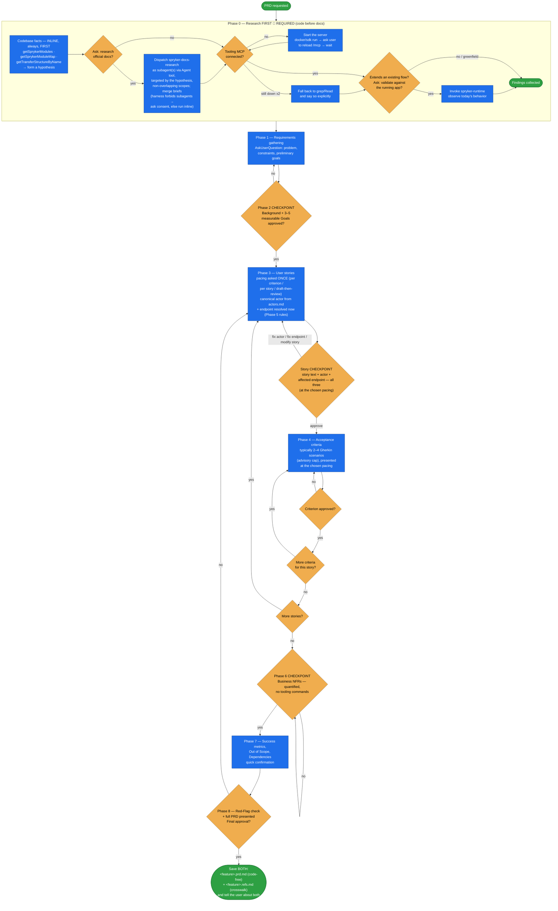

# product-requirement-document

Drive an **interactive, research-grounded PRD** for a Spryker feature — one that another AI agent can
turn into tasks. It researches the real platform first, assigns a canonical Spryker actor to every
story, names the affected endpoint path, and keeps the body strictly business-facing.

A PRD defines WHAT and WHY — never HOW, HOW LONG, or which commands to run. Requirements written from
memory drift from how Spryker actually works, so Phase 0 pins module names, transfer fields, controllers
and endpoint paths against the real install before a single requirement is drafted. The code references
it discovers aren't thrown away: they land in a sibling `.refs.md` attachment for the planner, keeping
the PRD body code-free.

## When it triggers

A user asks for a PRD, spec, or requirements document for a Spryker feature; planning a new feature
before implementation; aligning on scope and goals.

**Not for:** implementation plans, technical design docs, API reference, project timelines, or quick
informal requirement gathering.

## What the PRD deliberately excludes

No Quality Gates (`phpstan` / `phpcs` / `codecept`), no task breakdown, no architecture or code design in
stories, and **no code references anywhere in the body** — no FQCNs, no `Class::method()`, no
controller/action/plugin/facade/transfer/repository class names, no file paths. Capabilities are named by
feature/module name, settings by configuration name, and the endpoint line carries the URL path only.

## Flow schema

Phase 5 has no box of its own — it is the **endpoint-resolution rule set**, applied inside Phase 3 so the
endpoint is confirmed at the story checkpoint and merely written down afterwards.

## Stage → skill map

| Phase | Delegates to |
|---|---|
| 0 · codebase facts (first, always) | Spryker tooling MCP, inline: `getSprykerModules`, `getSprykerModuleMap`, `getTransferStructureByName` + `deploy.dev.yml` |
| 0 · docs (opt-in, targeted by the codebase hypothesis) | `Skill(spryker-docs-research)` — dispatched via the **Agent** tool as one or more subagents with non-overlapping scopes; if the harness forbids unrequested subagents, ask consent, else run inline and say so |
| 0 · running app (opt-in) | `Skill(spryker-runtime)` — validate existing flows, confirm users at `/user` and roles at `/acl` |
| 1–8 · every checkpoint | `AskUserQuestion` |

## Files

| File | Role |
|---|---|
| [`SKILL.md`](SKILL.md) | The spine — the 9 phases, critical requirements, `AskUserQuestion` usage, storage locations, red flags, and the interactive checklist. |
| [`workflow.md`](workflow.md) | The detailed phase-by-phase interactive script. |
| [`actors.md`](actors.md) | The canonical actor set — Back Office user, Customer, Company user (Customer), Agent, Merchant user, Merchant Agent — where each operates, how each authenticates, the Merchant user vs. Merchant Agent scope distinction, and story phrasing. |
| [`gherkin-guide.md`](gherkin-guide.md) | Strict Gherkin rules: one behavior per scenario, max 3–4 steps, everything quantified, plus common mistakes and a validation checklist. |
| [`template.md`](template.md) | The allowed PRD sections — Background, Goals, User Stories, NFRs, Constraints, Decisions & Accepted Risks, Success Metrics, Out of Scope, Dependencies. No Quality Gates, no Tasks, no priority tiers. |
| [`refs-attachment.md`](refs-attachment.md) | Structure of the sibling `<feature-name>.refs.md`: module map, endpoints per story, facade methods, transfers, configuration, plugins, file paths, running-app observations. |
| [`examples.md`](examples.md) | A full PRD example plus anti-patterns. |

## Critical requirements

- **Research before requirements.** Codebase facts are never optional; docs research and running-app
  validation are opt-in but the **question must be asked**, never silently skipped.
- **Strict actor assignment.** One canonical actor per story from `actors.md`. Never "As a user". Two
  actors means two stories. A narrower ACL role is allowed if the canonical actor stays mapped —
  `As a Back Office content manager (Back Office user)`.
- **Endpoint path per story.** Resolved from the research, with the host taken from `deploy.dev.yml`
  (`groups.<region>.applications.<app>.endpoints`) or a user-specified target. Marked `existing` or
  `greenfield` (greenfield names its closest neighbor — never a fabricated path). "No endpoint affected"
  is stated explicitly when true.
- **Code-free body.** All discovered FQCNs, transfers, config keys, and file paths go to `.refs.md`.
- **Gherkin, quantified.** Every criterion. "Fast" → "within 500 ms".
- **Interactive checkpoints — at the user's chosen pacing.** After Background & Goals, at each
  story/criterion checkpoint per the pacing asked once at Phase 3 (per-criterion / per-story /
  draft-then-review), after NFRs, and before saving. Never hardcode the slowest mode; never skip a
  checkpoint the chosen pacing implies.

## Output

Two files saved side by side — global at `resources/plan/PRD/Features/{FeatureName}/` or module-specific
at `src/{Org}/{Module}/resources/plan/PRD/`:

- `<feature-name>.prd.md` — the business-facing, code-free requirements document.
- `<feature-name>.refs.md` — the implementation crosswalk for the planner, linked from the PRD's
  research header.

## Packaging note

This skill ships in the `spryker-ai-dev-sdk` plugin under `vendor/spryker-sdk/ai-dev/…`, which is
Composer-managed — `composer update spryker-sdk/ai-dev` may overwrite it. The durable home for edits
is the plugin's own repository (`github.com/spryker-sdk/ai-dev`).
