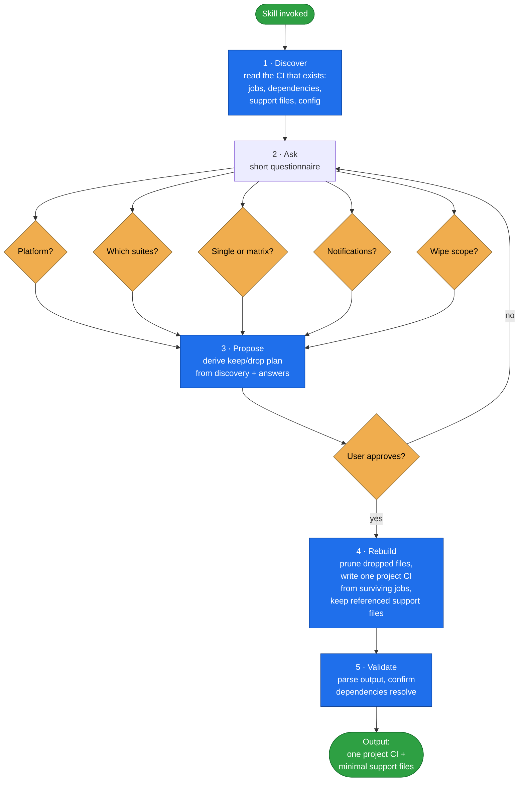

# project-ci-generator

Turn a heavy product/vendor-style CI setup into a **single, lean project CI pipeline** —
driven by a questionnaire, portable across CI hosts.

A product repo's CI must protect every customer, every database, every language version, and
the upstream release process. A project inherits all of it but needs almost none — it targets
one environment and only needs to gate its own commits. This skill reads whatever CI exists,
asks what the project needs, proposes a plan, then keeps only what matters and drops the rest.

## When it triggers

Invoke it when the user wants to: "clean up CI for the project", "make a project CI",
"recreate one CI file", "remove product-only CI jobs", "clear the CI folder and rebuild", or
port CI to another host.

## Flow schema

## Design decisions baked in

- **Investigate, never assume.** CI contents change over time, so every run reads and analyzes
  whatever CI actually exists — no remembered job list, filename, or classification is trusted.
- **Questionnaire first.** Output is determined by the answers, never guessed.
- **Propose before acting.** The keep/drop plan is derived from the discovery and answers,
  presented, and approved before anything is deleted — CI changes are outward-facing and hard
  to reverse.
- **Transform, don't template.** The new CI is built from the surviving jobs of the existing
  CI, reusing their real commands so the result is environment-correct.
- **Support files are load-bearing.** Support files referenced by kept jobs are preserved;
  everything unreferenced is pruned — with the KEEP set built from the **final** CI's real
  references (deploy files and the `pipeline:` recipes they name), never from filenames.
- **Recoverable by construction.** Before the first deletion the run verifies a clean tree,
  records the HEAD sha, and takes a backup (a `ci-pre-cleanup-<sha>` git tag, or an
  `.ai-dev/ci-backup/` copy when the CI is uncommitted); removals go through `git rm` so they
  land as reviewable staged changes, and the final report names the exact restore command.

## Packaging note

This skill ships in the `spryker-ai-dev-sdk` plugin under `vendor/spryker-sdk/ai-dev/…`, which is
Composer-managed — `composer update spryker-sdk/ai-dev` may overwrite it. The durable home for edits
is the plugin's own repository (`github.com/spryker-sdk/ai-dev`).
