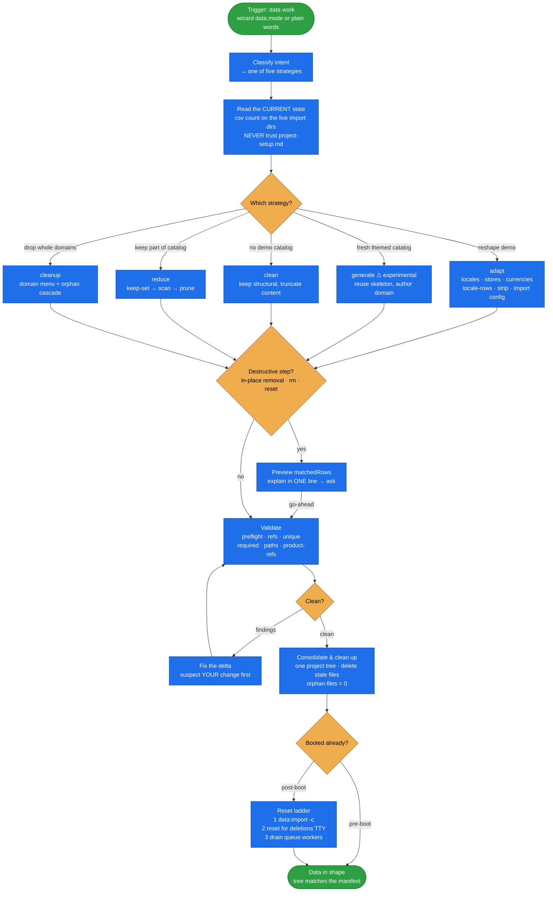

# project-data

The one skill for everything under a project's **`data/import/**`** — get the import data into the
shape the project needs, through one of **five strategies**: `adapt`, `generate`, `clean`, `reduce`,
`cleanup`.

It supplies the *judgment*; the mechanics come from the `spryker-import-tools` scripts (`csv.php` +
`validate.php`), which are concept-free — they know nothing about stores, locales or currencies. A
single bad row aborts a 30–60 minute install, so the whole skill is built around validating
statically before booting.

## When it triggers

Whenever demo/import data must be populated, reshaped, reduced, cleaned up, or removed:

- "adapt the demo shop to my stores and currencies" → **adapt**
- "add demo data / generate a catalog of tools from these images", "create CMS blocks from these
  pictures" → **generate**
- "start clean with no demo catalog" → **clean**
- "we only sell heat-recovery, drop the rest of the catalog" → **reduce**
- "remove the demo customers / merchants / reviews" → **cleanup**
- "drop German", "we don't need de_DE" → adapt's **strip pass**, standalone
- any ad-hoc add/edit/filter/remove on import CSVs → the same tools driven directly, no strategy

Used by the wizard's data step (`data.mode` picks the strategy; `leave` skips it) and standalone on a
fresh or already-running project. **Never make the user name a strategy or a file** — classify their
plain words; ask one question only if genuinely ambiguous.

Not here: store definitions / region / import-config skeleton (`define-stores`), real translation
(`translate-content`), go-live curation (`curate-golive-data`), the engines themselves
(`spryker-import-tools`), booting and verification (`boot-and-verify`).

## Flow schema

## Files

| File | Role |
|------|------|
| [`SKILL.md`](SKILL.md) | The router + the **shared core** every strategy applies: tool discipline, current-state reading, the destructive-op gate, the apply/reset ladder, the cross-cutting invariants, the consolidate-and-clean-up tail. |
| [`references/adapt.md`](references/adapt.md) | **adapt** method — steps 1–6: locale columns/rows, stores, currencies, locale-row data, strip demo leftovers, import config. |
| [`references/adapt-strategy.md`](references/adapt-strategy.md) | Per-column-family strategy map for adapt, plus the two make-or-break chains (search visibility, transactional emails) and the price/currency rules. |
| [`references/generate.md`](references/generate.md) | **generate** method (⚠ experimental, supervised only) — reuse the skeleton, author the domain in FK order, plus the nine required-shape gotchas C1–C9. |
| [`references/clean.md`](references/clean.md) | **clean** method — build the minimal bootable tree (spec: `define-stores/references/minimal-baseline.md`). |
| [`references/reduce.md`](references/reduce.md) | **reduce** method — keep-set → broad orphan scan → prune → verify → boot. |
| [`references/cleanup.md`](references/cleanup.md) | **cleanup** method — plain-language domain menu, per-domain cascade, the never-remove operational config. |

## Strategies

| Strategy | Intent | Method reference |
|---|---|---|
| **adapt** | Reshape the shipped demo catalog to the project's stores/locales/currencies, English content everywhere. Edits the shipped import **in place** — git is the diff and the revert. | `references/adapt.md` |
| **generate** | Author a fresh themed catalog in the project's own vertical, into its own folder. **Experimental — supervised runs only**; several failure modes pass every validator and boot green. | `references/generate.md` |
| **clean** | No demo catalog: keep the structural files, truncate the content files to header-only, author the few genuinely-new ones, `rm -rf` what the new manifest no longer references. | `references/clean.md` |
| **reduce** | Keep part of the catalog and remove the rest without leaving an orphan reference. | `references/reduce.md` |
| **cleanup** | Remove whole demo domains — customers, merchants, reviews, wishlists, CMS, discounts, transactional activity. | `references/cleanup.md` |

**They compose.** These are operations on the current data, runnable in any order: adapt now and
replace with generate later; clean, then generate onto the cleared base; reduce after adapting. The
one unbuilt path is merging a themed catalog *alongside* a still-full demo catalog — clean or reduce
first.

## Design decisions baked in

- **Never assume a starting state.** Every strategy begins by measuring what is in `data/import/**`
  *now*. `.ai-dev/project-setup.md` is a snapshot a later pass may have invalidated — it can still
  claim "full demo" long after a cleanup stripped the catalog.
- **Statically validate before spending a boot.** `preflight` sweeps the boot-critical invariants
  across every file the manifest imports in one call — `spy_url` global uniqueness, non-blank
  `is_searchable.<locale>`, price completeness (empty **or** literal `0`), base-before-relation
  import order. A 30–60 min install aborting on one duplicate URL is the failure being bought out.
- **Explain, then ask, before anything destructive.** In-place `filter`/`delete` and header-only
  truncation rewrite files without prompting; `reset`/`clean-data` can wipe DB and search volumes
  that git cannot restore. Preview (`matchedRows` with no `--out`/`--in-place`), state in one line
  what will be destroyed, get an explicit go-ahead — even when the allowlist would let it through.
- **Suspect your own data delta first.** If the shop worked before your edits and breaks after, the
  file you just changed is the prime suspect — not vendor code. Diff the delta and re-check
  completeness before reading a single vendor package.
- **A finished project contains only its own stores, locales and currencies.** The add half
  (`duplicate-columns`) and the drop half (`drop-columns --suffix`) must be symmetric — reused demo
  files carry foreign `.<locale>` columns and `locale` rows that a green boot never flags.
- **A blank per-locale cell is a finding; every row of a rewritten structural file must be accounted
  for.** Two invariants the suite kept re-learning file by file: an empty `.<locale>` cell is a defect
  unless a named importer inherits it (locale buckets are all-or-nothing), and a rewrite that touches
  only the rows the brief named silently drops the rest — a "replace the 3 category links" brief wipes
  the footer's legal links, social icons and payment logos, on a green boot.
- **Keep the shipped import dependency order — never reorder it.** Reordering breaks it two ways: a
  store's `locale-store` after the catalog leaves a silently empty store; `currency-store` hoisted
  above `currency` aborts with `Currency not found`.
- **The tree must match the manifest.** Every strategy ends with the consolidate-and-clean-up pass,
  proven by `validate.php orphan-files` returning zero — otherwise seeded store dirs full of stale
  demo copies become a second, plausible-looking source of truth.

## Packaging note

This skill ships in the `spryker-ai-dev-sdk` plugin under `vendor/spryker-sdk/ai-dev/…`, which is
Composer-managed — `composer update spryker-sdk/ai-dev` may overwrite it. The durable home for edits
is the plugin's own repository (`github.com/spryker-sdk/ai-dev`).
