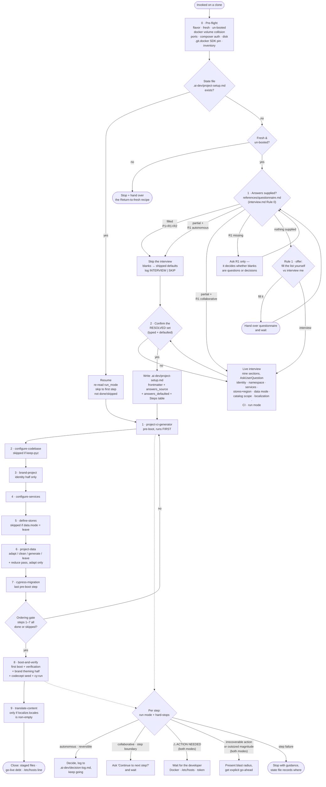

# project-starter-wizard

Turn a **fresh, un-booted clone of a Spryker b2b / b2b-marketplace demoshop into the customer's
project** — the setup decisions collected once up front, then nine orchestrated steps to a verified
running shop.

This skill owns the conversation and the flow; it writes almost nothing itself. The transformation
work belongs to the sibling step-skills, and the wizard's job is to collect everything once, record
the answers in a resumable state file, and drive the steps in the one order that works.

## Two ways to answer

The nine decision sections arrive either way — same fields, same state file:

- **Fill the questionnaire** ([`references/questionnaire.md`](references/questionnaire.md)) and hand it
  over → **no interview at all.** Minimum viable set is three answers: `P1` project name, `R1` mode,
  `R2` hard-stop acknowledgement. **Every other line is optional — blank means "take the default"**,
  and in `autonomous` mode a blank the wizard must actually resolve becomes a logged decision, not a
  question. Partial fills are first-class.
- **Be interviewed** — the batched `AskUserQuestion` path, when nothing was supplied. If you'd rather
  fill the file, the wizard offers that choice before asking anything.

## When it triggers

At the very start of a new customer project, on a fresh clone: "turn this demoshop into our
project", "start the project setup", "run the project starter". Also on "give me the setup
questionnaire" and "here are my filled answers — run it autonomously". It is **also the resume
entry** — if a prior run left `.ai-dev/project-setup.md`, invoking it skips collection entirely and
continues from the first step that isn't `done` or `skipped`.

Not for an already-booted or dirty clone with no state file — that stops with the
**"Return to fresh" recipe**, never a bare refusal.

## Flow schema

## Files

| File | Role |
|------|------|
| [`SKILL.md`](SKILL.md) | The spine — pre-flight, the nine steps and their ordering rationale, run modes, hard-stops, resume, abort paths, and the tooling discipline that binds every step. |
| [`references/questionnaire.md`](references/questionnaire.md) | **The fillable question bank** — every decision as a question carrying its default inline, grouped P/N/S/T/D/C/L/Q + run-config R, with a copy-paste YAML answer block. Fill it to skip the interview; hand it to a colleague who isn't at the keyboard. |
| [`references/interview.md`](references/interview.md) | **How** to collect the bank — Rule 0 (filled/partial/missing detection + parsing), Rule 1 (offer fill-it-yourself vs interview), AskUserQuestion mechanics, plain-language phrasings for the jargon, the nine sections, and the `.ai-dev/project-setup.md` template. Read **before** the first question. |
| [`references/pitfalls.md`](references/pitfalls.md) | The Known-traps catalog — every known failure signature across the whole run as *signature → cause → fix*, grouped by area (cross-cutting, boot aborts, post-boot false greens, per-step). Match a failure here before diagnosing from scratch. |

## Step → skill map

The wizard runs these in this exact order; each links to its own README.

| Step | Skill | Notes |
|------|-------|-------|
| 1 | [project-ci-generator](../project-ci-generator/README.md) | Pre-boot, first — executes interview §8's `ci:` plan; owns a dropped suite's whole footprint. |
| 2 | [configure-codebase](../configure-codebase/README.md) | Namespace + FE/test wiring; skipped on `keep-pyz`. |
| 3 | [brand-project](../brand-project/README.md) | Identity half only — theming half runs in step 8. |
| 4 | [configure-services](../configure-services/README.md) | Engines, dev services, applications into `deploy.dev.yml`. |
| 5 | [define-stores](../define-stores/README.md) | Region + store definitions; skipped if `data.mode = leave`. |
| 6 | [project-data](../project-data/README.md) | Strategy by `data.mode`: adapt / clean / generate / leave. |
| 7 | [cypress-migration](../cypress-migration/README.md) | E2E infra; last pre-boot because it reads steps 1, 3, 4, 5 and 6's output. |
| 8 | [boot-and-verify](../boot-and-verify/README.md) | First boot, per-store verification, and the post-boot halves of steps 2, 3 and 7. |
| 9 | [translate-content](../translate-content/README.md) | Optional; only when `localize.locales` is non-empty. |

Steps also lean on [spryker-import-tools](../spryker-import-tools/README.md) for all CSV work, and
step 8 spawns the `spryker-verifier` agent for its authoritative verdict.

## Modes

Questionnaire `R1` (or interview §9), recorded as `run_mode` in the state file, honoured again on
resume. Same work either way — only the check-in cadence differs.

- **autonomous** — steps 1–9 as one continuous pass, no "continue?" check-ins. At a reversible,
  in-project decision point — **including every questionnaire question you left blank** — it picks the
  best option and records it in `.ai-dev/decision-log.md`. Asking a configuration question mid-run is
  a mode violation.
- **collaborative** (alias: `supervised`) — a one-line result and an explicit "Continue to
  `<next step>`?" at each step boundary; every decision surfaced as a question with a recommendation.
  It also asks the questionnaire's blanks instead of resolving them.

Neither mode relaxes the hard-stops — this is what `R2` acknowledges: a `⚠ ACTION NEEDED`
prerequisite, any **irrecoverable** action (what `git checkout` cannot undo — a DB/volume drop,
`sudo`, deleting untracked files, any post-boot data deletion), a catalog reduction of outsized
**magnitude**, and a step failure all return control to the developer in **both** modes. **A filled questionnaire is not a promise of an uninterrupted run**;
it's a promise of no further *configuration* questions.

## Design decisions baked in

- **Collect once, then no further configuration questions.** All nine sections are collected up
  front — from a filled questionnaire or one interview — so the run needs no new config decisions.
  But the skill refuses to over-promise silence: destructive operations and any data defect the boot
  surfaces still consult the developer.
- **A blank is a default, not a question.** Only `P1`/`R1`/`R2` are required; everything else has a
  working default, and answering nothing at all is a valid, complete answer set (a rebrand-only
  project on shipped defaults). `answers_defaulted` in the state file plus the decision log record
  every value you didn't choose, so "I never picked that" always has an answer.
- **`R1` is the one answer with no safe default.** It decides whether a blank becomes a question or a
  logged decision, so a questionnaire arriving without it gets exactly one question back.
- **A questionnaire skips questions, never checks.** Pre-flight runs in full either way — the volume/
  namespace collision check in particular is re-run as soon as the project name is known.
- **Communication is load-bearing, not cosmetic.** A required human action leads the message as a
  single `⚠ ACTION NEEDED:` line, alone, above any status — a prerequisite buried under a
  validation table reads as status, and the run stalls on an unread ask. Every control-returning turn
  then **closes** with exactly one of `⚠ NEEDS YOU:` (numbered exact commands, each with the cost of
  declining) or `✅ NEEDS NOTHING`; "Ready when you are" is banned, because it hands back control
  without saying what is needed.
- **An autonomous stall and a verbose step report are the same defect.** A message shaped like a
  finished deliverable is what ends the turn — so a step report is capped at three lines and the next
  skill's call must land in the *same* message as the state-file update and the `run.log` line.
- **Recoverability gates deletions; magnitude gates intent.** The destructive gate asks "can
  `git checkout` undo this?", not "does this say `rm`?" — and the catalog reduce pass confirms the
  resolved category tree with product counts even under `autonomous`, because a perfectly reversible
  drop can still not be what the developer meant.
- **The state file is the run.** `.ai-dev/project-setup.md` carries the answers and a Steps table
  with per-step status and intra-step progress notes, so an interrupted run resumes precisely
  instead of blindly re-running a non-idempotent deletion pass.
- **Surgical edits only.** A step changes only the exact keys it owns; neighbouring blocks stay
  byte-for-byte as shipped (an agent that also "tidied" the adjacent `docker.mount.mutagen` block
  crippled the Mac dev env).
- **Environment limits are not project defects.** No TTY, the tool timeout, shell word-splitting —
  those are limits of how the agent runs. Surface them; never edit project config to work around one.
- **A closed set of capabilities, one simple command per call.** CSV work goes through the
  `spryker-import-tools` php tools, file work through Read/Grep/Edit, state changes through
  `docker/sdk`. Pipes, `&&`, loops and subshells prompt regardless of the allowlist — so they're
  avoided by shape, not by permission.

## Run artifacts

The run writes four files into the clone's own tree — it is self-contained, and "Return to fresh"
deletes them:

| File | Role |
|------|------|
| `.ai-dev/project-setup.md` | The **state** — interview answers + the Steps table Resume operates on. |
| `.ai-dev/run.log` | The **timeline** — step START/END, conditional skips with their reason, hard-stops, sub-skill handoffs, the step-8 verifier verdict, and every `RESUME`. |
| `.ai-dev/decision-log.md` | The **rationale** — each autonomous decision with its evidence and how to reverse it. |
| `.ai-dev/skill-improvement-log.md` | Maintainer feedback (**dev scaffolding — stripped before release**). |

The log is created in §2 beside the state file, and a resumed run **appends a `RESUME` line rather
than starting a new file**, so one run reads as one continuous timeline across interruptions. It is
written with Write/Edit — not `printf >>` — because redirects prompt regardless of the allowlist,
which would break the hands-off guarantee.

The four files sit flat at `.ai-dev/` because the state file's path is load-bearing: pre-flight
detects a prior run by it, Resume reads it, and "Return to fresh" deletes it.

## Output

A transformed clone: project identity and branding, a registered namespace, the chosen services and
stores, project-shaped import data, a lean CI pipeline, a vendored Cypress suite — booted, verified
per store by an independent verifier agent, with changes staged (never committed).

Two kinds of leftover work are tracked rather than silently dropped:

- **`## Required follow-ups`** in the state file — durable cross-step handoffs, written by the step
  that discovers one and read by the step that consumes it, so they survive a resume.
- **The close summary** — flags what still needs a human before go-live, such as an `origin` that
  still points at the demoshop upstream, a still-shipped Spryker logo, and any translation debt from
  locales left as English copies.

## Packaging note

This skill ships in the `spryker-ai-dev-sdk` plugin under `vendor/spryker-sdk/ai-dev/…`, which is
Composer-managed — `composer update spryker-sdk/ai-dev` may overwrite it. The durable home for edits
is the plugin's own repository (`github.com/spryker-sdk/ai-dev`).
