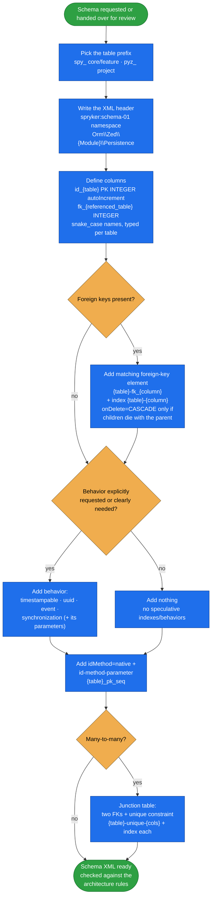

# propel-schema

The **Spryker Propel schema convention sheet** — naming rules, column types, behaviors, and
architecture constraints for writing or reviewing a module's `*.schema.xml`, with worked single-table
and many-to-many examples.

Propel schemas are where Spryker's persistence conventions are enforced by convention rather than by a
compiler: get a primary-key name, a sequence parameter, or a foreign-key name wrong and the generated
ORM drifts from what the rest of the platform expects. This skill front-loads those rules so a schema
comes out right the first time.

## When it triggers

Creating, updating, or **reviewing** a Propel schema definition for a Spryker module — "add a table for
X", "write the schema XML", "does this schema follow Spryker conventions", "add a junction table between
A and B".

## Flow schema

## Naming conventions

| Element | Pattern |
|---|---|
| Table prefix | `spy_` core/feature modules · `pyz_` project-level modules |
| Primary key | `id_{table_name}` — INTEGER, autoIncrement, required |
| Foreign key column | `fk_{referenced_table}` — INTEGER |
| Sequence | `<id-method-parameter value="{table_name}_pk_seq"/>` |
| Foreign key name | `{table}-fk_{column}` |
| Index name | `{table}-{column}` |
| Unique constraint | `{table}-unique-{column}` |
| Column names | snake_case only |

## Column types

| Use case | Type |
|---|---|
| IDs, counters | `INTEGER` |
| Short strings | `VARCHAR` |
| Long text / JSON | `LONGVARCHAR` |
| Flag | `BOOLEAN` |
| Fixed options | `ENUM` |
| UUID | `VARCHAR size="36"` |
| Timestamps | `TIMESTAMP` |
| Date only | `DATE` |
| Decimal | `DECIMAL` |

## Behaviors

| Behavior | Effect |
|---|---|
| `timestampable` | Adds `created_at`, `updated_at` |
| `uuid` | Auto-generates a UUID; requires `<parameter name="key_columns" value="id_{table}"/>` |
| `event` | Triggers sync events; requires `<parameter name="{table}_all" column="*"/>` |
| `synchronization` | Syncs data to Redis / Elasticsearch |

## Architecture rules

- Primary keys MUST be INTEGER following the `id_{table_name}` pattern.
- Every foreign-key column MUST have a matching `<foreign-key>` element, and SHOULD have an `<index>`.
- `onDelete="CASCADE"` only when child rows genuinely should die with the parent.
- Table and column names MUST be snake_case.
- Always add `idMethod="native"` plus an `<id-method-parameter>` on tables with a primary key.
- **Only** add indexes and behaviors that are explicitly requested or clearly needed — no speculative
  extras.

## Files

| File | Role |
|---|---|
| [`SKILL.md`](SKILL.md) | The whole skill — conventions, type/behavior tables, architecture rules, XML header, plus a worked single-table example (`pyz_company_catalog`) and a many-to-many junction example. |

## Packaging note

This skill ships in the `spryker-ai-dev-sdk` plugin under `vendor/spryker-sdk/ai-dev/…`, which is
Composer-managed — `composer update spryker-sdk/ai-dev` may overwrite it. The durable home for edits
is the plugin's own repository (`github.com/spryker-sdk/ai-dev`).
