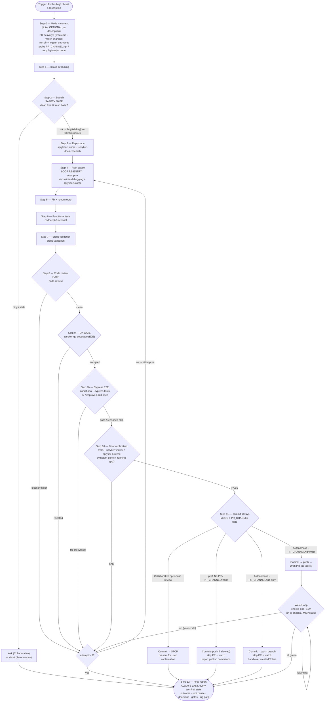

# spryker-bugfix

End-to-end bug-fixing workflow for Spryker projects: from a **ticket _or_ a plain description** to a
committed, validated, QA-accepted fix on a `bugfix/*` branch. In Autonomous mode it goes all the way to
a pushed **Draft PR** with a remote-CI watch loop.

This skill is an **orchestrator** — it runs a fixed sequence of stages and delegates the heavy work of
each stage to an already-installed skill or Claude subagent. It writes no product code itself; it
coordinates the skills that do.

## Files

| File | Role |
|------|------|
| [`SKILL.md`](SKILL.md) | The workflow spine — Steps 0–12, one paragraph each. This is what Claude loads. |
| [`stages.md`](stages.md) | Full, authoritative per-step instructions + the stage→skill quick map. Read the relevant § before each step. |
| [`reference.md`](reference.md) | Run-lean context discipline (`$BUGFIX_DIR`, State Object), operating principles, decision log, red flags. Read once per run. |

## Two ways in — the ticket is optional

The bug context can come from **either or both** of:

- a **ticket** from any tracker (JIRA key, GitHub issue URL/number, or any other service), **or**
- a **free-text description** of the symptom with technical hints.

A ticket is **never required**. When a ticket exists and its integration is reachable (Atlassian MCP,
`gh`, …) the skill pulls it for extra context; otherwise it works entirely from the description. The
branch name, PR title, and commit message all fall back to `no-ticket` / `NO-TICKET`.

## Design constraints

- **Claude-only.** Every stage delegates to a bundled/installed `Skill(...)` or a Claude subagent. No
  third-party MCP is required for the core flow — the **only** external touchpoint is the optional
  Step 0 ticket pull. Every spawned subagent runs on a Claude model.
- **Run lean.** Bulk output (Chrome, XDebug, codecept, phpcs/phpstan, review, verification, CI logs)
  runs inside subagents that write raw logs to `$BUGFIX_DIR`
  (`$CLAUDE_PROJECT_DIR/.ai-dev/spryker-bugfix/<bugfix-id>/`) and return only compact verdicts.
- **Plan is a task list.** Step 0 arranges the 12 stages as a `TaskCreate` task list and drives it with
  `TaskUpdate` (one task `in_progress` at a time; a fresh attempt task per loopback). `TaskList` is the
  live position — it survives compaction and scheduled wake-ups, so a resumed run or the watch loop
  re-orients from it. It complements the `run.log` timeline and the `decisions.md` rationale.
- **The bug is the contract.** A fix is "done" only when the user-visible symptom no longer reproduces
  with evidence **and** every gate is green.
- **Gate weight scales, gate existence does not.** Step 1 records a diff `size` (`trivial` / `normal` /
  `complex`) that shrinks the Step 8 reviewer fan-out (1 instead of 3–5) and narrows Step 9's QA scope to
  the single affected flow — but no gate is ever skipped for a small diff, and each still reports its own
  verdict honestly. Same rule after a dirty-branch override: the gates are **scoped** to the fix's file
  list and the report says so.
- **Cypress E2E coverage is a first-class, conditional stage.** Step 0 asks how to handle it (auto /
  always / skip); Step 9b — after QA has accepted the fix — delegates to `Skill(cypress-tests)` to
  **fix** a spec the bug broke, **improve** assertions that would have missed it, or **add** a new
  spec — only when the bug is user-visible on an E2E surface and the project's suite exists. A skip
  is always a logged decision.
- **PR delivery is chosen + capability-gated.** Step 0 asks **whether to open a PR and via which
  channel**, then probes what's available and records `PR_CHANNEL` — `gh` (native GitHub CLI), `mcp` (a
  connected **forge MCP** for the remote host: GitHub / GitLab / Bitbucket / …), `git-only` (push a
  branch, no PR API), or `none` (local-only). `gh` is **never assumed** — an MCP server or plain `git`
  is enough. If the chosen/available channel can't open a PR, Step 11 degrades to a clean terminal
  (commit, and where possible push + a handoff create-PR line) instead of failing, and the skill **sets
  no labels** on any PR it opens. Every push/PR step checks the preference + channel first and is
  skipped-with-a-note when unavailable.

## Modes

- **Collaborative** — the agent stops at the important decision points and **before push** for review.
- **Autonomous** — after the single Step 0 intake, the agent runs unattended to a pushed Draft PR;
  every fork is a logged CRITICAL DECISION, not a question. The only hard stops are a stale/dirty base
  (Step 2) and the attempt budget (`attempt > 3`).

## Flow



### The verification loop

Steps 8 (review), 9 (QA), 10 (final verification), and 11 (remote CI) are gates — and a Step 9b
Cypress failure that indicts the fix (not the test) joins the same loop. A failure in any of
them draws from **one shared `attempt` counter** and loops back to **Step 4** to re-investigate, then
forward through the full chain again. The hard stop is `attempt > 3`: the run STOPs and reports —
nothing is pushed and no PR is marked ready with a known-broken state.

## Stage → skill map

Skill names below are shorthand: the real invocable name is prefixed with the plugin,
e.g. `Skill(spryker-ai-dev-sdk:spryker-runtime)`. Agent types follow the same rule on a
plugin install — `subagent_type="spryker-ai-dev-sdk:spryker-verifier"`, not the bare name.

| Step | Delegates to |
|------|--------------|
| 0 | `AskUserQuestion`; **optional** ticket pull (Atlassian MCP / `gh issue view` / paste) |
| 3 | `Skill(spryker-runtime)` + `Skill(spryker-docs-research)` |
| 4 | `Skill(ai-runtime-debugging)` + `Skill(spryker-runtime)` |
| 6 | `Skill(codecept-functional)` |
| 7 | `Skill(static-validation)` |
| 8 | `Skill(code-review)` |
| 9 | `Skill(spryker-qa-coverage)` |
| 9b | `Skill(cypress-tests)` — conditional: fix / improve / add a Cypress E2E spec for the bug |
| 10 | `Skill(codecept-functional)` re-run + `spryker-verifier` agent / `Skill(spryker-runtime)` |
| 11 | `git` / `gh pr create --draft` / a watch loop on whichever scheduler or monitor tool `ToolSearch` resolves |

## Run artifacts

Every file the run produces lives in one per-bugfix folder (`$BUGFIX_DIR`), created at Step 0 and
surviving loopbacks and scheduled wake-ups — which is what lets the watch loop re-hydrate from it:

```
.ai-dev/spryker-bugfix/<bugfix-id>/     # <bugfix-id> = ticket key, else no-ticket-<brief-name>
```

| File | Role |
|------|------|
| `run.log` | The append-only **timeline** — one line per step boundary, every loopback (`attempt=<n>`), every gate verdict. |
| `decisions.md` | The **rationale** — CRITICAL DECISIONS plus OPEN QUESTIONS / RISKS; the source for the Step 12 report. |
| `repro-notes.md` | The reproduction scenario in full; the State Object keeps only a 1–3 line summary + this path. |
| `<stage>-attempt<N>.log` | **Bulk output** per gate — tests, static analysis, review, verification, CI logs. |
| `watch-state.md` | The Step 11 handoff the remote-CI watch loop re-reads on each wake-up. |

The Step 12 report's last line is the path to the step log and decision log.

## Packaging note

This skill ships in the `spryker-ai-dev-sdk` plugin under `vendor/spryker-sdk/ai-dev/…`, which is
Composer-managed — `composer update spryker-sdk/ai-dev` may overwrite it. The durable home for edits is
the plugin's own repository (`github.com/spryker-sdk/ai-dev`).
