# spryker-customization

Take a **PRD or acceptance criteria and walk it to a committed branch** — intake, plan, edit,
refresh, per-AC verification, self-correction, Cypress E2E coverage (when warranted), static
validation, review, commit gate.

This skill is an **orchestrator**. It writes no research and drives no browser itself; it delegates
focused work to the `spryker-*` subagents and skills at the points the workflow calls out. Two things
are fixed up front — a quality bar (PoC or MVP) and which phases run — and user-facing interaction is
deliberately compressed into two gates: one consolidated planning round, and the commit.

It **never auto-commits**, never pushes, and never works on the user's current branch.

## When it triggers

"Build this", "implement this", "here is a PRD — build it", "add X for the demo", "build this PoC",
"production-quality build" — any request to implement a Spryker customization from a PRD or
acceptance criteria.

## Flow schema

```mermaid
flowchart TD
    A([Invoked with a PRD / ACs]) --> S0A{"Step 0a — Quality bar<br/>PoC or MVP?<br/>infer from wording, ask if ambiguous"}
    S0A --> S0B["Step 0b — Show the phase checklist<br/>ON/OFF defaults, user confirms or overrides"]
    S0B --> S0C{"Step 0c — PRD source"}
    S0C -- "PRD in context" --> S0C1{"Confirm: use it ·<br/>refresh it · new one"}
    S0C -- "no PRD" --> S0C2{"I'll provide one ·<br/>create one · ACs only"}
    S0C1 -- "refresh / new" --> PRD["Skill: product-requirement-document"] --> S1
    S0C2 -- "create" --> PRD
    S0C1 -- "use it" --> S1
    S0C2 -- "provide / ACs only" --> S1

    S1{"Step 1 — Intake<br/>restate as a numbered AC checklist<br/>flag ambiguity, missing info,<br/>conflicts with the quality bar<br/>USER CONFIRMS"}
    S1 -- "not confirmed" --> S1
    S1 -- "confirmed" --> S2{"Step 2 — Branch<br/>git status clean?"}
    S2 -- "dirty" --> ASKB{"Ask before proceeding"} --> S3
    S2 -- "clean" --> S3["Cut ai-customize/&lt;slug&gt; from HEAD<br/>not from master"]

    S3 --> S3P["Step 3 — Plan<br/>ALWAYS spryker-feature-expert first,<br/>one parallel Agent call per domain.<br/>Never grep vendor/ yourself"]
    S3P --> BAR{"Which bar?"}
    BAR -- "PoC" --> COLLAPSE["PoC collapse mapping (mandatory)<br/>per class: what breaks if inlined?<br/>'just organization' → inline it"]
    BAR -- "MVP" --> CANON["Preserve the canonical chain<br/>check nothing is MISSING:<br/>plugin registration, transfer XML,<br/>config/DI, all locales, ACL"]
    COLLAPSE --> REFINE
    CANON --> REFINE["PRD refinement — re-read the PRD<br/>with the research in hand"]
    REFINE --> CONSOL["Consolidate EVERY later question now:<br/>PRD items · credentials per AC ·<br/>test data · locale/store scope"]
    CONSOL --> GATE1{"Plan + questions —<br/>one round of answers"}
    GATE1 -- "user pivots scope" --> COST["Restate the cost:<br/>+N files, ~M lines. Confirm."] --> S3P
    GATE1 -- "answered" --> S4

    S4["Step 4 — Edit, per the chosen bar<br/>project layer only · never vendor/ ·<br/>never src/Generated or src/Orm ·<br/>track every file you touch"]
    S4 -- "new UI element" --> FE["HARD pre-edit gate:<br/>Skill yves-atomic-frontend BEFORE<br/>the first write to Theme/default/components<br/>or any new .scss/.ts"] --> S4
    S4 -- "why is this doing X at runtime?" --> DBG["Skill ai-runtime-debugging<br/>[AI-DEBUG] tagged logs"] --> S4
    S4 --> S5["Step 5 — Skill spryker-refresher<br/>pass the edited-file list<br/>NEVER inline a docker/sdk console command"]
    S5 -- "non-zero exit" --> DIAG5["spryker-issue-diagnoser"] --> S5
    S5 --> WARM["Cache pre-warm: navigate each<br/>affected page once, discard the result"]

    WARM --> S6A{"Step 6a — FE smoke check<br/>any Yves changes?"}
    S6A -- "no Yves changes" --> S6B
    S6A -- "yes" --> SMOKE{"spryker-verifier smoke:<br/>HTTP 200 + no JS errors +<br/>sentinel in the bundle"}
    SMOKE -- "FAIL" --> S7
    SMOKE -- "pass" --> S6B{"Step 6b — QA-thorough phase on?"}

    S6B -- "on (MVP default)" --> QA["Skill spryker-qa-coverage →<br/>Happy/Negative/Authorization/Corner plan"]
    QA --> ORDER["UI Chrome cases FIRST, then API/DB/console.<br/>Pre-warm one login per unique user,<br/>pass the warm tab to the verifier.<br/>Functional tests LAST"]
    S6B -- "off (PoC default)" --> LIT["spryker-verifier per literal AC<br/>UI first, no expansion"]
    ORDER --> FAN["Fan out spryker-verifier<br/>one Agent call per case, parallel<br/>seed via spryker-data-seeder if data is missing"]
    LIT --> FAN

    FAN --> RED{"Any red AC or red test?"}
    RED -- "no" --> S7A{"Step 7a — Cypress phase on?<br/>user-visible E2E surface?<br/>suite exists?"}
    S7A -- "off / no surface / no suite<br/>(logged skip)" --> S7B
    S7A -- "yes" --> CY["Skill cypress-tests<br/>fix / improve / add spec<br/>targeted run + code:check"]
    CY -- "green / none needed" --> S7B
    CY -- "red — feature bug missed by Step 6" --> S7
    RED -- "yes" --> S7["Step 7 — self-correct loop<br/>spryker-issue-diagnoser + the ATTEMPT LOG"]
    S7 --> SIG{"Diagnoser: insufficient signal?"}
    SIG -- "yes" --> DBG2["Skill ai-runtime-debugging<br/>instrument, re-trigger, read back"] --> S7
    SIG -- "no" --> FIX["Smallest edit for the root cause<br/>append to the attempt log<br/>re-run refresher if needed"]
    FIX --> REV{"Re-verify just that AC"}
    REV -- "green" --> RED
    REV -- "still red" --> STUCK{"Stuck signal?<br/>repeat cause+fix · repeat file/edit,<br/>no verdict change · insufficient signal<br/>twice after debugging · N=10 failsafe"}
    STUCK -- "no" --> S7
    STUCK -- "yes" --> ESC(["Escalate to the user:<br/>(a) different angle (b) accept as failed<br/>(c) hand over. WAIT — never mark<br/>failed-after-retries unilaterally"])

    RED -- "UI AC green on objective checks" --> VIS{"Show the screenshot, ASK the user.<br/>Visual quality is never self-assessed"}
    VIS -- "changes wanted" --> S4
    VIS -- "signed off" --> S7A

    S7B["Step 7b — final pre-commit pass<br/>1. strip ALL [AI-DEBUG] instrumentation<br/>2. Skill static-validation (ONLY here)<br/>3. spryker-code-reviewer"]
    S7B -- "blocking issues, retries &lt; 2" --> S7B
    S7B -- "finding needs scope beyond the diff" --> ESC2(["STOP — offer expand / document /<br/>revert. Workarounds are forbidden"])
    S7B --> S7C{"Screenshots phase on?"}
    S7C -- "yes" --> CAP["Step 7c — spryker-screenshot-collector<br/>BEFORE the commit gate"] --> S8
    S7C -- "no" --> S8

    S8["Step 8 — git add ONLY your tracked files<br/>never git add . / -A<br/>final review against git diff --cached"]
    S8 --> GATE2{"Implementation report<br/>+ 'Commit?'"}
    GATE2 -- "yes" --> C(["git commit with the ACs in the body.<br/>Branch stays LOCAL — no push"])
    GATE2 -- "no / an AC still red" --> L(["Leave the files STAGED.<br/>No git reset — tell the user how<br/>to review, commit, or unstage"])

    classDef step fill:#1f6feb,stroke:#0b3d91,color:#fff;
    classDef decision fill:#f0ad4e,stroke:#8a6d3b,color:#000;
    classDef terminal fill:#2ea043,stroke:#176f2c,color:#fff;
    class S0B,PRD,S3,S3P,COLLAPSE,CANON,REFINE,CONSOL,COST,S4,FE,DBG,S5,DIAG5,WARM,QA,ORDER,LIT,FAN,S7,DBG2,FIX,CY,S7B,CAP,S8 step;
    class S0A,S0C,S0C1,S0C2,S1,S2,ASKB,BAR,GATE1,S6A,SMOKE,S6B,RED,SIG,REV,STUCK,VIS,S7A,S7C,GATE2 decision;
    class A,ESC,ESC2,C,L terminal;
```



## Two quality bars

| | **PoC** | **MVP** |
|---|---|---|
| Code shape | The entry-point class absorbs the canonical chain — no Calculator/Saver/Mapper/Adapter when the entry point can do the job; no interfaces for single implementations. Target 1–2 PHP classes. | Canonical Spryker patterns — plugin chains, factory expanders, project-layer transfer XML. |
| Values | Hardcoded OK | Config or DI, no hardcoded values |
| Locales / ACL | Default locale only, no ACL ceremony beyond an AC | Every configured store; ACL wherever admin actions exist |
| Tests | off by default | on by default |
| Bar | — | The diff should survive a senior code review |

**Visual quality applies to both.** "PoC" describes code complexity, not visual polish — a new line
of plain unstyled text on a polished Spryker page is a broken feature that happens to compile. Reuse
existing atoms/molecules/organisms; match surrounding styling; introduce no new visual idioms without
justification.

## Phases you can switch off

Everything except intake+plan, branch+edit, and the commit gate is negotiable at Step 0b. Whatever is
off, the workflow **skips its subagents entirely**.

| Phase | Default |
|---|---|
| Tests alongside the edit | on for MVP, off for PoC |
| Refresh (`spryker-refresher`) | on |
| Verification (`spryker-verifier` per AC) | on |
| QA-thorough 4-bucket coverage (`spryker-qa-coverage`) | on for MVP, off for PoC |
| Self-correction on red ACs | on if verification is on |
| Cypress E2E coverage (`cypress-tests` skill, once all ACs are green) | on for MVP, off for PoC |
| Static validation | on |
| Code review (`spryker-code-reviewer`) | off — opt-in |
| Demo artifact capture (`spryker-screenshot-collector`) | off — opt-in |

## Stage → skill map

Subagents live under `.claude/agents/` and are invoked via the **`Agent`** tool with
`subagent_type="<name>"`. Skills are loaded into the main session via the **`Skill`** tool. The two
are never swapped.

| Step | Delegates to | Kind |
|---|---|---|
| 0c | `product-requirement-document` | Skill |
| 3 | `spryker-feature-expert` — always, before planning; parallel per domain | Agent |
| 4 | `yves-atomic-frontend` (hard pre-edit gate for any UI element) | Skill |
| 4 / 7 | `ai-runtime-debugging` — when runtime values aren't in logs / DB / browser state | Skill |
| 4 / 6 | `spryker-data-seeder` — whenever a case needs data that doesn't exist | Agent |
| 5 | `spryker-refresher` — mandatory; the orchestrator must not inline console commands | Skill |
| 6 | `spryker-qa-coverage` — expand ACs into the 4-bucket plan | Skill |
| 6a / 6b | `spryker-verifier` — smoke check, then per case, parallel within a bucket | Agent |
| 7 | `spryker-issue-diagnoser` — on every red AC and every refresher failure | Agent |
| 7a | `cypress-tests` — once all ACs are green: fix / improve / add an E2E spec, run targeted + quality gate | Skill |
| 7b | `static-validation` — the only step that runs it | Skill |
| 7b / 8 | `spryker-code-reviewer` — after static validation, so it sees a clean diff; re-run at 8 against the staged diff | Agent |
| 7c | `spryker-screenshot-collector` — before the commit gate | Agent |

## Design decisions baked in

- **One consolidated question round.** Before showing the plan, the orchestrator walks the rest of the
  workflow in its head and gathers every question that will come up later — PRD refinements surfaced
  by the research, which seeded user each AC's verification needs, what test data must exist, locale
  and store scope. The user answers once; execution then runs uninterrupted to the commit gate.
- **Never research Spryker yourself.** No grep, sed, awk, or reading of `vendor/` and transfer XMLs.
  Field lookups go through `getTransferStructureByName`, interfaces through
  `getInterfaceMethodsByNamespace`, modules through `getSprykerModules` — all via
  `spryker-feature-expert`. If its first answer isn't enough, ask a sharper follow-up rather than
  falling back to manual grep.
- **Static validation runs exactly once, at Step 7b.** Its own description fires aggressively on any
  PHP edit, so Steps 4, 5, and every iteration of 7 carry an explicit guard against it. Running it
  earlier lets `phpcbf` reformat interim code the verifier hasn't checked and adds lint findings to a
  loop that's already iterating on a moving target.
- **Persistence, not a retry counter.** The self-correct loop runs until green or a real stuck signal
  fires — a repeated root cause with a repeated failed fix, two identical no-progress edits, twice
  "insufficient signal" *after* runtime debugging, or the N=10 runaway failsafe. The user is prompted
  only when there is genuinely nothing left to try. An **attempt log** carries across iterations so
  the diagnoser has memory of what already failed.
- **A workaround is a re-plan signal, not a comment.** If the code you're about to write would be
  described as a workaround or a "we have to do this because Spryker…", re-invoke the feature-expert
  with a specific follow-up about the seam you're fighting — 9/10 the canonical seam exists and was
  missed. Same on review findings: masking with an `if`, a `try/catch`, a sentinel, or an extracted
  method that names the masking logic is forbidden; escalate with a scope/document/revert choice.
- **No defensive comments.** No docblocks justifying the code, no references to reviews or fixes, no
  "why this approach over the obvious one". If the why needs prose, the code needs restructuring; the
  PR description carries the rest.
- **The model never judges visual quality.** The verifier's role on visual ACs is limited to objective
  checks — element renders, uses an atom class, no layout breakage. Subjective design judgment goes to
  the user with the screenshot, every time; iteration happens only on an explicit redirect.
- **Cypress E2E coverage is a conditional phase that runs only on a stable feature.** Step 7a fires
  after the self-correct loop has converged (all ACs green, visual sign-offs done), so no spec is
  authored against an implementation still in flux. The `cypress-tests` skill decides fix vs improve
  vs add against the existing suite; a spec that goes red because the feature is wrong is a red AC
  Step 6 missed and feeds back into the Step 7 loop, and a skip (PoC, no E2E surface, no suite) is
  always logged, never silent.
- **Frontend smoke check before any fan-out.** Facade-level tests can pass on a broken UI, so a 500,
  a JS console error, or a missing bundle sentinel stops Step 6 immediately and hands straight to the
  diagnoser — rather than burning minutes on results that don't reflect a working feature.
- **Never drive the browser from the main loop.** Verification belongs to `spryker-verifier`, capture
  to `spryker-screenshot-collector`. When a result looks wrong the answer is a sharper re-invocation,
  not loading `mcp__claude-in-chrome__*` into the main session for a "quick check".
- **Refusing the commit must not lose work.** Files stay staged, with the exact commands to review,
  commit, or unstage — no `git reset`, no confusing dirty tree to interpret.

## Run artifacts

Every run writes its trail to one folder, created at the end of Step 0 and kept for the whole build —
including across self-correct iterations, which is what lets iteration N read what N−1 already tried:

```
.ai-dev/spryker-customization/<feature-slug>/
```

| File | Role |
|------|------|
| `run.log` | The append-only **timeline** — one line per step boundary, every self-correct iteration, every gate verdict. |
| `decisions.md` | The **rationale** — each fork resolved without asking, plus an OPEN QUESTIONS / RISKS section that feeds the report's Caveats. |
| `<stage>-<n>.log` | **Bulk output** from a subagent or gate (verifier runs, review findings, static-validation reports). |

The Step 8 report is built *from* these files rather than from recollection, and it prints the
`run.log` path so the commit decision can be audited.

## Output

An implementation report at Step 8 — quality bar, an AC table with status and evidence (screenshots,
responses, queries), a diff summary listing every touched file with a one-line purpose, PoC caveats
where shortcuts were taken — followed by the commit question against the already-staged diff.

On yes: a `git commit` on `ai-customize/<slug>` with the ACs in the body. The branch stays local.

## Packaging note

This skill ships in the `spryker-ai-dev-sdk` plugin under `vendor/spryker-sdk/ai-dev/…`, which is
Composer-managed — `composer update spryker-sdk/ai-dev` may overwrite it. The durable home for edits
is the plugin's own repository (`github.com/spryker-sdk/ai-dev`).
