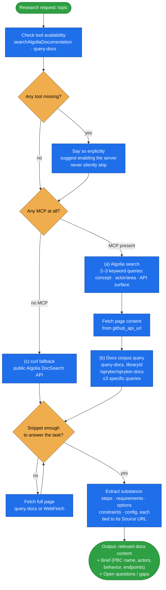

# spryker-docs-research

Research and summarise the **official Spryker public documentation** — module behavior, configuration
options, API/Glue references, architecture concepts, supported actors, feature/PBC names, and
integration guides — and hand back the actual documented content with source links.

Spryker is large, versioned, and convention-heavy. Guessing feature names, supported capabilities, or
actors from memory produces requirements and plans that don't match the real platform. This skill runs
**first**, before design, planning, or code investigation, so everything downstream is anchored in
documented reality.

## When it triggers

Any time a task needs to know how a Spryker feature, module, or pattern works *according to the docs*
before planning, writing a PRD, or implementing — "how does the OMS state machine work", "what are the
installation steps for MerchantPortal", "is this behavior supported in Spryker" — or any time you are
about to describe Spryker behavior from memory. `product-requirement-document` invokes it (as a
subagent) to ground PRDs.

**Not for** reading the installed codebase. It never looks at modules, transfers, or real endpoint
paths — those belong to a separate code-investigation step and get flagged under "Open questions".

## Flow schema

## Search options

Two complementary options — use whichever are connected, and combine them: Algolia finds the exact doc
pages, the docs corpus gives conceptual depth and examples.

| Option | Tool | Provided by | Notes |
|---|---|---|---|
| a | `searchAlgoliaDocumentation` | Spryker tooling server | 2–3 word queries rank best; run several focused searches, then fetch content from `github_api_url`. |
| b | `query-docs` | docs server (often `context7`) | Always pass the fixed `libraryId: "/spryker/spryker-docs"`; **never** call `resolve-library-id`. Keep to ≤3 specific queries. |
| c | `curl` | — | No-MCP fallback against the public Algolia DocSearch API. |

Tools are matched by **tool name**, not server name — MCP server names are install-specific, and calling
conventions (e.g. `mcp__<server>__<tool>`) vary by client.

## Output

A `## Spryker Documentation Research: <topic>` report: a **Tool availability** line, then
**Relevant documentation** (one section per doc page, each with its **Source** URL and the real steps /
requirements / options / constraints / config, code snippets verbatim), a **Brief** synthesis
(feature/PBC name, supported actors, key behavior, documented endpoints), and **Open questions / gaps**.

## Design decisions baked in

- **Docs before opinion.** Never describe Spryker behavior from memory when the documentation can
  confirm it.
- **Content, not pointers.** The caller gets the documentation substance so it can act without
  re-opening the docs — not a list of URLs to go read.
- **Cite everything.** Every claim and passage carries its doc URL.
- **Public docs only.** Questions needing exact module names, transfer fields, or real endpoint paths
  are recorded as gaps, not answered from memory.
- **Surface gaps loudly.** A missing MCP tool or an unanswered question is a finding, not something to
  paper over — degraded research produces wrong requirements.

## Packaging note

This skill ships in the `spryker-ai-dev-sdk` plugin under `vendor/spryker-sdk/ai-dev/…`, which is
Composer-managed — `composer update spryker-sdk/ai-dev` may overwrite it. The durable home for edits
is the plugin's own repository (`github.com/spryker-sdk/ai-dev`).
