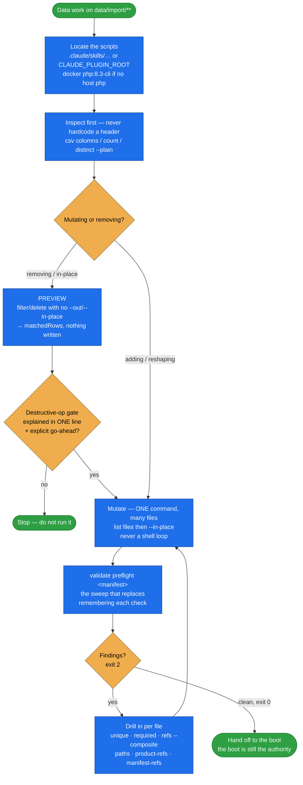

# spryker-import-tools

Two self-contained PHP scripts that make Spryker data-import CSVs and manifests **safe to
manipulate and cheap to validate** — plus the authoritative invocation and command-discipline rules
every consumer skill follows.

Spryker CSVs contain multi-line quoted fields (`cms_page.csv` among them), so `cut`/`awk`/`sed`
corrupt them. And a single bad import row aborts a 30–60 minute install — these checks catch that
statically in seconds. Both scripts are **concept-free**: they know nothing about stores, locales or
currencies. You decide what to do; they do it correctly and print JSON.

## When it triggers

Whenever a Spryker data-import CSV or import manifest is being manipulated or validated:

- `csv.php` — read / inspect / filter / delete / duplicate / set / replace / scale / derive /
  rename / apply-translations.
- `validate.php` — `preflight`, `refs` (including composite tuples), `required`, `unique`, `absent`,
  `paths`, `product-refs`, `manifest-refs`, `orphan-files`, `threshold-glossary`, `manifest-diff`,
  `known-set`.

It is the engine behind `project-data`, `define-stores`, `curate-golive-data` and
`translate-content` — those skills supply the judgment and point here for the mechanics.

## Flow schema



## Files

| File | Role |
|------|------|
| [`SKILL.md`](SKILL.md) | Command reference for both scripts, the **authoritative** invocation & command-discipline rules, and the flag cookbook (one worked example per command). |
| [`scripts/csv.php`](scripts/csv.php) | RFC-4180 CSV manipulation. Header-name access only, atomic writes, idempotent where sensible. |
| [`scripts/validate.php`](scripts/validate.php) | Pre-boot consistency checks. Own CSV reader — no dependency on `csv.php`. |
| [`scripts/csv.test.php`](scripts/csv.test.php) | Test suite for `csv.php`. |
| [`scripts/validate.test.php`](scripts/validate.test.php) | Test suite for `validate.php`. |
| [`data/entity-map.yml`](data/entity-map.yml) | One row per shipped `data_entity`: its source **filename** (often different from the entity name — that mismatch is why the file exists), its **class** (`structural` / `content` / `unclassified`), and for structural rows the mandatory `why`. The keep-set the `clean` and `minimal-baseline` lists derive from. |
| [`references/demo-facts.md`](references/demo-facts.md) | The concrete demo-shop **identifiers** (a real SKU pair, the `cms-block-email--` prefix and its `block_key` column, the product-label and navigation keys, the `shop_ui` colour keys, the manifest families), each paired with the command that re-derives it. No record counts — a count is stated as its measuring command. |

`known-set` keeps both `entity-map.yml` and `demo-facts.md` honest.

## Usage

Run with host `php`, or `docker run --rm -v "$PWD":/app -w /app php:8.3-cli php …` when there is no
host php. Both scripts print JSON (`{status, …}`) and exit `0` / `1` / `2`.

### csv.php

```bash
php scripts/csv.php <command> <file> [<file2>...] [options]
```

Inspection — own their output, never write; `--plain` gives line output:

```bash
php scripts/csv.php read product_abstract.csv --limit 5          # ONE file only
php scripts/csv.php columns product_abstract.csv category.csv --plain
php scripts/csv.php count product_price.csv product_stock.csv --plain
php scripts/csv.php distinct cms_block.csv --column block_key --plain
```

Mutation — `--out <file>` for one file, or `--in-place` for one-or-many (several files **require**
`--in-place`; that is how you avoid a shell loop):

```bash
php scripts/csv.php filter cms_block.csv --where block_key=cms-block-email-- --match prefix --in-place
php scripts/csv.php delete customer.csv --in email=demo1@example.com,demo2@example.com --in-place
php scripts/csv.php duplicate-columns product_abstract.csv category.csv --from en_US --to pl_PL,uk_UA --in-place
php scripts/csv.php duplicate-rows product_image.csv --column locale --from en_US --to pl_PL,uk_UA --in-place
php scripts/csv.php set product_abstract_store.csv --column store --value PL --in-place
php scripts/csv.php select product_abstract.csv --columns abstract_sku,name.en_US --out slim.csv
php scripts/csv.php drop-columns product_abstract.csv cms_block.csv --suffix .de_DE --in-place
php scripts/csv.php rename-columns price_product_offer.csv --rename abstract_sku:product_offer_reference --in-place
php scripts/csv.php replace product_abstract.csv --column url.pl_PL --search '#^/en/#' --with '/pl/' --regex --in-place
php scripts/csv.php scale product_price.csv --column value_net --column value_gross --rates PLN=4.3,UAH=45 --in-place
php scripts/csv.php derive product_price.csv --target value_gross --source value_net --factor 1.19 --only-empty --in-place
php scripts/csv.php apply-translations category.csv --source-column name.en_US --target-column name.uk_UA --map map.csv --in-place
```

Filter/delete conditions: `--where col=val` (repeatable, AND; `--match exact|prefix|contains`),
`--in col=v1,v2`, or `--in-file col=path`. Extra flags: `scale` takes `--by`, `--currency-column`,
`--no-round`, `--json-keys`; `duplicate-columns` takes `--skip-base`.

### validate.php

```bash
php scripts/validate.php <check> [options]     # --quiet to branch on the exit code alone
```

```bash
# Run this FIRST — one driver, every boot-critical invariant across the whole manifest:
php scripts/validate.php preflight data/import/local/full_EE.yml --base . --locales en_US,pl_PL,uk_UA
php scripts/validate.php preflight data/import/local/full_EE.yml --baseline .ai-dev/preflight-baseline.json

php scripts/validate.php paths data/import/local/full_EE.yml --base .
php scripts/validate.php unique product_abstract.csv --column url.pl_PL
php scripts/validate.php required product_abstract.csv --column is_searchable.pl_PL
php scripts/validate.php refs offer_store.csv --column store --ref-file store.csv --ref-column name
php scripts/validate.php refs merchant_product_offer_store.csv --column merchant_reference --column store \
  --ref-file merchant_store.csv --ref-column merchant_reference --ref-column store --composite
php scripts/validate.php absent config/ src/Pyz --string DE --string de_DE
php scripts/validate.php product-refs data/import/common \
  --keep-from data/import/common/common/product_abstract.csv:abstract_sku \
  --keep-from data/import/common/common/product_concrete.csv:concrete_sku
php scripts/validate.php manifest-refs data/import/local/full_EE.yml --base .
php scripts/validate.php orphan-files data/import/local/full_EE.yml data/import --base .
php scripts/validate.php threshold-glossary data/import/local/full_EE.yml --locales en_US,pl_PL --base .
php scripts/validate.php manifest-diff data/import/local/full_EU.yml data/import/local/full_EE.yml --base .
php scripts/validate.php known-set --base <repo-root>
php scripts/validate.php known-set --emit-map --base <repo-root>
```

`known-set` resolves its defaults relative to the script, so it runs from any cwd (default manifest
`data/import/local/full_EU.yml`, default map `data/entity-map.yml`, default skills dir the plugin's
`skills/`); override with `--manifest`/`--map`/`--skills`.

### Exit codes

| Code | Meaning |
|---|---|
| `0` | Clean — no findings. |
| `1` | `csv.php`: operation-level problem. |
| `2` | `validate.php`: at least one finding. Both scripts: usage / missing column / unreadable file. |

## Invocation & command discipline (the authoritative copy)

These rules keep an unattended run quiet — no needless permission prompts — and safe. `SKILL.md`
holds the full text; the short form:

- **Invoke by the literal path from the project cwd** — never `cd`, never a shell variable. A `cd`
  prefix, an assignment prefix (`CSV=… php …`), or a multi-line assign-then-use all miss the
  allowlist and prompt on **every** call.
- **One simple command per Bash call, no shell operators.** `;`, `|`, `&&`, `$(…)`, `for`/`while`,
  redirects and env-prefixes can never be allowlisted.
- **One op over many files = ONE command** — list the files before the flags, add `--in-place`.
- **Count with the tool** — `rowCount` / `matchedRows` / `count --plain`, never `| grep -c`.
- **Explore with the built-in Read / Grep / Glob**, edit YAML with the built-in Edit tool — never
  `python`/`ruby`/`sed` regenerating a config file.
- **`rm` prompts by design** — surface every deletion as an explicit step.
- **Destructive-operation gate** — preview, explain in one plain line, get an explicit go-ahead
  before any in-place removal/truncation or any DB/volume drop, even when the allowlist would let it
  through silently.

## Design decisions baked in

- **Concept-free by design.** New demoshop files or entities need no new code — point the checks at
  them. All the domain judgment lives in the consumer skills.
- **Errors, never silent narrowing.** A missing column is a clean JSON error with exit `2`; `read`
  given several files errors instead of quietly using the first; a malformed `--where` fails loudly.
- **Writes are atomic** (temp file + rename), so a crash mid-batch never leaves a truncated CSV.
- **Counts have no maintainable home.** `demo-facts.md` records only identifiers you can look up,
  each with its re-derive command; `known-set` gates on any bare record count that creeps into a
  skill's prose.
- **`unclassified` blocks the boot.** A new upstream entity arrives loud in `entity-map.yml` instead
  of being silently dropped from a keep-list.
- **A green boot is still the correctness authority.** These checks are the cheap early net, not a
  replacement for it.

## Packaging note

This skill ships in the `spryker-ai-dev-sdk` plugin under `vendor/spryker-sdk/ai-dev/…`, which is
Composer-managed — `composer update spryker-sdk/ai-dev` may overwrite it. The durable home for edits
is the plugin's own repository (`github.com/spryker-sdk/ai-dev`).
