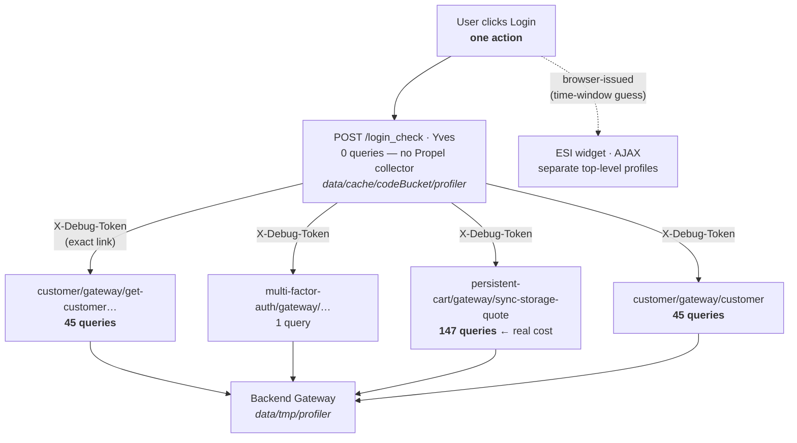
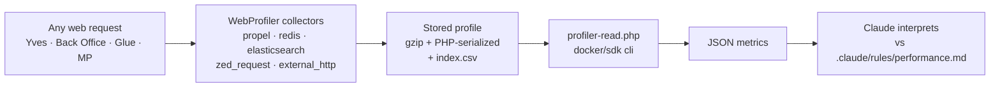
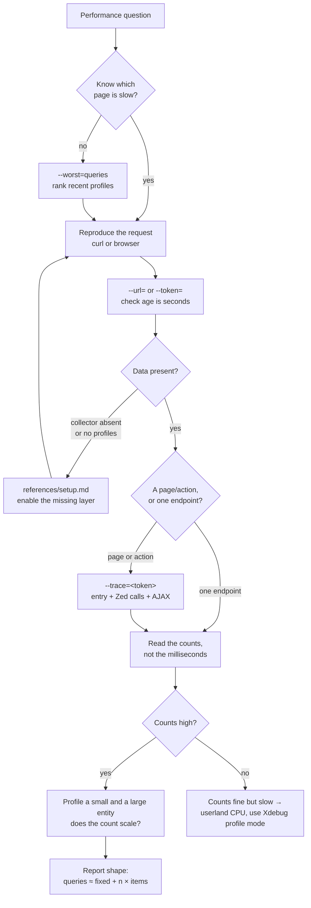

# spryker-profiler

Turns the Spryker/Symfony WebProfiler into hard performance numbers you can act on —
and explains how to switch profiling on when there is nothing to read.

Spryker records **every** web request automatically. That history is the cheapest source
of truth for performance work: instead of guessing which code is slow, read what actually
ran. This skill reduces a stored profile to the metrics that matter and prints JSON, so
nobody has to scrape the profiler's HTML or open a browser.

> This README is for humans. `SKILL.md` holds the instructions Claude follows;
> `references/setup.md` holds the configuration detail.

## What it can tell you

| Metric | Answers |
|---|---|
| `queries` / `unique` / `duplicates` | How many SQL statements a request ran, and how many were repeats |
| `redis` | Key-value operations per request |
| `elasticsearch` | Search calls per request |
| `zed_requests` | Yves→Zed calls — the architecture-boundary check |
| `external_http` | Third-party calls blocking the response |
| `duration_ms` / `memory_mb` | Wall time and peak memory (treat time as noisy locally) |
| `segments` | Queries attributed to a named code path you wrapped |

The I/O counters say *how much* work happened. These say *why*, and whether the
numbers are even comparable between runs:

| Metric | Answers |
|---|---|
| `logs` | Errors, warnings and deprecations logged during the request |
| `audit_log` | Security and compliance events, by channel — a separate stream from `logs` |
| `exception` | What was thrown, with message and status code |
| `twig` | Template count and render time — the view-layer cost |
| `events` | Listeners called synchronously, plus Spryker application events |
| `http` | Which controller and route handled it; where a 3xx redirected to |
| `session` | Session payload size — re-written on every request |
| `runtime` | Debug mode and **Xdebug** flags (printed only when on) — check before comparing any timing |

Typical questions it answers directly:

- "Why is this page slow?" → the whole request tree, not just the page's own request
- "Something feels sluggish, I don't know where" → ranks recorded requests to find the outlier
- "Did my fix work?" → same URL before and after, with real numbers
- "What did this request log / throw?" → errors, audit entries and exceptions per request
- "Why is there no profiler data?" → walks the three layers that must all be enabled

## Collector coverage

A Spryker request records **20 collectors**. The reader consumes every one that carries
request data — 17 of 20 — and maps them onto the fields above:

| Collector | Output field | Yves | Zed / Back Office / Backend Gateway |
|---|---|:---:|:---:|
| `propel` | `database` (+ `segments`) | — | ✅ |
| `redis` | `redis` | ✅ | — |
| `elasticsearch` | `elasticsearch` | ✅ | — |
| `zed_request` | `zed_requests` | ✅ | — |
| `external_http` | `external_http` | ✅ | — |
| `time` | `duration_ms` | ✅ | ✅ |
| `memory` | `memory_mb` | ✅ | ✅ |
| `logger` | `logs` | ✅ | ✅ |
| `audit_log` | `audit_log` | ✅ | ✅ |
| `exception` | `exception` | ✅ | ✅ |
| `twig` | `twig` | ✅ | ✅ |
| `events` | `events.called_listeners`, `events.orphaned` (when > 0) | ✅ | ✅ |
| `application_events` | `events.application_events` | — | ✅ |
| `request` | `http.method`, `http.path`, `http.controller`, `http.route` | ✅ | ✅ |
| `router` | `http.redirect_to` | ✅ | ✅ |
| `session` | `session` | ✅ | ✅ |
| `config` | `runtime` | ✅ | ✅ |

Columns are what stored profiles actually contain, not what the dependency providers
register. Glue registers most of the same collectors but was not exercised when this was
measured — check `source` and the `collector` fields in the output rather than assuming.

The three not read — `ajax`, `profiler`, `spryker_config_profiler` — hold no per-request
measurements. They are toolbar plumbing and a dump of resolved configuration, all of it
still reachable in the browser via `?panel=<collector>`.

A collector the application never registered is **omitted** from the output rather than
reported as zero — except the I/O metrics, where a missing collector is itself the
finding, so those always say `collector: "absent"` explicitly. A collector that is
present but whose API the reader no longer recognises reports
`collector: "incompatible"` with the class name; that means an upgrade renamed
something, not that the data is missing.

## One action is many profiles

The thing that most often produces a wrong answer: **a profile is one HTTP request, not
one user action.** Clicking "Login" on Yves creates six profiles across two applications
and two storage directories.



Read only the Yves profile and you report **0 queries**. The action really ran **238**.

`--trace` reconstructs this. Yves→Zed links are *exact* — the callee returns its own
`X-Debug-Token`, which the caller stores. Browser-issued AJAX and ESI sub-requests carry
no such link, so those are grouped by time window and flagged as the heuristic they are.

```bash
docker/sdk cli php $SCRIPT --trace=c7cac1                # full tree + related requests
docker/sdk cli php $SCRIPT --trace=c7cac1 --no-siblings  # only the proven Zed chain
```

## How it works



The script reads the stored files directly rather than the profiler UI, so it works
headlessly and can scan thousands of past requests in one pass.

## The workflow



Two habits this encodes, both learned the hard way:

- **Reproduce first, then read.** Profiles accumulate for days; without checking `age`
  you will analyse last week's request and not notice.
- **Trust counts over time.** Local wall-clock swings 10× for identical work (cold
  caches, dev containers). I/O counts are stable and are what scales badly in production.

## Usage

Run from the project root so the script can locate the project:

```bash
SCRIPT=.claude/skills/spryker-profiler/scripts/profiler-read.php

# What was recorded, newest first
docker/sdk cli php $SCRIPT --list --limit=10

# Metrics for a URL, with the top repeated SQL
docker/sdk cli php $SCRIPT --url=/en/cart --verbose

# One specific profile
docker/sdk cli php $SCRIPT --token=85a44b

# The full picture for one page load: entry + Zed calls + related AJAX
docker/sdk cli php $SCRIPT --trace=85a44b
docker/sdk cli php $SCRIPT --trace=85a44b --no-siblings   # proven Zed chain only

# Find the outlier without knowing which page is slow
docker/sdk cli php $SCRIPT --worst=queries --scan=200 --limit=10

# Back Office / Zed data lives in a different directory than Yves
docker/sdk cli php $SCRIPT --dir=/data/data/tmp/profiler --worst=duplicate_queries
```

`--> DEVELOPMENT MODE` is printed by the SDK before the JSON; strip it with
`sed -n '/^{/,$p'` when piping into a parser. Errors are also JSON on stdout
(`{"error": "..."}`), so they survive that filter.

Rankable metrics: `queries`, `duplicate_queries`, `redis`, `elasticsearch`,
`zed_requests`, `external_http`, `memory_mb`, `duration_ms`.

## Going deeper than counts

**Segmented SQL** attributes queries to a named code path, turning "this page runs 261
queries" into "the calculator stack runs 180 of them". Wrap the suspect code, re-run, and
the reader reports it under `database.segments`:

```php
use Spryker\Shared\Propel\Logger\PropelInMemoryLogger;

PropelInMemoryLogger::startSegment('order-validation');
try {
    $this->validateOrder($orderTransfer);
} finally {
    PropelInMemoryLogger::endSegment();
}
```

Always use `try`/`finally` — the logger is static, so an unclosed segment swallows every
later query in the request. Remove segments once you have the answer; they are debugging
scaffolding.

**The script is a starting point, not a boundary.** A stored profile holds far more than
the script prints — full SQL text, headers, routing, events, Twig data, logger entries.
When a question needs something it does not expose (normalising SQL literals to collapse
`IN (1)`/`IN (2)` into one shape, say), Claude is expected to extend the script or write a
throwaway one rather than stop at the available flags.

## Reporting

The skill matches its output to the situation rather than always producing a document:

- **Inline by default** — when profiling is a step inside a larger task, you get the few
  numbers that matter, not a report.
- **A written report on request or when it matters** — if you ask for one, or the finding
  is significant enough to deserve attention on its own. Markdown by default, standalone
  HTML on request or when the result is visual. Written to `.claude/local-trash/` unless
  you name a location.

Reports **link to the profiler rather than copy it**. Every profile carries a
`profiler_url`, and panels are deep-linkable:

```markdown
Back Office product edit ran **261 queries** (44 duplicated) — [full SQL breakdown](http://backoffice.eu.spryker.local/_profiler/cf708c?panel=propel)
```

The rendered page already shows every query and timing better than a report could
restate, and stays accurate. Note the links only work while the profile is on disk
(pruned after 2 days) and only on the machine running the environment — so anything
meant to outlive that keeps its key numbers inline too.

## Things that will confuse you

**`collector: "absent"` is not zero.** It means the metric was never measured for that
application. Yves has no SQL collector (by design — it should read from Redis), and Back
Office has no Redis collector. Reporting "0 queries" from an absent collector is a false
conclusion.

**`collector: "incompatible"` is not absent either.** The collector is recording, but its
API is not the one the reader expects — usually a Spryker or Symfony upgrade that renamed
a method. The output names the class so the reader can be fixed; the data is still there
in the browser panel meanwhile.

**Timings are only comparable at equal `runtime`.** `xdebug: true` inflates wall-clock
several-fold and `debug: true` disables caches, so a "regression" can be nothing more
than a differently-configured container. Check `runtime` before trusting any before/after
duration.

**Each application writes to its own directory.** Yves **and Glue** → `data/cache/codeBucket/profiler`;
Zed, Back Office, Backend Gateway, Merchant Portal → `data/tmp/profiler`. The script auto-picks the
most recently written one, which is often not the one you want, so check `source` in the
output and pass `--dir` when you know the application.

**The index outlives the data.** Symfony deletes stored profiles after 2 days but never
trims `index.csv`, so the index can list 15,000 requests when 33 files survive. `--worst`
reports `actually_analysed` and `expired_or_missing` and warns when the ranking covers a
thin slice.

**`external_http: 0` may mean "not instrumented".** External calls are the one metric
that is opt-in — they appear only if the calling code uses
`ExternalHttpInMemoryLoggerTrait`. A Guzzle client that does not is invisible to the
profiler, so a zero here is never proof that a request makes no outbound calls.

**Login walls profile the redirect.** An unauthenticated request to Zed / Back Office /
Merchant Portal records the 302 to the login form — a few queries that say nothing about
the page you wanted. Reproduce with an authenticated session and check the profile's
`status` is the one you expected.

**Back Office tables are two requests.** The page renders an empty grid shell and loads
its rows via `<route>/table` (e.g. `/sales/index/table`), which is where the real cost
usually sits. Profile both.

## When there is no data

Three independent layers must all be in place. `references/setup.md` covers each in full,
including the per-application wiring and the official Spryker integration docs.

```mermaid
flowchart TD
    N["No data?"] --> L1{"IS_WEB_PROFILER_ENABLED<br/>set to true?"}
    L1 -- no --> F1["Set it in config/Shared/config_local.php<br/>note: gitignored, so it is per-machine"]
    L1 -- yes --> L2{"WebProfilerApplicationPlugin<br/>registered for THIS application?"}
    L2 -- no --> F2["Add it — Zed alone has 4 separate stacks:<br/>Zed · Back Office · Backend Gateway · Backend API"]
    L2 -- yes --> L3{"Collector plugin<br/>for this metric?"}
    L3 -- no --> F3["Add the collector to that application's<br/>WebProfilerDependencyProvider"]
    L3 -- yes --> OK["Reproduce and re-read"]
    F1 --> CC["console cache:empty-all"]
    F2 --> CC
    F3 --> CC
    CC --> OK
```



Console commands, queue workers and cron jobs are **never** profiled — the WebProfiler is
request-scoped. Use Xdebug profiling or explicit timing for those.

## Files

| Path | Purpose |
|---|---|
| `SKILL.md` | Instructions Claude follows — workflow, interpretation, pitfalls |
| `references/setup.md` | Enabling and configuring the profiler per application |
| `scripts/profiler-read.php` | The reader — reduces stored profiles to JSON metrics |
| `evals/evals.json` | Test prompts used to validate the skill |
| `README.md` | This file — the human-facing overview |

## Installed as a plugin?

The skill works identically wherever it lives. The only thing that matters is whether its
scripts sit **inside the project directory** — the Docker container mounts only the project,
so that is all PHP inside it can reach:

- **Inside the project** — a setup install (`.claude/skills/spryker-profiler/`) *or* a
  Composer-vendored plugin (`vendor/spryker-sdk/ai-dev/plugins/…`): run the script in place,
  no copy needed.
- **Outside the project** — a plugin cache under `~/.claude/plugins/…`: the script is
  unreachable from inside the container. Copy it into the project first, then run the copy:

```bash
mkdir -p .claude/tmp
# Source is whichever resolves — never a hardcoded install path:
#   .claude/skills/spryker-profiler/scripts/profiler-read.php   (setup install)
#   ${CLAUDE_PLUGIN_ROOT}/skills/spryker-profiler/scripts/profiler-read.php  (plugin install)
cp "${CLAUDE_PLUGIN_ROOT}/skills/spryker-profiler/scripts/profiler-read.php" .claude/tmp/
SCRIPT=.claude/tmp/profiler-read.php
```

The copy is disposable — the script locates the project from the working directory, so it
behaves the same wherever it lands inside the repo. SKILL.md tells Claude to make this
choice automatically based on the skill's base directory.
