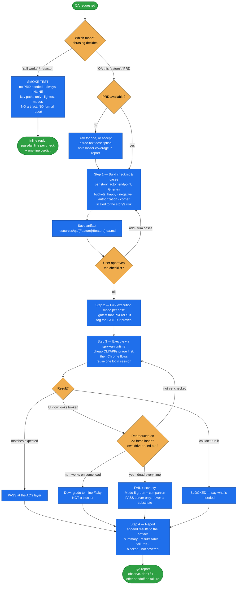

# spryker-qa-coverage

**Hands-on QA against the running application.** Turns a PRD (or a feature description) into a
concrete test checklist, executes every case against the live app via `spryker-runtime`, and reports
PASS / FAIL / BLOCKED with real evidence.

A PRD says what a feature *should* do. This skill proves whether the running app actually does it —
happy paths *and* the corner cases that break Spryker features. It never infers from code: a verdict
is backed by an HTTP status, a DB row, a Redis key, a rendered page, or a console message that was
actually observed.

## When it triggers

"QA this", "test this feature", "does this still work", "did my refactor break anything",
"sanity-check what I just built", "run the test cases", "find the edge cases", "make sure it works
in the back office", or handing over a PRD and asking whether it is correctly implemented. Works at
**any** point — after a feature is done, mid-development, or as a quick post-refactor smoke check.

Explicitly **not** for:

- **static analysis / CI** — never runs phpstan, phpcs, `spryker-ci`, or `validation.sh`;
- **writing automated test code** — that's `codecept-functional` / `cypress-e2e-test`;
- **fixing anything** — QA observes and reports, then offers a handoff.

## Flow schema

## Files

| File | Role |
|------|------|
| [`SKILL.md`](SKILL.md) | The workflow — the two modes, the four test-case buckets, the mode/layer table, Steps 1–4, the report format, and the red flags. |
| [`test-case-template.md`](test-case-template.md) | The per-case structure (checklist line + full case), a worked example, the field guide, and a corner-case idea bank to brainstorm against. |

## Modes

| Mode | When | Artifact | Delegation |
|------|------|----------|------------|
| **Full QA** (default) | A feature is complete, or thorough QA is asked for. All applicable buckets, every actor the feature touches, saved checklist + written report. | Yes — `resources/qa/{FeatureName}/{feature-name}.qa.md` + a formal report | Inline by default; a subagent is optional for long/noisy runs — and then the session context (what changed, env gotchas, findings so far, the PRD path) **must** be passed into its prompt |
| **Smoke test** (light) | Mid-development sanity, post-refactor regression. No PRD needed; key paths only; lightest modes. | No artifact, no formal report — inline pass/fail lines + a one-line verdict | **Never** delegated — its whole value is the main conversation's context |

## Execution modes → what they prove

Everything runs through `spryker-runtime`; the case picks the lightest mode that genuinely proves it.

| What the case verifies | Mode | Layer tag |
|---|---|---|
| Rendered UI, client JS, a real user flow | Chrome (Mode 3) | **E2E** |
| A request confirmed to originate from a real UI action | Chrome + network capture | **endpoint(button-driven)** |
| Endpoint contract: status, shape, fields | HTTP/API (Mode 2) | **endpoint(synthetic)** |
| Multi-step / CSRF flow, repeated runs | Browser-seeded curl (Mode 4) | **endpoint(synthetic)** |
| CSRF endpoint where the token can't be read, or a broken control | Page-context fetch (Mode 5) | **endpoint(synthetic)** |
| Data created/changed, command behavior | Console/CLI (Mode 1) | **console** |
| Data actually persisted / published | DB, Redis, Elasticsearch, queues | **storage** |

## Design decisions baked in

- **Prefer true end-to-end.** The bar is the real user flow through the rendered UI, plus the
  persisted state behind it. A workaround (direct endpoint, facade, seeded DB) is legitimate but
  tests a layer *below* the UI and must be reported as such.
- **The layer tag keeps the report honest.** A 200 from a synthetic request and a 200 from a button
  click are not the same evidence, so every case records which layer it proved. A user-flow AC
  verified only synthetically is `PASS (server only)`, never a clean PASS.
- **Reproduce before you fail it.** "The button does nothing" is a hypothesis, not a verdict —
  Spryker Zed front-end bootstrap is often an intermittent `DOMContentLoaded` race. Reproduce on ≥3
  fresh loads and rule out your own driver (`form_input` sets `.value` without firing events) before
  recording a blocker.
- **A tidy "server works / UI dead" split is a smell.** It's the shape of a prematurely-closed
  investigation; keep driving the real control to completion.
- **Cases are scaled to risk, not templated.** Always the happy path; add negative, authorization,
  and corner cases only where *this* story carries that risk — more cases mean a slower pass.
- **Observe, don't fix.** Report the failure with evidence and a reproduction, offer the handoff,
  and stop short of touching product code — that's what keeps the verdict trustworthy.

## Output

For Full QA: the saved checklist/case artifact plus a report with a summary line, a results table
(case, actor, mode, layer, result, evidence, severity), per-failure detail with expected vs. actual
and a reproduction, the blocked list, and an explicit **Not covered** section. For a smoke test:
inline results only, opened with a statement that it's a smoke test, not full coverage.

## Packaging note

This skill ships in the `spryker-ai-dev-sdk` plugin under `vendor/spryker-sdk/ai-dev/…`, which is
Composer-managed — `composer update spryker-sdk/ai-dev` may overwrite it. The durable home for edits
is the plugin's own repository (`github.com/spryker-sdk/ai-dev`).
