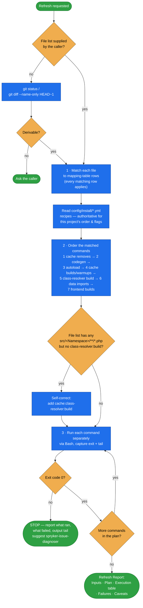

# spryker-refresher

**Makes just-applied changes active.** Given a list of touched files, it derives the post-change
console-command chain — codegen, cache clears, autoload, warmups, frontend builds — runs it in
dependency order, and reports exit codes.

Spryker caches and generates a lot: transfers, Propel classes, the class-resolver map, Twig, navigation,
routes, REST validation, search source maps. Edit a file and nothing happens until the right command
runs. This skill owns the file-pattern → command mapping so the chain is surgical (only what your change
set needs) rather than a full install run.

## When it triggers

"Run post-change commands", "refresh after edits", "regenerate transfers", "rebuild the frontend",
"clear caches after this change", "warm up the caches", "what do I need to run after changing X", "make
these changes take effect". Typical jobs: *"I just touched a transfer XML — refresh"*, *"I edited a
schema XML"*, *"I touched some Twig and a Yves controller"*, *"I added a new plugin registration"*.

**Not for:** editing code (read-only on source), judging whether a change is *correct*, destructive
commands (anything from a `destructive*.yml` recipe, anything that drops/truncates/wipes data or storage,
`docker/sdk reset`), or running the whole install chain.

## Flow schema

## Touched file → command mapping

The heart of the skill. Each row's trigger is independent — apply **every** row that matches a file in
the change set. Claude runs on the host, so commands are invoked as `docker/sdk console <command>`
(Composer as `docker/sdk cli composer <args>`).

| Trigger | Commands |
|---|---|
| `*.transfer.xml` changed | `transfer:generate` |
| `*.schema.xml` changed (project layer) | `propel:install` |
| `.php` added / renamed / moved / deleted under a project namespace in `src/` | `composer dumpautoload --apcu` |
| Project-layer `.php` whose FQCN matches an existing vendor class (an override) | `cache:class-resolver:build` |
| `*DependencyProvider.php` changed | `cache:empty-all` |
| `config/*.php` or `config_default*.php` changed | `cache:empty-all` |
| Yves / Zed / Merchant Portal Twig, JS, SCSS changed | `frontend:yves:build` \| `frontend:zed:build` \| `frontend:mp:build` → `twig:cache:warmer` |
| `navigation.xml` changed | `navigation:cache:remove` → `navigation:build-cache` |
| Glue / SAPI / BAPI route or `*RestApi*` plugin changed | `rest-api:remove-validation-cache` → `rest-api:build-request-validation-cache` |
| `RouteProvider` plugin or route config added/changed/deleted | `router:cache:warm-up` and/or `:backoffice` / `:backend-gateway` / `:merchant-portal` |
| OMS XML (`config/Zed/oms/*.xml`) changed | `oms:process-cache:warm-up` |
| Glossary CSV changed | `data:import:glossary` (Yves translations only — not Zed BO labels) |
| Zed translator CSV (`src/<Ns>/Zed/Translator/data/<Module>/*.csv`) | `translator:generate-cache` |
| Search schema / index-map JSON changed | `search:source-map:remove` → `search:setup:source-map` → `search:setup:sources` |
| Data import CSV changed | `data:import:<entity>` |
| Publisher plugin / queue config changed | Queue workers need a **manual** restart — document it, don't auto-run |
| BO stale template after a clean refresh (rare) | `rm -f src/Generated/Zed/Twig/codeBucket/.pathCache` → `twig:cache:warmer` |

If a command not in the table seems needed, confirm it exists in `docker/sdk console list` first.

## Knowledge sources — discover, don't assume

| Source | Role |
|---|---|
| `config/install/*.yml` | The canonical sequences this project actually runs — source of truth for spelling, flags, ordering. Read before improvising. |
| `docker/sdk console list` | Live truth for which commands exist in the running stack. |
| `searchAlgoliaDocumentation` / `docs.spryker.com` | Fallback when a command's purpose isn't obvious. |
| `git status`, `git diff --name-only HEAD~1` | Derive the touched-file list when the caller didn't enumerate it. |

## Output

A **Refresh Report**: Inputs (files touched, change classes detected), Plan (each command + why),
Execution table (`#`, command, exit code, notes), Failures (full command, exit code, ~20-line output
tail, suggested next step), and Caveats — manual follow-ups such as a queue-worker restart or a
storefront hard refresh.

## Design decisions baked in

- **Recipes over memory.** The mapping table narrows the search; `config/install/*.yml` is authoritative
  for this project's ordering and flags.
- **Surgical, never the full chain.** Only the commands the actual file list demands.
- **One command per Bash call.** So every step's exit code and output tail is captured individually.
- **Stop on the first failure.** Dependents are not skipped-over — the run stops and the caller decides
  retry vs. hand-off to `spryker-issue-diagnoser`.
- **`cache:class-resolver:build` is the classic miss.** The most common refresh defect is a project
  override landing while Spryker keeps resolving to the vendor class. The skill self-checks for it before
  reporting.
- **No `cd` prefixes in Bash.** The harness already runs from the project root; a `cd` shifts the command
  onto a different permission-allowlist pattern and triggers prompts.

## Packaging note

This skill ships in the `spryker-ai-dev-sdk` plugin under `vendor/spryker-sdk/ai-dev/…`, which is
Composer-managed — `composer update spryker-sdk/ai-dev` may overwrite it. The durable home for edits
is the plugin's own repository (`github.com/spryker-sdk/ai-dev`).
