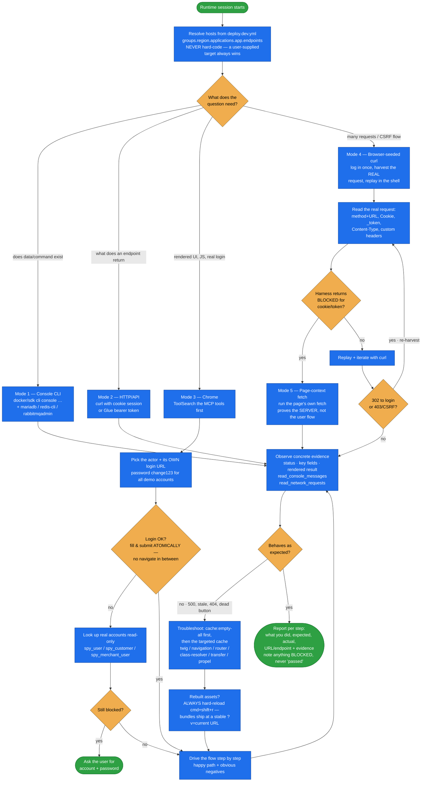

# spryker-runtime

**Run the local Spryker app and observe what it really does** — log in as any actor, drive the UI in
Chrome, call endpoints over HTTP, and execute `docker/sdk cli console` commands against the running
Docker environment.

This is the **shared building block** the other runtime skills delegate to rather than
re-implementing. `spryker-qa-coverage` invokes it to execute every test case (its whole mode table
points here); `spryker-bugfix` uses it to reproduce and to verify a fix; the PRD and verification
skills use it to confirm how a flow behaves today. Host resolution, per-actor login, the five modes,
and the Chrome safety rules live here once.

## When it triggers

"Run the app", "manually test this", "do a QA pass", "log in to the back office", "call this
endpoint", "execute this console command" — and any time you need to walk a flow as a specific
actor, confirm how an existing flow behaves before writing a PRD or plan, reproduce a bug, verify a
fix end-to-end, inspect what an endpoint returns, or check which actors and roles exist at `/user`.

## Flow schema

## The five modes

| Mode | Use it for | Cost |
|------|-----------|------|
| **1 · Console (CLI)** | Does the data/command exist, run a console command, inspect DB / Redis / queues. `console list` prints the full catalogue — find the real command name instead of guessing. | Cheapest |
| **2 · HTTP / API** | Exactly what an endpoint returns. Cookie session for Yves/Back Office (**cookie name = the resolved host with `.` → `-`**), bearer token from `/access-tokens` for Glue. | Cheap |
| **3 · Browser (Chrome)** | Rendered UI, client JS, establishing a login session. Chrome MCP tools are deferred — `ToolSearch` them first. | Expensive |
| **4 · Browser-seeded curl** | Multi-step, CSRF-protected, or repeated scenarios. Log in **once**, perform the action once and read the request it *actually* sent, then replay scriptably. | Fast after setup |
| **5 · Page-context fetch** | A CSRF/session endpoint whose token the harness won't let you read, or proving the server when a UI control is dead. Runs the page's own `fetch` — the cookie attaches implicitly, the secret is never printed. | Fallback |

## Actors and login

Every demo account shares the password **`change123`**, but each actor has its **own** login URL —
using the wrong one fails silently.

| Actor | Path (on the resolved host) | Demo account | Scope |
|-------|------------------------------|--------------|-------|
| Back Office user (admin) | `<host:backoffice>/security-gui/login` | `admin@spryker.com` | Back Office dashboard |
| Customer | `<host:yves>/DE/en/login` | `sonia@acme.com` | `/DE/en/customer/overview` |
| Agent | `<host:yves>/agent/login` | `agent123@spryker.com` | Agent dashboard; can impersonate a customer |
| Merchant user | `<host:merchant-portal>/security-merchant-portal-gui/login` | `harald@spryker.com` | **One** merchant, via `spy_merchant_user.fk_merchant` |
| Merchant Agent | same URL as Merchant user | see the DB lookup | **Across** merchants |

When the defaults don't work, the skill runs read-only lookups against `spy_user`, `spy_customer`,
and `spy_merchant_user` — and if authentication still fails, it **asks the user** rather than
guessing. Passwords are hashed and cannot be read back.

## Design decisions baked in

- **Hosts are resolved, never hard-coded.** They come from `groups.<region>.applications.<app>.endpoints`
  in `deploy.dev.yml` (the skill ships an `awk` one-liner that picks the endpoint carrying `region:`).
  A user-named target — a cloud or staging URL — always wins over the local default.
- **Pick the lightest mode that answers the question.** Chrome only when rendered UI or a real
  session is genuinely the thing under test.
- **Mode 5 proves the server, not the user flow.** The JS that builds the payload, fires the
  request, and applies the response is exactly what a page-context fetch bypasses.
- **A dead Zed button is a race until proven otherwise.** The `DOMContentLoaded` controller-init
  failure is intermittent — the same page can be inert on one load and fine on the next. Reload at
  least 3 times, check whether a control sharing the same `#init()` binding is *also* dead, and rule
  out your own driver (`form_input` sets `.value` without firing `input`/`change`) before blaming
  the code.
- **Instrument the network *before* the action.** Prime `read_network_requests` with `clear:true`
  immediately before the click; a `window.fetch` monkey-patch can miss a request the bundle issued
  via its own captured reference. "No browser-layer request **and** no server-side row" is the
  conclusive proof.
- **Rebuild assets → hard reload → then test, as one inseparable sequence.** Spryker serves bundles
  at a stable `?v=current` URL, so a normal reload keeps serving the cached bundle. This is the #1
  cause of "I rebuilt but nothing changed".
- **Never trigger `alert`/`confirm`/`prompt`** — modal dialogs freeze the Chrome extension. If a
  tool misbehaves after 2–3 tries, stop and ask rather than looping.
- **Stale cache before broken feature.** A 500, a stale menu, a 404 route, or "my change isn't
  showing" is usually generated code or cache: `cache:empty-all` first, then the targeted command
  (`twig:cache:warmer`, `navigation:cache:remove`, the per-app `router:cache:warm-up:*`,
  `composer dump-autoload -o` + `cache:class-resolver:build`, `transfer:generate`, `propel:install`).

## Output

A factual, reproducible account of what happened: command output, HTTP status and key response
fields, the resolved endpoint path, or the rendered behavior — plus per-step pass/fail with
evidence, an optional `gif_creator` recording for flows worth sharing, and an explicit note for
anything blocked. Never a paraphrase, never "passed" for something that couldn't be run.

## Packaging note

This skill ships in the `spryker-ai-dev-sdk` plugin under `vendor/spryker-sdk/ai-dev/…`, which is
Composer-managed — `composer update spryker-sdk/ai-dev` may overwrite it. The durable home for edits
is the plugin's own repository (`github.com/spryker-sdk/ai-dev`).
