# static-validation

Spryker static analysis over **only the code that changed** versus a base branch — PHP **and**
frontend.

Runs the project's standard tools scoped to your diff — PHP tools inside the container via
`docker/sdk cli`; the frontend linters wherever `node_modules` actually is (container first,
host fallback — many Spryker projects install it on the host only):

- **PHP** — `phpcbf`, `phpcs`, `phpmd` (project architecture ruleset `phpmd.xml`, priority 4),
  `phpstan` (level 6).
- **Frontend** — `eslint` (js/ts), `stylelint` (scss/css/less), `prettier` (all of the above +
  json/html) — the same linters as `package.json`, but on **changed files only** instead of the
  all-files globs (`eslint … './src/Pyz/Yves/**/*.{js,ts}'`, `prettier --check '**/*.…'`).

It is the flexible successor to fixed, single-base validation scripts.

## Why

Validating the whole codebase on every change is slow and noisy, and the `package.json` FE scripts
lint **everything**. This skill validates just what you touched — and, for PHP, optionally the
whole Spryker module you touched — against whatever base branch your work forked from.

## Flow schema

```mermaid
flowchart TD
    A([bash $SCD options]) --> B["Resolve roots<br/>REPO_ROOT = --repo or git rev-parse --show-toplevel<br/>refuse the skill's own repo<br/>MAIN_ROOT = parent of --git-common-dir"]
    B --> SDK{"docker/sdk<br/>executable found?"}
    SDK -- "no" --> ERR2([exit 2 — environment error])
    SDK -- "yes" --> WT{"linked worktree?<br/>MAIN_ROOT != REPO_ROOT"}
    WT -- "yes" --> WARN["warn: container mounts the MAIN checkout<br/>commit/sync worktree-only files"]
    WT -- "no" --> BASE
    WARN --> BASE["Resolve base ref<br/>--base &gt; STATIC_CHECK_BASE &gt; auto-detect<br/>master &rarr; main &rarr; origin/HEAD"]
    BASE --> BOK{"base resolves?"}
    BOK -- "no" --> ERR2
    BOK -- "yes" --> COLLECT["Collect changed files<br/>git diff base...HEAD (merge-base)<br/>+ git diff HEAD (working tree)<br/>+ git ls-files --others (untracked)<br/>dedupe, skip deleted"]

    COLLECT --> ANY{"anything changed?"}
    ANY -- "no" --> OK0([exit 0 — nothing to validate])
    ANY -- "yes" --> PART["Partition by extension<br/>.php &rarr; PHP<br/>.js/.ts &rarr; eslint + prettier<br/>.scss/.css/.less &rarr; stylelint + prettier<br/>.json/.html &rarr; prettier"]

    PART --> SKIP["PHP: skip generated code<br/>src/Generated, src/Orm"]
    SKIP --> SCOPE{"--scope"}
    SCOPE -- "files (default)" --> SF["one target per changed .php file"]
    SCOPE -- "module" --> SM["module root of<br/>src/Org/Layer/Module<br/>&rarr; validate whole dir<br/>non-module paths stay individual"]
    SF --> SETS
    SM --> SETS["Build path sets<br/>cs_paths: phpcs/phpcbf (tests only with --include-tests)<br/>strict_paths: phpmd/phpstan (never tests or config/)"]

    SETS --> DRY{"--dry-run?"}
    DRY -- "yes" --> PLAN([Print base, scope<br/>and per-tool paths<br/>exit 0 — run nothing])
    DRY -- "no" --> RUN["Run each selected tool via<br/>docker/sdk cli, from MAIN_ROOT<br/>--tools filters the set"]

    RUN --> PHP["PHP<br/>phpcbf (always fixes)<br/>phpcs<br/>phpmd ruleset+priority<br/>phpstan -l level -c config"]
    RUN --> FE{"--fix / STATIC_CHECK_FIX=1?"}
    FE -- "no" --> FEC["eslint · stylelint --allow-empty-input<br/>prettier --check"]
    FE -- "yes" --> FEF["eslint --fix · stylelint --fix<br/>prettier --write"]

    PHP --> AGG["Aggregate exit codes<br/>any tool non-zero &rarr; overall_rc = 1"]
    FEC --> AGG
    FEF --> AGG
    AGG --> VERDICT{"overall_rc"}
    VERDICT -- "0" --> OK([exit 0 — static analysis passed])
    VERDICT -- "1" --> BAD([exit 1 — violations reported<br/>report findings, list autofixed files])

    classDef step fill:#1f6feb,stroke:#0b3d91,color:#fff;
    classDef decision fill:#f0ad4e,stroke:#8a6d3b,color:#000;
    classDef terminal fill:#2ea043,stroke:#176f2c,color:#fff;
    class B,WARN,COLLECT,PART,SKIP,SF,SM,SETS,RUN,PHP,FEC,FEF,AGG step;
    class SDK,WT,BOK,ANY,SCOPE,DRY,FE,VERDICT decision;
    class A,OK,OK0,BAD,ERR2,PLAN terminal;
```



## Features

- **Flexible base branch.** `--base <ref>` for any branch (`master`, `main`, `develop`,
  a release branch, …). Auto-detects when omitted (`master` → `main` → the remote's default
  branch). Also honours the `STATIC_CHECK_BASE` env var.
- **Worktree-aware.** Resolves the current worktree root with `git rev-parse --show-toplevel` for
  file/diff detection, and finds `docker/sdk` in the **main** working tree via
  `git rev-parse --git-common-dir` — a linked worktree doesn't contain the untracked,
  SDK-provided `docker/sdk`. Works from the main checkout, any linked worktree, or a subdirectory.
  From a linked worktree the container mounts the **main** checkout, so the run prints a notice and
  only analyses files present there — commit/sync worktree-only changes into the main tree first.
- **PHP file **or** module scope.**
  - `--scope files` (default): validate each changed `.php` file.
  - `--scope module`: detect the changed Spryker **modules** (`src/{Org}/{Layer}/{Module}`) and
    validate each whole module directory — catches breakage in files you didn't edit but that live
    in the same module.
- **Frontend, changed-only.** Changed files are partitioned by extension and each linter runs on
  just those files: `.js/.ts` → eslint + prettier, `.scss/.css/.less` → stylelint + prettier,
  `.json/.html` → prettier. Configs auto-load (`eslint.config.mjs`, `.stylelintrc.js`,
  `.prettierrc.json`; `.prettierignore` honoured). `--scope` does not apply to FE files.
- **Covers committed, uncommitted *and* brand-new files.** Diffs `base...HEAD` (merge-base — only
  what your branch adds, not what base moved forward with), plus working-tree edits, plus untracked
  (non-ignored) files.
- **Skips generated code** (`src/Generated`, `src/Orm`) and, for `phpmd`/`phpstan`, test and
  config files.
- **Tool subset + autofix.** `--tools` to pick a subset; `--fix` to autofix (phpcbf always fixes;
  eslint/stylelint `--fix`, prettier `--write`).

## Usage

**Locate the engine:** `.claude/skills/static-validation/scripts/static-check-diff.sh` (setup install,
relative to the project cwd) or `${CLAUDE_PLUGIN_ROOT}/skills/static-validation/scripts/static-check-diff.sh`
(plugin install). `$SCD` below is shorthand for whichever resolves — substitute it inline as a literal path.

**Run from the Spryker project root** (the directory containing `docker/sdk`), or pass `--repo <path>`.
The project to validate comes from your cwd or `--repo`, never from the skill's install location —
running with the skill directory as cwd is refused with an actionable error.

```bash
# Preview what would be checked (no tools run):
bash "$SCD" --dry-run

# Validate a project without cd-ing into it:
bash "$SCD" --repo /path/to/project --dry-run

# Validate changed files (PHP + FE) against auto-detected base:
bash "$SCD"

# Validate every changed PHP MODULE (+ all changed FE files) against master:
bash "$SCD" --base master --scope module

# Only the frontend linters, autofix:
bash "$SCD" --tools eslint,stylelint,prettier --fix

# Fully read-only check (no fixers), against main:
bash "$SCD" --base main --tools phpcs,phpmd,phpstan,eslint,stylelint,prettier
```

### Options

| Option | Default | Description |
|---|---|---|
| `-r, --repo <path>` | cwd's git repo | Project root to validate — run from anywhere. |
| `-b, --base <ref>` | auto-detect | Base branch/ref to diff against. |
| `-s, --scope <mode>` | `files` | `files` or `module` — PHP grouping only (FE always individual). |
| `--tools <list>` | all | Subset of `phpcbf,phpcs,phpmd,phpstan,eslint,stylelint,prettier`. |
| `--fix` | off | Autofix: phpcbf (always), eslint/stylelint `--fix`, prettier `--write`. |
| `--include-tests` | off | Include `/tests/` files in phpcs/phpcbf. |
| `--dry-run` | off | Print plan + per-tool paths only, run nothing. |
| `-h, --help` | — | Show usage. |

### Environment overrides

Defaults live in the script; each is overridable via an env var:

| Env var | Default | Overrides |
|---|---|---|
| `STATIC_CHECK_BASE` | auto-detect | Base branch/ref (same as `--base`). |
| `STATIC_CHECK_PHPCS_STANDARD` | `phpcs.xml` | phpcs/phpcbf ruleset. |
| `STATIC_CHECK_PHPMD_RULESET` | `phpmd.xml` | phpmd ruleset (project-level; falls back to `vendor/spryker/architecture-sniffer/src/Project/ruleset.xml` when absent). |
| `STATIC_CHECK_PHPMD_PRIORITY` | `4` | phpmd `--minimumpriority` (project-level baseline). |
| `STATIC_CHECK_PHPSTAN_CONFIG` | `phpstan.neon` | phpstan config file. |
| `STATIC_CHECK_PHPSTAN_LEVEL` | `6` | phpstan level (matches `phpstan.neon`). |
| `STATIC_CHECK_FIX` | `0` | `1` = autofix mode (same as `--fix`). |
| `STATIC_CHECK_REPO` | cwd's git repo | Project root to validate (same as `--repo`). |

```bash
# Run phpstan at level 8 against a custom config:
STATIC_CHECK_PHPSTAN_LEVEL=8 STATIC_CHECK_PHPSTAN_CONFIG=phpstan-strict.neon \
  bash "$SCD" --tools phpstan
```

### Exit codes

| Code | Meaning |
|---|---|
| `0` | Clean, or dry-run, or nothing changed. |
| `1` | **Code violations** reported by at least one tool. |
| `2` | Usage error (bad option, unknown `--tools` name, unresolvable base, base == HEAD, not a git repo, skill's own dir as cwd), **or a tool that failed to RUN** (missing `src/Generated`, missing `node_modules`, unresolvable tool config), **or no tool was invoked at all**. |

Exit `2` never means "your code has problems" — nothing was analysed. The script names the tool and
the remediation. Do not report those as findings or try to fix code for them.

## Requirements

- A **running** Spryker environment (`docker/sdk cli` must work). Start it with the
  `spryker-docker-sdk` skill if the containers are down.
- **`src/Generated`** must exist for phpstan — the project's `phpstan-bootstrap.php` hard-requires files
  under it. Generate with `docker/sdk cli console transfer:generate`, then
  `docker/sdk cli composer phpstan-setup` for `src/Generated/Client/Ide/AutoCompletion.php`
  (the bootstrap file — `transfer:generate` alone does **not** create it, and `phpstan-setup`
  itself fails until transfers exist, so run them in that order). Without them phpstan fatals
  during bootstrap and the script exits `2` naming that remedy.
- **`node_modules`** must exist in the container (`/data`) **or** on the host for eslint/stylelint/prettier.
  The script probes both and uses the project's pinned `node_modules/.bin/<tool>`. Install with
  `docker/sdk cli npm install`, or `npm ci` on the host.
- Project configs present at repo root: PHP — `phpcs.xml`, `phpstan.neon`, and the project
  architecture ruleset `phpmd.xml` (if absent, the vendored
  `vendor/spryker/architecture-sniffer/src/Project/ruleset.xml` is used). Frontend — `eslint.config.mjs`,
  `.stylelintrc.js`, `.prettierrc.json`.

## Caveats

- **Autofixers mutate files:** `phpcbf` always (whenever included); `eslint`/`stylelint`/`prettier`
  only with `--fix`. For a non-mutating review, drop `phpcbf` from `--tools` and omit `--fix`.
- On Docker-for-Mac the file sync back to the host is slightly async — after an autofix run, the
  host copy updates a moment later. Re-run in check mode to confirm.
- phpstan level and phpcs standard mirror the project QA baseline.
- **phpmd runs BOTH rulesets, because CI does.** Spryker ships two and they are **disjoint, not nested**:
  `phpmd.xml` (project, priority 4) and `vendor/spryker/architecture-sniffer/src/ruleset.xml` (core,
  priority 2 — ~26 rules found nowhere else, e.g. `FacadeReturnValueRule`, `SpyEntityUsageRule`).
  Spryker CI typically runs both unconditionally, so a project-only run can be green while CI's
  "Run Architecture rules" step is red. Setting `STATIC_CHECK_PHPMD_RULESET` (+ `_PRIORITY`) pins a
  single pair and disables the second run.
- **Test files are excluded from phpmd/phpstan**, including repo-root trees like `tests/PyzTest/…`
  (phpcs/phpcbf too, unless `--include-tests`). If excluding tests leaves no phpcs target, phpcs/phpcbf
  are **skipped with a warning** rather than silently re-including the test files — which matters
  because `phpcbf` rewrites what it is given.

## Layout

```
static-validation/
├── SKILL.md                        # trigger + agent workflow
├── README.md                       # this file
└── scripts/
    └── static-check-diff.sh        # the engine (bash 3.2 compatible)
```

## Packaging note

This skill ships in the `spryker-ai-dev-sdk` plugin under `vendor/spryker-sdk/ai-dev/…`, which is
Composer-managed — `composer update spryker-sdk/ai-dev` may overwrite it. The durable home for edits
is the plugin's own repository (`github.com/spryker-sdk/ai-dev`).
