# translate-content

The **opt-in localization pass** that project setup defers: actually translate a Spryker project's
storefront content into one chosen locale — glossary, and optionally catalog, CMS, navigation and
labels.

`project-data`'s adapt strategy leaves every project locale as an **English copy** — fast boot,
translation debt flagged. This skill pays that debt down, one locale at a time. It is never forced;
the default stays English copies until the developer asks.

## When it triggers

- "localize `uk_UA`", "translate the shop content into Polish";
- "the storefront is still English in my locale";
- offered by the wizard after boot, or run standalone on any project.

Strictly **per-locale and opt-in**. `en_US` stays the untouched source and fallback.

Not here: the English-copy default and URL localization (both `project-data` adapt); machine-
translation *quality* (the translator's concern — this skill guarantees the mechanics are safe).

## Flow schema

```mermaid
flowchart TD
    A([Trigger: localize one locale]) --> SC{"Scope?<br/>developer chooses"}
    SC -- "glossary only" --> GSHAPE
    SC -- "glossary + catalog content" --> GSHAPE

    GSHAPE{"Glossary shape?"}
    GSHAPE -- "shipped interleaved<br/>key,translation,locale" --> SPLIT["Split per locale first<br/>filter --where locale=en_US --out<br/>→ set --column locale per locale<br/>repoint config · delete the original"]
    GSHAPE -- "per-locale files already" --> D1
    SPLIT --> D1

    D1["1 · Extract DISTINCT source values<br/>csv distinct &lt;files&gt; --column X.en_US --plain<br/>far fewer strings than rows"]
    D1 --> T{"Is the column<br/>human prose?"}
    T -- "no — machine key / FK<br/>attribute_key_N.&lt;locale&gt; · url · is_searchable" --> SKIP([Leave it alone<br/>translating it 500s the<br/>Back Office attribute page])
    T -- "yes" --> D2

    D2["2 · Translate the distinct set<br/>translator sub-agents write a<br/>source,target CSV map<br/>chunk the LIST, never the files"]
    D2 --> COV["Verify map coverage with the tool<br/>validate refs --column X.en_US<br/>--ref-file map.csv --ref-column source"]
    COV --> COVD{"Every source value mapped?"}
    COVD -- "no — findings" --> D2
    COVD -- "yes" --> D3

    D3["3 · Apply the map<br/>csv apply-translations --in-place<br/>ONLY X.&lt;locale&gt; changes"]
    D3 --> PATHS["Re-prefix glossary PATH values<br/>/en/gtc → /nb/gtc<br/>exempt /assets/ · require a /&lt;lang&gt;/ boundary"]
    PATHS --> MORE{"More column families<br/>or file groups?"}
    MORE -- "yes" --> D1
    MORE -- "no" --> V

    V["Verify by VALUES, not a byte-diff<br/>spot-check key_translation.&lt;locale&gt;<br/>the first-run bug lives there"]
    V --> LIVE{Project booted?}
    LIVE -- "no" --> REP
    LIVE -- "yes" --> APPLY["Temp import config → data:import<br/>drain the queue workers<br/>DELETE the temp config immediately"]
    APPLY --> REP(["Locale localized<br/>+ report the SEO half no skill owns"])

    classDef step fill:#1f6feb,stroke:#0b3d91,color:#fff;
    classDef decision fill:#f0ad4e,stroke:#8a6d3b,color:#000;
    classDef terminal fill:#2ea043,stroke:#176f2c,color:#fff;
    class SPLIT,D1,D2,COV,D3,PATHS,V,APPLY step;
    class SC,GSHAPE,T,COVD,MORE,LIVE decision;
    class A,REP,SKIP terminal;
```

## The method — distinct → translate → map → apply

The load-bearing efficiency and safety win: translate the **distinct values**, not every row. A
column has far fewer distinct strings than rows, and `apply-translations` fans one map over all rows
and files in a single command — no whole-file rewrite, no shell loop, no chunked reassembly.

Because only the target column's values change, the operation is safe by construction. The file is
re-encoded canonically (quoting and line-endings normalized), so verify by **values**, not a raw
byte-diff. Unmapped values are left as-is, so extending the map and re-running is idempotent.

## What to translate

| Translate | Never touch |
|---|---|
| `name`, `description`, `meta_title` / `meta_description` / `meta_keywords`, `title`, `content`, `alt_text`, `placeholder` / `placeholder.content` (including the `cms-block-email--*` bodies), glossary `translation` | The **unsuffixed** machine columns `key` and `values` in `product_management_attribute.csv` |
| `key_translation.<locale>` — the attribute **label** on the PDP ("Color", "Body Material"). Easy to miss: left English, the storefront shows an English label next to a translated value | **`attribute_key_N.<locale>`** on `product_abstract` / `product_concrete` — the named exception |
| `value_translations.<locale>` — the attribute **values**, often a comma-list. Preserve item count, order and commas: it is positionally aligned with the machine `values` column | `is_searchable.<locale>`, `css_class`, `*imageUrl` / `*link` / asset URLs, any bare key/SKU/FK. **`url.<locale>` is never *translated* but must be *re-pointed* in two cases** — after a category `name` translation regenerates its slug, and before a glossary path points at a CMS page that doesn't exist in that locale |
| `value_N.<locale>` on `product_abstract` / `product_concrete`; `key.<locale>` in `product_search_attribute.csv` (key-ish name, but display text) | Any other locale's columns — only the one `X.<locale>` you target |

**The rule is not the suffix — it is whether the value must equal an identifier declared elsewhere.**
`attribute_key_N.<locale>` looks translatable and is not: its value must stay equal to the unsuffixed
`attribute_key_N` (`material`, `size`), the same key that exists in `product_attribute_key.csv`.
Translating it to `Materiał` breaks the localized-attributes map and **500s the Back Office
product-attribute page for every product**.

## Preservation rules (bake into the translator prompt)

Keep intact, translating only the surrounding prose: `{{tokens}}` / `%s` / `%min%`-style
placeholders; HTML markup and attributes (text nodes only); units and numbers; brand and proper
names. A translation that drops a token or breaks markup is a defect.

## Design decisions baked in

- **Distinct values, not rows.** The unit of translation is the distinct string set — smaller,
  re-runnable, and chunkable across sub-agents without ever splitting a file.
- **Coverage is checked by a tool, not by eye.** `validate refs` against the map's `source` column is
  exactly a set-membership check; any finding is a value that would import untranslated. Don't
  reinvent it in `python`/`jq`.
- **Check the glossary's shape before assuming the mechanics fit.** The shipped `glossary.csv` is
  `key,translation,locale` — one column, locale as a *row* value. Mapping onto it directly would hit
  every other locale's rows in the same column, so an un-adapted repo gets split per locale first.
- **Path values are locale-specific data, not prose.** A per-locale glossary must carry that locale's
  language prefix (`/en/gtc` → `/nb/gtc`) — some keys are used as a raw `href` with no
  `generatePath()`, so the prefix has to live in the data. Exempt `/assets/` and require a
  `/<lang>/` word boundary, or the sweep false-positives on image paths and ASCII-art email bodies.
  **But the rewrite is conditional on the referent existing:** a well-formed `/it/gtc` is still a 404
  when `cms_page.csv` is `en_US`-only, so the target locale must be served by the store
  (`locale_store.csv`) and the CMS page's `url.<locale>` must be populated — otherwise localize the
  page first rather than rewriting into a 404.
- **A locale is done per FILE, not per column family.** `glossary.<locale>.csv`,
  `navigation_node.csv`, `content_banner.csv` and `cms_page.csv` must all be consistent for the
  locale — label *and* URL columns. `project-data` localizes catalog and category nodes only, and a
  real run left three of those four files English. `content_banner`'s per-locale set
  (`title`/`subtitle`/`click_url`/`imageUrl`/`altText`) is all-or-nothing.
- **Green import ≠ published read model.** Queues draining to zero is not evidence; one locale of four
  silently kept boot-time KV values. The gate is a per-locale `kv:translation:<locale>:<key>`
  timestamp/value comparison *across* locales, with `publish:trigger-events -r translation` as the fix.
- **Verify the attribute labels specifically.** `key_translation.<locale>` still equal to the English
  copy is the known first-run bug — the PDP then shows a translated value beside an English label.
- **Say what isn't covered.** The SEO half of localization — localized URL slugs (adapt changes only
  the language prefix; translating a category `name` *does* regenerate its slug, which is why the
  URL rebuild exists), sitemap regeneration, `hreflang`, robots — is owned by no skill in this
  plugin, and is named in the closing report every time a locale is localized. So is the map's one
  structural limit: one target per distinct source string, so context-dependent wording collapses to
  a single translation.

## Packaging note

This skill ships in the `spryker-ai-dev-sdk` plugin under `vendor/spryker-sdk/ai-dev/…`, which is
Composer-managed — `composer update spryker-sdk/ai-dev` may overwrite it. The durable home for edits
is the plugin's own repository (`github.com/spryker-sdk/ai-dev`).
