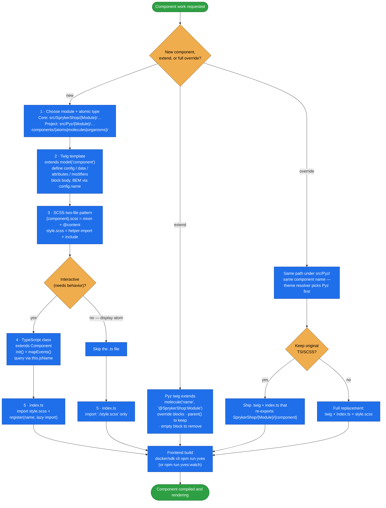

# yves-atomic-frontend

Build, extend, and override **Spryker Yves atomic-design components** — atoms, molecules, organisms —
across all five files a component is made of: `index.ts`, `style.scss`, the mixin SCSS, the TypeScript
class, and the Twig template.

A Yves component is not a template; it's a small, strict convention. The Twig extends
`model('component')` and declares `config` / `data` / `attributes` / `modifiers`; the SCSS splits into a
mixin file and a `style.scss` entry point; the TS extends `ShopUi/models/component` and is registered
lazily from `index.ts`. Break one of those and the component silently doesn't render, doesn't get styled,
or doesn't initialise. This skill carries the whole convention plus three deep-reference files.

## When it triggers

Any Yves `Theme/` component work: "create a new molecule", "override the product card", "add a custom
atom for X", "extend the cart item component", "build a new frontend component", "add a frontend widget",
"how do I add a new Twig template to the storefront", or any SCSS/TypeScript work in the SprykerShop
frontend layer.

## Flow schema



## Component file structure

Every component is one kebab-case folder with up to five files:

| File | Role |
|---|---|
| `index.ts` | Webpack entry point — imports the style, lazily registers the TS class. |
| `style.scss` | Style entry point — `helper-import` + applies the mixin. |
| `{component-name}.scss` | The mixin definition with BEM styles (and `@content`). |
| `{component-name}.ts` | TypeScript class — **optional**, omit for pure-HTML display atoms. |
| `{component-name}.twig` | The Twig template. |

## Key rules

**Twig** — always ``; `config.name` is the BEM block and drives every CSS
class; `config.jsName` (`js-{name}`) is for JS selectors only, never CSS; `required` marks mandatory props
and throws a helpful error when missing; always `only` on includes to prevent scope leakage; reference
siblings with `atom()`, `molecule('name', 'Module')`, `organism('name', 'Module')`.

**SCSS** — the mixin file emits no CSS on its own, `style.scss` does; mixin name is
`{module-name-kebab}-{component-name-kebab}`; always include `@content` so downstream can inject rules.

**TypeScript** — extend `Component` from `ShopUi/models/component`; use `init()` for setup, not the
constructor (`readyCallback()` only when other components must already be loaded); query via
`this.jsName`; read Twig-declared values with `this.getAttribute()`; prefer `protected` over `private` so
the class stays extensible.

## Referencing core components in Pyz

| Layer | Twig namespace | TS import alias |
|---|---|---|
| SprykerShop | `@SprykerShop:ModuleName` | `SprykerShop/ModuleName/...` |
| Spryker | `@Spryker:ModuleName` | `Spryker/ModuleName/...` |
| Pyz | `@Pyz:ModuleName` | `Pyz/ModuleName/...` |

## Files

| File | Role |
|---|---|
| [`SKILL.md`](SKILL.md) | The spine — file structure, the 5-step creation walkthrough, using components in templates, extending vs. overriding in Pyz, namespace table, and the post-creation build command. |
| [`references/examples.md`](references/examples.md) | Full worked examples: a status-badge **atom**, a notification-banner **molecule** with TS, a product-showcase **organism** (layout composer), and a Pyz **extension** of the product card. |
| [`references/scss-patterns.md`](references/scss-patterns.md) | The two-file pattern, mixin naming, `@content`, the `style.scss` template, BEM methodology, ShopUi global variables, useful mixins, responsive breakpoints, and overriding component SCSS in Pyz. |
| [`references/typescript-patterns.md`](references/typescript-patterns.md) | Component lifecycle (`register` → lazy load → custom element → `readyCallback` → `init`), the `Component` base class, querying children, reading Twig attributes, cross-component communication, event patterns, extending a TS component in Pyz, and the lazy-loading pattern. |

## After creating components

```bash
docker/sdk cli npm run yves
# watch mode during development:
docker/sdk cli npm run yves:watch
```

## Packaging note

This skill ships in the `spryker-ai-dev-sdk` plugin under `vendor/spryker-sdk/ai-dev/…`, which is
Composer-managed — `composer update spryker-sdk/ai-dev` may overwrite it. The durable home for edits
is the plugin's own repository (`github.com/spryker-sdk/ai-dev`).
