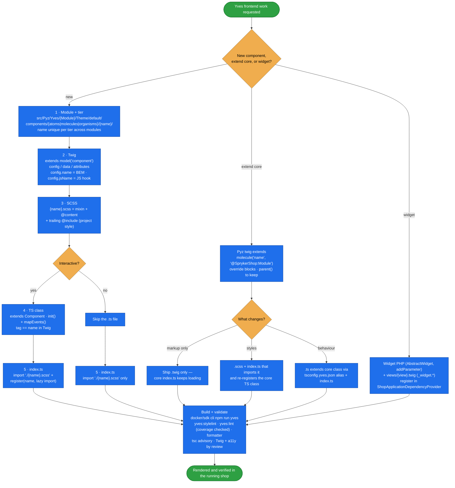

# yves-atomic-frontend

Build, extend, and override **Spryker Yves storefront frontend code in a project** — atomic-design
components (atoms, molecules, organisms), templates and views, and Widgets — across Twig, SCSS, and
TypeScript, then validate it honestly.

A Yves component is not a template; it's a small, strict convention. The Twig extends
`model('component')` and declares `config` / `data` / `attributes`; the SCSS is a mixin with `@content`;
the TS extends `ShopUi/models/component` and is registered lazily from `index.ts`. Break one of those and
the component silently doesn't render, doesn't get styled, or doesn't initialise. On top of that, the
builder's entry-point precedence decides what a project override must ship, and the lint scripts have
blind spots (ESLint may not cover project TS, `--fix` is ignored, Twig and accessibility are unchecked).
This skill carries all of it, with project paths only — core is read from `vendor/` and extended into
`src/Pyz/Yves`, never edited.

## When it triggers

Any Yves `Theme/` work: "create a new molecule", "override the product card", "add a custom atom for X",
"extend the cart item component", "create a widget", "pass data to the template", "add a JS hook", "why
isn't my style applied", "the component isn't initializing", "eslint max-lines error", "how do I add a
new Twig template to the storefront". The always-loaded companion rule `yves-frontend`
(`data/rules/yves-frontend.md`) carries the non-negotiables; this skill carries the depth.

## Flow schema


```mermaid
flowchart TD
    A([Yves frontend work requested]) --> B{"New component,<br/>extend core, or widget?"}

    B -- "new" --> C["1 · Module + tier<br/>src/Pyz/Yves/{Module}/Theme/default/<br/>components/{atoms|molecules|organisms}/{name}/<br/>name unique per tier across modules"]
    C --> D["2 · Twig<br/>extends model('component')<br/>config / data / attributes<br/>config.name = BEM · config.jsName = JS hook"]
    D --> E["3 · SCSS<br/>{name}.scss = mixin + @content<br/>+ trailing @include (project style)"]
    E --> F{"Interactive?"}
    F -- "yes" --> G["4 · TS class<br/>extends Component · init() + mapEvents()<br/>tag == name in Twig"]
    F -- "no" --> H["Skip the .ts file"]
    G --> I["5 · index.ts<br/>import './{name}.scss' +<br/>register(name, lazy import)"]
    H --> I2["5 · index.ts<br/>import './{name}.scss' only"]
    I --> VAL
    I2 --> VAL

    B -- "extend core" --> X["Pyz twig extends<br/>molecule('name', '@SprykerShop:Module')<br/>override blocks · parent() to keep"]
    X --> Z{"What changes?"}
    Z -- "markup only" --> Z1["Ship .twig only —<br/>core index.ts keeps loading"]
    Z -- "styles" --> Z2[".scss + index.ts that imports it<br/>and re-registers the core TS class"]
    Z -- "behaviour" --> Z3[".ts extends core class via<br/>tsconfig.yves.json alias + index.ts"]
    Z1 --> VAL
    Z2 --> VAL
    Z3 --> VAL

    B -- "widget" --> W["Widget PHP (AbstractWidget, addParameter)<br/>+ views/{view}.twig (_widget.*)<br/>register in ShopApplicationDependencyProvider"]
    W --> VAL

    VAL["Build + validate<br/>docker/sdk cli npm run yves<br/>yves:stylelint · yves:lint (coverage checked) · formatter<br/>tsc advisory · Twig + a11y by review"]
    VAL --> END([Rendered and verified in the running shop])

    classDef step fill:#1f6feb,stroke:#0b3d91,color:#fff;
    classDef decision fill:#f0ad4e,stroke:#8a6d3b,color:#000;
    classDef terminal fill:#2ea043,stroke:#176f2c,color:#fff;
    class C,D,E,G,H,I,I2,X,Z1,Z2,Z3,W,VAL step;
    class B,F,Z decision;
    class A,END terminal;
```

## Component file structure

Every component is one kebab-case folder, directly under its tier directory, with up to five files:

| File | Role |
|---|---|
| `index.ts` | Webpack entry point — imports the styles, lazily registers the TS class. |
| `{component-name}.scss` | Mixin with BEM styles and `@content`; in projects it also ends with the `@include`. |
| `style.scss` | Core convention only — `helper-import` guard + mixin include. Projects usually omit it. |
| `{component-name}.ts` | TypeScript class — **optional**, omit for CSS-only components. |
| `{component-name}.twig` | The Twig template. |

## Key rules

**Twig** — ``; `config.name` is the BEM block, `config.jsName` (`js-{name}`)
is for JS only; a TS-backed component sets `tag` equal to `name`; `required` for mandatory `data`, new keys
optional and defaulted; `only` on every include; module as second argument outside ShopUi; named blocks +
hoisted class variables so projects can override a region; `| trans` with glossary keys; `qa()` test hooks.

**SCSS** — mixin `{module-kebab}-{component-name}($name: '.{component-name}')` with `@content` last;
tokens and helpers are injected (no import); never style `js-` classes; no named colours.

**TypeScript** — extend `Component`; set up in `init()`; query via `this.jsName`; read attributes inline;
`protected` over `private`; no magic numbers, no `console`, ≤ 200 lines.

**Overrides** — mirror the core path under `src/Pyz/Yves`; extend `@SprykerShop:`/`@SprykerFeature:`;
a project `index.ts` replaces the core entry, so ship one only when styles or behaviour change.

**Validation** — `npm run yves:stylelint`, `npm run yves:lint`, `npm run formatter`; `yves:lint -- --fix`
is ignored; confirm ESLint actually covers your file; `tsc` is advisory; a webpack build is not
verification; Twig and accessibility are review-only.

## Files

| File | Role |
|---|---|
| [`SKILL.md`](SKILL.md) | The spine — project vs core paths, the 5-step creation walkthrough, using components, customizing core (extend, what to ship, import aliases), Widgets in brief, build + validate, checklist. |
| [`references/examples.md`](references/examples.md) | Worked examples: CSS-only status-badge **atom**, notification-banner **molecule** with TS, product-showcase **organism**, and a markup-only project **extension** of the product card. |
| [`references/twig-widgets.md`](references/twig-widgets.md) | Component model and define blocks, BEM vs JS hooks, overridable blocks, module resolution, `qa()`, translations, Widget PHP + view + registration + `` tag, BC-safe `data`. |
| [`references/scss-patterns.md`](references/scss-patterns.md) | Mixin pattern (project vs core style), `@content`, BEM, injected tokens and helpers, design tokens, overriding core SCSS, enforced Stylelint rules. |
| [`references/typescript-patterns.md`](references/typescript-patterns.md) | Lifecycle (`register` → lazy load → `mountCallback` → `init`), base class API, queries, attributes and JSON, events, extending a core TS class, enforced ESLint rules, TS config facts. |
| [`references/validation.md`](references/validation.md) | Where checks run, commands and autofix, the two ESLint traps and a covering-config recipe, Prettier, `tsc` as advisory, triage loop, what no tool checks. |

## After creating components

```bash
docker/sdk cli npm run yves
# watch mode during development:
docker/sdk cli npm run yves:watch
```

## Packaging note

This skill ships in the `spryker-ai-dev-sdk` plugin under `vendor/spryker-sdk/ai-dev/…`, which is
Composer-managed — `composer update spryker-sdk/ai-dev` may overwrite it. The durable home for edits
is the plugin's own repository (`github.com/spryker-sdk/ai-dev`).
