# architecture-prep

Turns a mostly-empty Spryker `architecture/` template folder into a real, project-specific,
decision-grade **arc42 + C4** architecture document — version-controlled Markdown + Mermaid (`.mmd`).
It's an **orchestrator**: it gathers inputs, grounds every claim, fans the writing out to teammate
subagents, then runs a **review → fix → re-verify loop** until the document passes.

Runs in any Spryker project or demoshop (b2b / b2c / marketplace / suite) from the project root, and
scaffolds the `architecture/` folder if it's missing.

## When it triggers

"prepare/fill in the architecture", "set up the architecture folder", "do the arc42/C4 docs",
"document the system context / building blocks / runtime flows", "capture this as an ADR / solution
design", or "turn this TAD / these TADs into architecture docs (as PRs)" — even without the words
"arc42" or "C4". Not for writing a PRD, building from a PRD, or fixing a bug.

## Three ways in

| Input | What happens |
|---|---|
| **Nothing structured** | Batched interview ([interview.md](references/interview.md)) driven by the [questionnaire.md](references/questionnaire.md) question bank |
| **A filled/partial questionnaire** | Skips the interview (or asks only the blanks) |
| **A TAD / structured brief** | The doc IS the intake — no interview ([tad-mapping.md](references/tad-mapping.md)) |

Documents provided up front are mined for answers before anything is asked
([prefill.md](references/prefill.md)), so the interview only covers genuine gaps.

One deliverable → one document edited in place. **N TADs/briefs → N documents → N PRs**, one git
worktree per deliverable ([multi-deliverable.md](references/multi-deliverable.md)).

## Workflow

```mermaid
---
config:
  layout: elk
---
flowchart TD
    Start([Invoked in a Spryker project]):::user --> S0

    subgraph Intake[" "]
      S0["**Step 0** — Intake &amp; mode<br/>classify input · scaffold architecture/ · pick sections · Gated/Autonomous"]:::backend
      S0b["**Step 0b** — Pre-fill from provided documents<br/>derive → confirm in one batch"]:::backend
      S1["**Step 1** — Interview OR TAD fast-path<br/>→ intake.md"]:::backend
    end

    S0 --> S0b --> S1

    S1 -->|"TAD / filled questionnaire"| S2
    S1 -->|"gaps remain"| Q{{"questionnaire.md → AskUserQuestion batches"}}:::web
    Q --> S2

    subgraph Research["**Step 2** — Research (parallel teammates, shared once)"]
      R1["Spryker docs<br/>research-docs.md"]:::storage
      R2["Web / external systems<br/>research-web.md"]:::storage
    end
    S2([grounding]):::backend --> Research

    Research --> S3["**Step 3** — Plan the fan-out<br/>one task per section (or per deliverable)"]:::backend

    S3 --> S4
    subgraph Write["**Step 4** — Write (parallel teammates)"]
      W1["section / deliverable writer<br/>+ paired diagrams"]:::web
      W2["section / deliverable writer<br/>+ paired diagrams"]:::web
      W3["… one per section (or per deliverable, isolated)"]:::web
    end
    S4(["depth bar: architecture-depth.md"]):::backend --> Write

    Write --> S5["**Step 5** — Cross-link &amp; consistency pass<br/>(orchestrator inline)"]:::backend

    S5 --> S6a

    subgraph Loop["**Step 6** — Self-review &amp; FIX loop (max 3 rounds)"]
      direction TB
      S6a["**6a Review** — independent reviewer<br/>vs review.md → ranked findings"]:::external
      S6b["**6b Fix** — writers fix in place<br/>(mandatory on BLOCKER/MAJOR)"]:::web
      S6c{"**6c Re-verify** — fresh reviewer<br/>0 open BLOCKER/MAJOR?"}:::external
      S6a --> S6b --> S6c
      S6c -->|"no (round &lt; 3)"| S6a
    end

    S6c -->|"yes — passes"| S6d["**6d Present** — summary + before→after<br/>+ triaged TODOs"]:::backend
    S6c -->|"round 3 blocker"| Esc["escalate unresolved blocker<br/>(never hidden)"]:::storage
    Esc --> S6d

    S6d --> S7["**Step 7** — Handoff<br/>ready to feed a PRD · list TODOs"]:::backend
    S7 --> Prev{{"Preview + PDF?<br/>preview.html (served) · preview-standalone.html (file://) → Save-as-PDF"}}:::web
    S7 --> Push{{"Push / PRs?<br/>(only if asked)"}}:::web
    Prev --> Done
    Push --> Done(["architecture/ committed · PR(s) opened · PDF exported"]):::user

    classDef user fill:#e1f5ff,stroke:#0366d6,color:#023;
    classDef backend fill:#2980B9,stroke:#1B4F72,color:#fff;
    classDef web fill:#27AE60,stroke:#1D8348,color:#fff;
    classDef storage fill:#9B59B6,stroke:#6C3483,color:#fff;
    classDef external fill:#E67E22,stroke:#AF601A,color:#fff;
```



The loop is the point: review **drives fixes**, it doesn't just report. A round that finds a BLOCKER or
MAJOR is always followed by a fix pass and a fresh re-verify — in both Gated and Autonomous mode. Every
finding ends either *fixed* or *converted to a triaged owned gap*; nothing is silently dropped.

## Reference files (read the right one at the right time)

| File | What it covers | Read when |
|---|---|---|
| [run-lean.md](references/run-lean.md) | Run dir, State Object, logging, decision log | Start of every run |
| [architect-persona.md](references/architect-persona.md) | The architect role, communication rules, no-duplication and hygiene policy | Orchestrator at start + every writer |
| [questionnaire.md](references/questionnaire.md) | The canonical fillable question bank (L1–L4, gated) | Before Step 1 |
| [prefill.md](references/prefill.md) | Deriving answers from provided documents before asking | Step 0b, if documents exist |
| [interview.md](references/interview.md) | How to collect the questionnaire (levels, gates, batches) | Before Step 1 |
| [tad-mapping.md](references/tad-mapping.md) | TAD fast-path: TAD-section → arc42-section | Step 0, if a TAD is the input |
| [multi-deliverable.md](references/multi-deliverable.md) | N inputs → N worktrees/branches → N PRs | Step 0, if N > 1 |
| [sections.md](references/sections.md) | Per-arc42-section writer guidance + diagram map | Step 4, each writer its own § |
| [architecture-depth.md](references/architecture-depth.md) | The decision-grade / build-ready depth bar | Orchestrator once + every writer |
| [review.md](references/review.md) | Spryker-specific self-review checklist | Before Step 6 + the reviewer subagent |
| [preview.md](references/preview.md) | Two project-agnostic (copy-only) files in `architecture/`: `preview.html` (dev — served, auto-discovers docs) + `preview-standalone.html` (handoff — pure-Bash-built, opens over file://) + PDF export | Step 7, to view or export the doc |

## The arc42 sections

`01` introduction & goals · `02` constraints · `03` system scope & context (+C1) · `04` solution
designs · `05` building block view (+C2/C3) · `06` runtime view (+sequences) · `07` deployment view ·
`08` crosscutting concepts · `09` architecture decisions (ADRs) · `10` quality requirements (volumes) ·
`11` risks & technical debt · `12` glossary. Step 0 asks which to produce this run; only those are
written.

## Run artifacts

The **deliverable** is the git-tracked `architecture/` folder, edited in place. Everything the run
produces *about* itself is kept separately so it never pollutes that deliverable:

```
.ai-dev/architecture-prep/<run-id>/
```

| File | Role |
|------|------|
| `run.log` | The append-only **timeline** — one timestamped line per boundary (`STEP <n> … \| START` / `\| END`) and per milestone (`SECTION 03 \| written (2 todos)`). |
| `decisions.md` | The **rationale** — every fork resolved autonomously, plus open questions and risks. |
| `intake.md` | The single intake file every interview answer or TAD mapping is written into. |
| `research-*.md` | Per-source findings from the Step 2 research teammates (docs / web / current-state). |

Logged at minimum: the Step 0 config, interview complete, each research source done or skipped, each
section written with its TODO count, the cross-link pass total, the review outcome, and the handoff.
A failed or blocked step is logged `FAIL`/`SKIP` with its reason **before** the run stops, so the log
always ends with the cause rather than trailing off. Multi-deliverable runs keep **one** run directory
even though each deliverable gets its own worktree.

Full discipline — the run directory, the State Object, log line shapes, and the decision log — is in
[references/run-lean.md](references/run-lean.md).

## Packaging note

This skill ships in the `spryker-architecture` plugin under `vendor/spryker-sdk/ai-dev/…`, which is
Composer-managed — `composer update spryker-sdk/ai-dev` may overwrite it. The durable home for edits
is the plugin's own repository (`github.com/spryker-sdk/ai-dev`).
